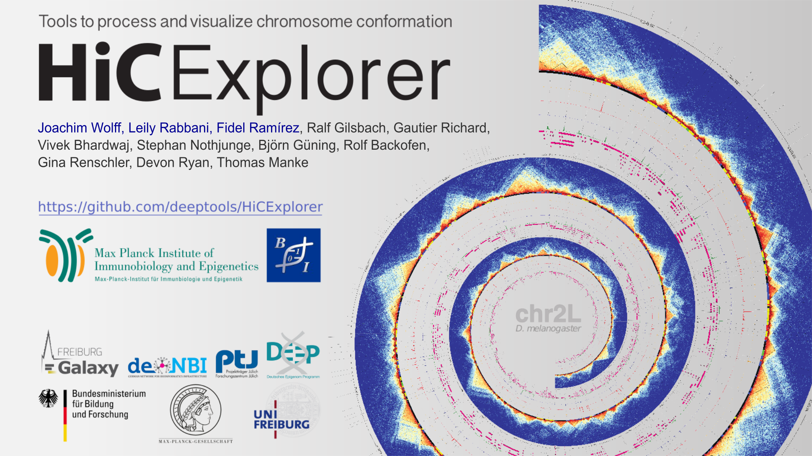

.. image:: https://travis-ci.org/deeptools/HiCExplorer.svg?branch=master
   :target: https://travis-ci.org/deeptools/HiCExplorer
.. image:: https://readthedocs.org/projects/hicexplorer/badge/?version=latest
   :target: http://hicexplorer.readthedocs.io/?badge=latest
.. image:: https://anaconda.org/bioconda/hicexplorer/badges/installer/conda.svg
   :target: https://anaconda.org/bioconda/hicexplorer
.. image:: https://quay.io/repository/biocontainers/hicexplorer/status
   :target: https://quay.io/repository/biocontainers/hicexplorer

HiCExplorer
===========

Set of programs to process, analyze and visualize Hi-C and cHi-C data
---------------------------------------------------------------------

Sequencing techniques that probe the 3D organization of the genome generate large amounts of data whose processing,
analysis and visualization is challenging. Here, we present HiCExplorer, a set of tools for the analysis and
visualization of chromosome conformation data. HiCExplorer facilitates the creation of contact matrices, correction
of contacts, TAD detection, A/B compartments, merging, reordering or chromosomes, conversion from different formats including
`cooler <https://github.com/mirnylab/cooler>`_ and detection of long-range contacts. Moreover, it allows the visualization of
multiple contact matrices along with other types of data like genes, compartments, ChIP-seq coverage tracks (and in general
any type of genomic scores), long range contacts and the visualization of viewpoints.

Single-cell Hi-C data
---------------------

We provide the scHiCExplorer to create, manipulate, analyse and visualize single-cell Hi-C data in its own software:
The  `scHiCExplorer <https://github.com/joachimwolff/schicexplorer>`_.

Citation:
^^^^^^^^^

Joachim Wolff, Leily Rabbani, Ralf Gilsbach, Gautier Richard, Thomas Manke, Rolf Backofen, Björn A Grüning.
**Galaxy HiCExplorer 3: a web server for reproducible Hi-C, capture Hi-C and single-cell Hi-C data analysis, quality control and visualization, Nucleic Acids Research**, Nucleic Acids Research, Volume 48, Issue W1, 02 July 2020, Pages W177–W184, https://doi.org/10.1093/nar/gkaa220

Joachim Wolff, Vivek Bhardwaj, Stephan Nothjunge, Gautier Richard, Gina Renschler, Ralf Gilsbach, Thomas Manke, Rolf Backofen, Fidel Ramírez, Björn A Grüning. 
**"Galaxy HiCExplorer: a web server for reproducible Hi-C data analysis, quality control and visualization", Nucleic Acids Research**, Volume 46, Issue W1, 2 July 2018, Pages W11–W16, doi: https://doi.org/10.1093/nar/gky504

Fidel Ramirez, Vivek Bhardwaj, Jose Villaveces, Laura Arrigoni, Bjoern A Gruening, Kin Chung Lam, Bianca Habermann, Asifa Akhtar, Thomas Manke.
**"High-resolution TADs reveal DNA sequences underlying genome organization in flies". Nature Communications**, Volume 9, Article number: 189 (2018), doi: https://doi.org/10.1038/s41467-017-02525-w

Availability
^^^^^^^^^^^^

HiCExplorer is available as a **command line suite of tools** on this very GitHub repository and also on other platforms (detailed in *Installation* below).

A **Galaxy HiCExplorer version** is directly available to users at http://hicexplorer.usegalaxy.eu. Training material is available at the `Galaxy Training Network <http://galaxyproject.github.io/training-material/topics/epigenetics/tutorials/hicexplorer/tutorial.html>`_,
while a Galaxy Tour is available `here <https://hicexplorer.usegalaxy.eu/tours/hixexplorer>`_ for users not familiar with this platform. Galaxy HiCExplorer is also available as a Docker image at the `Docker Galaxy HiCExplorer GitHub repository <https://github.com/deeptools/docker-galaxy-hicexplorer>`_. Finally, this Galaxy version is available on the `Galaxy Tool Shed <https://toolshed.g2.bx.psu.edu/>`_ and on the corresponding `GitHub repository <https://github.com/galaxyproject/tools-iuc>`_.

Installation
^^^^^^^^^^^^

With version 3.0, HiCExplorer is available for Python 3 only, the Python 2 support is discontinued. HiCExplorer can be installed with conda.

-  Anaconda and GitHub for command line usage.
-  Toolshed and Docker image for its integration on Galaxy servers.

There are many easy ways to install HiCExplorer. Details can be found
`here <https://hicexplorer.readthedocs.io/en/latest/content/installation.html>`_.

**We strongly recommended to use conda to install HiCExplorer.**

Command line version
++++++++++++++++++++

Install with conda
__________________

The easiest way to install HiCExplorer is using `BioConda <http://bioconda.github.io/>`_
::

   $ conda install hicexplorer -c bioconda -c conda-forge

Install by cloning this repository
__________________________________

You can install any one of the HiCExplorer branches on command line
(linux/mac) by cloning this git repository :

::

    $ git clone https://github.com/deeptools/HiCExplorer.git
    $ cd HiCExplorer
    $ python setup.py install

If you don't have root permission, you can set a specific folder using the ``--prefix`` option

::

	$ python setup.py install --prefix /User/Tools/hicexplorer

If you don't use conda, please take care of all dependencies on your own.

Galaxy version
++++++++++++++

Install with Docker
___________________

Installation instructions as a Docker image can be followed at https://github.com/deeptools/docker-galaxy-hicexplorer.

Install with Tool Shed
______________________

Galaxy HiCExplorer is part of the `Galaxy Tool Shed <https://toolshed.g2.bx.psu.edu/>`_ and can be installed from there to any Galaxy server following `this link <https://toolshed.g2.bx.psu.edu/repository/browse_repository?id=f1554978eeb3da8b>`_.

Documentation:
^^^^^^^^^^^^^^
Please visit our complete documentation `Here <http://hicexplorer.readthedocs.org/>`_. This documentation is also available directly within `Galaxy <http://hicexplorer.usegalaxy.eu/>`_.
