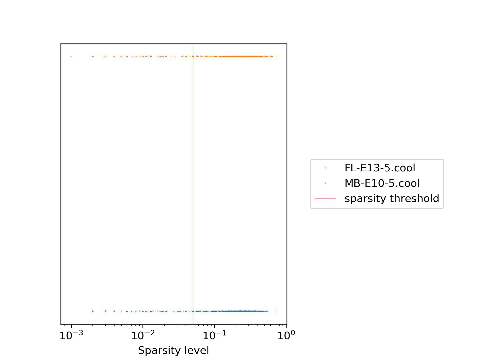
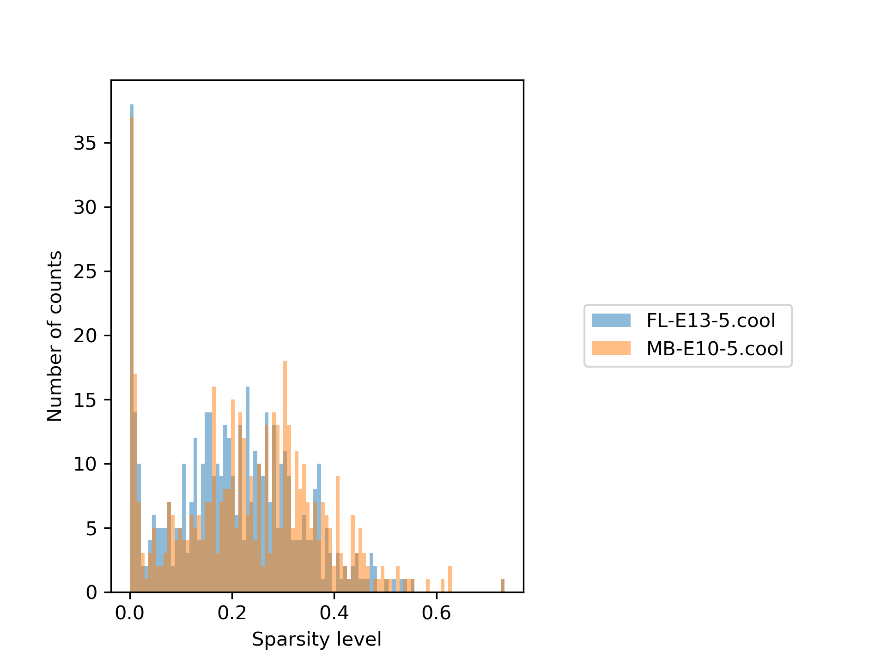
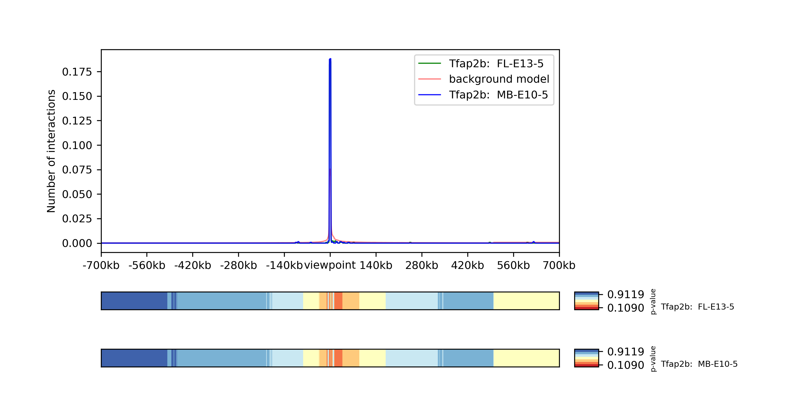
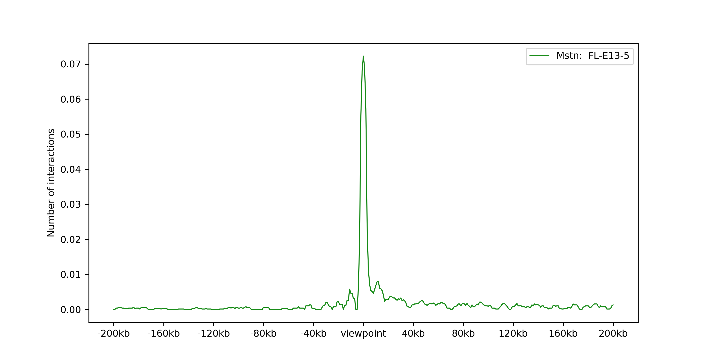
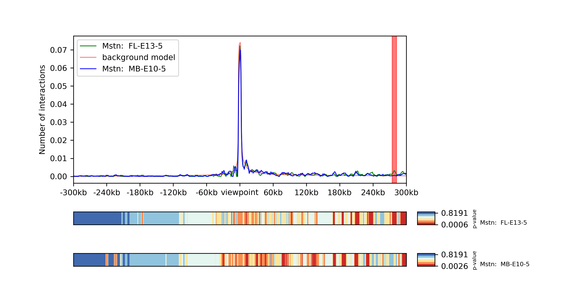
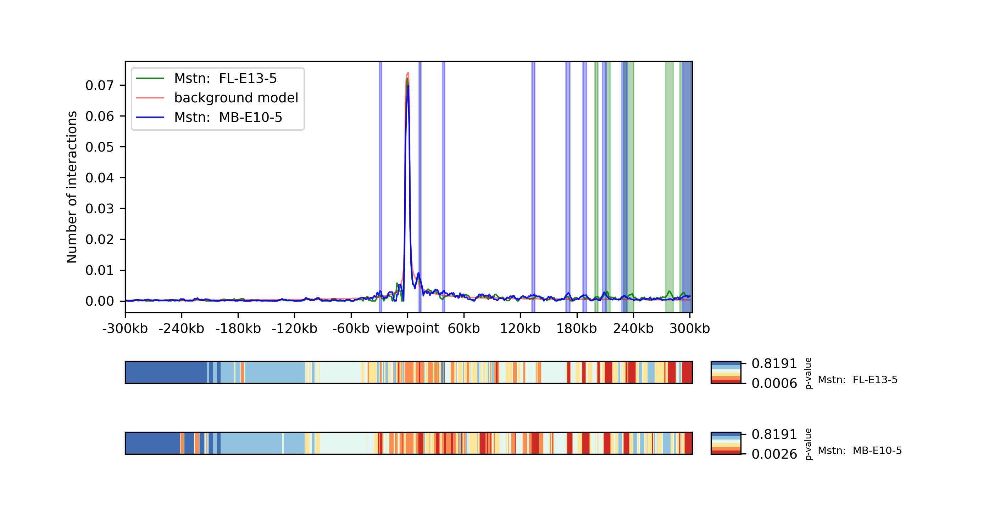

Captured Hi-C data analysis
===========================

How we use HiCExplorer to analyse cHi-C data
--------------------------------------------

This How-to is based on the published dataset from `Andrey et al. 2017 <https://doi.org/10.1101/gr.213066.116>`__. For the tutorial, we use the samples FL-E13.5 and MB-E-10.5. 

**Disclaimer**: With HiCExplorer 3.7 all data is stored in hdf5 based files to make the handling easier. Please check your version of HiCExplorer to make sure you use the latest version. Commands of older HiCExplorer version do not work with the introduced changes!

Download the raw data
---------------------

Please download the raw data via the following links or via `NCBI GSE84795 <https://www.ncbi.nlm.nih.gov/geo/query/acc.cgi?acc=GSE84795>`__ .

+--------------------------------------+---------------------------------------------------------------------------------------------------+---------------------------------------------------------------------------------------------------+
| Dataset                              | forward                                                                                           | reverse                                                                                           |
+======================================+===================================================================================================+===================================================================================================+
| CC-FL-E135-Wt-Mm-Rep1                | `SRR3950565_1 <ftp://ftp.sra.ebi.ac.uk/vol1/fastq/SRR395/005/SRR3950565/SRR3950565_1.fastq.gz>`__ | `SRR3950565_2 <ftp://ftp.sra.ebi.ac.uk/vol1/fastq/SRR395/005/SRR3950565/SRR3950565_2.fastq.gz>`__ |
+--------------------------------------+---------------------------------------------------------------------------------------------------+---------------------------------------------------------------------------------------------------+
| CC-FL-E135-Wt-Mm-Rep2                | `SRR3950566_1 <ftp://ftp.sra.ebi.ac.uk/vol1/fastq/SRR395/006/SRR3950566/SRR3950566_1.fastq.gz>`__ | `SRR3950566_2 <ftp://ftp.sra.ebi.ac.uk/vol1/fastq/SRR395/006/SRR3950566/SRR3950566_2.fastq.gz>`__ |
+--------------------------------------+---------------------------------------------------------------------------------------------------+---------------------------------------------------------------------------------------------------+
| CC-MB-E105-Wt-Mm-Rep1                | `SRR3950559_1 <ftp://ftp.sra.ebi.ac.uk/vol1/fastq/SRR395/009/SRR3950559/SRR3950559_1.fastq.gz>`__ | `SRR3950559_2 <ftp://ftp.sra.ebi.ac.uk/vol1/fastq/SRR395/009/SRR3950559/SRR3950559_2.fastq.gz>`__ |
+--------------------------------------+---------------------------------------------------------------------------------------------------+---------------------------------------------------------------------------------------------------+
|CC-MB-E105-Wt-Mm-Rep2                 | `SRR3950560_1 <ftp://ftp.sra.ebi.ac.uk/vol1/fastq/SRR395/000/SRR3950560/SRR3950560_1.fastq.gz>`__ | `SRR3950560_2 <ftp://ftp.sra.ebi.ac.uk/vol1/fastq/SRR395/000/SRR3950560/SRR3950560_2.fastq.gz>`__ |
+--------------------------------------+---------------------------------------------------------------------------------------------------+---------------------------------------------------------------------------------------------------+

Mapping
-------

Map the files with a mapper of your choice against the mm9 reference genome; as an example, the mapping with bowtie2 is shown.

.. code:: bash

    bowtie2 -x mm9_index --threads 8 -U SRR3950565_1.fastq.gz --reorder | samtools view -Shb - > SRR3950565_1.bam
    bowtie2 -x mm9_index --threads 8 -U SRR3950565_2.fastq.gz --reorder | samtools view -Shb - > SRR3950565_2.bam
    bowtie2 -x mm9_index --threads 8 -U SRR3950566_1.fastq.gz --reorder | samtools view -Shb - > SRR3950566_1.bam
    bowtie2 -x mm9_index --threads 8 -U SRR3950566_2.fastq.gz --reorder | samtools view -Shb - > SRR3950566_2.bam
    bowtie2 -x mm9_index --threads 8 -U SRR3950559_1.fastq.gz --reorder | samtools view -Shb - > SRR3950559_1.bam
    bowtie2 -x mm9_index --threads 8 -U SRR3950559_2.fastq.gz --reorder | samtools view -Shb - > SRR3950559_2.bam
    bowtie2 -x mm9_index --threads 8 -U SRR3950560_1.fastq.gz --reorder | samtools view -Shb - > SRR3950560_1.bam
    bowtie2 -x mm9_index --threads 8 -U SRR3950560_2.fastq.gz --reorder | samtools view -Shb - > SRR3950560_2.bam

    

Create cHi-C matrices
---------------------

To create a cHi-C matrix we use HiCExplorer's hicBuildMatrix for each replicate separately and merge the replicates into a single matrix later. Like Andrey et al., we use a resolution of 1kb and use the restriction enzyme DpnII.

.. code:: bash

    hicBuildMatrix --samFiles SRR3950565_1.bam SRR3950565_2.bam  --binSize 1000 --restrictionSequence GATC --outFileName SRR3950565.cool --QCfolder SRR3950565_QC --threads 6
    hicBuildMatrix --samFiles SRR3950566_1.bam SRR3950566_2.bam  --binSize 1000 --restrictionSequence GATC --outFileName SRR3950566.cool --QCfolder SRR3950566_QC --threads 6
    hicBuildMatrix --samFiles SRR3950559_1.bam SRR3950559_2.bam  --binSize 1000 --restrictionSequence GATC --outFileName SRR3950559.cool --QCfolder SRR3950559_QC --threads 6
    hicBuildMatrix --samFiles SRR3950560_1.bam SRR3950560_2.bam  --binSize 1000 --restrictionSequence GATC --outFileName SRR3950560.cool --QCfolder SRR3950560_QC --threads 6

.. code:: bash

    hicSumMatrix --matrices SRR3950565.cool SRR3950566.cool --outFileName FL-E13-5.cool
    hicSumMatrix --matrices SRR3950559.cool SRR3950560.cool --outFileName MB-E10-5.cool

Terminology: Reference point vs viewpoint
-----------------------------------------

A reference point is one single genomic position i.e. chr1 500 510 is a reference point. A viewpoint is in contrast the region defined by the 
reference point and the up and downstream range, i.e. range 100 and reference point chr1 50 70 leads to the viewpoint chr1 400 610.

Creation of reference point file
--------------------------------

Andrey et al. state that they used a total of 460 reference points, but that 24 were removed due to low sequence coverage or non-correspondence to a promoter region, leading to 446 in total.

To reproduce this, we need all reference points which are published in Supplementary Table `S2 <https://genome.cshlp.org/content/suppl/2017/01/20/gr.213066.116.DC1/Supplemental_Table_S2.xlsx>`__ and `S8 <https://genome.cshlp.org/content/suppl/2017/01/20/gr.213066.116.DC1/Supplemental_Table_S8.xlsx>`__.

It is simplest to create the reference point file in the following format using Excel and store it as a tab separated file:

.. code:: bash

    chr1	4487435	4487435 Sox17

Otherwise, just `download <https://drive.google.com/open?id=14kNDI1xuEiP-8S5lssTbRm5d3s2eMNLU>`__ the prepared file. We will do the quality control on our own and compare with the results of Andrey et al.

Quality control
^^^^^^^^^^^^^^^

As a first step we compute the quality of each viewpoint by considering the sparsity. As soon as one viewpoint in one sample is less than the user-defined threshold (`--sparsity`), the reference point is no longer considered.

.. code:: bash

    chicQualityControl -m FL-E13-5.cool MB-E10-5.cool -rp reference_points.bed --sparsity 0.025 --threads 20

The quality control creates five files: two plots showing the sparsity structure of the samples and three files containing the accepted reference points, the rejected ones and one file with all viewpoints and their sparsity level per sample.

In our example the plots look like the following:

The first plot shows the sparsity per sample for each viewpoint, while the second one shows the sparsity distribution as a histogram. It can be seen quite clearly that only a minority of the samples are really sparse and therefore need to be removed. The red line indicates the chosen sparsity level.

The reference point `Tdap2b` at `chr1 19198995`, which has a sparsity of 0.018 in FL-E13-5 and 0.016 in MB-E10-5, is considered to be of bad quality. To confirm this result we plot the viewpoint:

The plot shows there are effectively no interactions except with the reference point itself and confirm the point should be removed from the data.

The result of the quality control rejected 71 reference points as too sparse, but surprisingly the viewpoints rejected by Andrey et al. are accepted. An explanation for this could be that we only consider two samples and not all samples used by Andrey, and therefore we missed the bad quality of some viewpoints.

Please consider that this bad viewpoint was selected arbitrary out of the sample data and is only an example.

Download the data: `Filtered reference points <https://drive.google.com/open?id=1y3G1wJRBy0aZPQJ504N94jLE4jco2GAT>`__, `Quality control raw data <https://drive.google.com/open?id=1E0Ii-5QdZDco8NkEXb-rMoBCcGjYUfJg>`__ and `rejected reference points <https://drive.google.com/open?id=1LGDIoT7etslvHfNSPajYszaQlSsQegBx>`__.

Background model
^^^^^^^^^^^^^^^^

The background model computes all viewpoints given by the reference points for both samples in a range defined by the parameter `fixateRange`. We recommend setting it to 500kb because real interactions above the range 
are rarely observed and very low interaction numbers such as 1 are already considered to be significant. With this setting, only the interactions in a range 500kb up- and downstream of the reference point are considered for each viewpoint.
Based on this data, two background models are computed; the first one computes the average per relative distance to the reference point, and secondly, a negative binomial distribution per relative distance to
the reference point is fitted. This first model is used for filtering in the significant interaction evaluation by an x-fold factor and for plotting. The negative binomial model is more important; it is used to 
compute a p-value per relative distance in each sample, which is used to make the decision if an interaction is considered as significant.

.. code:: bash

    chicViewpointBackgroundModel -m FL-E13-5.cool MB-E10-5.cool --fixateRange 500000 -t 20 -rp reference_points.bed -o background_model.txt

The background model looks like this:

.. code:: bash

    Relative position	size nbinom     prob nbinom     max value       mean value
    -500000             75.895607451213	0.998528939430	2.333333333333	0.000101543771
    -499000	        90.348171762247	0.998725799952	2.750000000000	0.000104681360
    -498000	        78.512621775755	0.998514111424	2.800000000000	0.000106107536
    -497000	        75.706478185610	0.998327784087	3.800000000000	0.000116147819

You can `download <https://drive.google.com/open?id=1zblxEWa513LGwkjBknt83oZugg-uIJdw>`__ the background model.

Viewpoint computation
^^^^^^^^^^^^^^^^^^^^^

In this step the viewpoints for each reference point listed in a `reference_points.bed`-file is extracted from the interaction matrix, using the quality controlled file created by `chicQualityControl`. The up- and downstream range can be given via `--range upstream downstream`. Please use the same value for `--fixateRange` as in the background model computation.
For each relative distance the x-fold over the average value of this relative distance is computed and each location is assigned a p-value based on the background negative binomial distribution for this relative distance.
The output is one hdf5 based file containing all the data.

.. code:: bash

    chicViewpoint -m FL-E13-5.cool MB-E10-5.cool --averageContactBin 5 --range 1000000 1000000 -rp referencePoints.bed -bmf background_model.txt --outFileName interactions.hdf5 --fixateRange 500000 --threads 20

.. code:: bash

    chicExportData --file interactions.hdf5 --outputMode all -o interactions.tar.gz  -t 16

The text files for each matrix and viewpoint have the following structure:

.. code:: text

    # Chromosome	Start	End	Gene	Sum of interactions	Relative position	Relative Interactions	p-value	x-fold	Raw
    chr1	14167000	14168000	Eya1	673.000000000000	-133000	0.000000000000	1.000000000000	0.000000000000	0.000000000000
    chr1	14168000	14169000	Eya1	673.000000000000	-132000	0.000000000000	1.000000000000	0.000000000000	0.000000000000
    chr1	14169000	14170000	Eya1	673.000000000000	-131000	0.000000000000	1.000000000000	0.000000000000	0.000000000000
    chr1	14170000	14171000	Eya1	673.000000000000	-130000	0.000000000000	1.000000000000	0.000000000000	0.000000000000
    chr1	14171000	14172000	Eya1	673.000000000000	-129000	0.000000000000	1.000000000000	0.000000000000	0.000000000000
    chr1	14172000	14173000	Eya1	673.000000000000	-128000	0.000000000000	1.000000000000	0.000000000000	0.000000000000
    chr1	14173000	14174000	Eya1	673.000000000000	-127000	0.000000000000	1.000000000000	0.000000000000	0.000000000000
    chr1	14174000	14175000	Eya1	673.000000000000	-126000	0.000000000000	1.000000000000	0.000000000000	0.000000000000
    chr1	14175000	14176000	Eya1	673.000000000000	-125000	0.000297176820	0.042850447268	0.916568982282	0.200000000000
    chr1	14176000	14177000	Eya1	673.000000000000	-124000	0.000297176820	0.042850447268	0.908160092485	0.200000000000

Each file contains a header with information about content of the different columns. 

Significant interactions detection
^^^^^^^^^^^^^^^^^^^^^^^^^^^^^^^^^^

To detect significant interactions and to prepare a target file for each viewpoint which will be used for the differential analysis, the script `chicSignificantInteractions` is used. It offers two modes: either the user can specify 
an x-fold value or a loose p-value. The first one considers all interactions with a minimum x-fold over the average background for its relative distribution as a candidate or secondly, all interactions with a loose p-value or less are considered. 
These are pre-selection steps to be able to detect wider peaks in the same way as sharp ones. All detected candidates are merged to one peak if they are direct neighbors, and the sum of all interaction values of this neighborhood
is used to compute a new p-value. The p-value is computed based on the relative distance continuous negative binomial distribution of the interaction with the original highest interaction value. All peaks considered are accepted as significant interactions if
their p-value is as small as the threshold `--pvalue`.

To exclude interactions with an interaction value smaller than desired the parameter `--peakInteractionsThreshold` can be set.

In this example we use the created interactions.hdf5 file of chicViewpoint, a loose p-value of 0.1 and p-value of 0.01. For all stored locations the significant interactions are computed:

.. code:: bash

    chicSignificantInteractions --interactionFile interactions.hdf5 -bmf background_model.txt --range 1000000 1000000 --pValue 0.01 --loosePValue 0.1 --outFileNameSignificant significant.hdf5 --outFileNameTarget target.hdf5 --combinationMode dual

This creates two files, a file storing all significant interactions, significant.hdf5, and a target file, target.hdf5. The content of the two files can be export via chicExport: 

.. code:: bash

    chicExportData --file significant.hdf5 --outputMode all -o targets.tar.gz  -t 16
    chicExportData --file target.hdf5 --outputMode all -o targets.tar.gz  -t 16

For all tools it is also possible to just extract one gene by the gene name as it was given in the fourth column of the reference file. For each name, the data for all stored matrices is extracted. This mode works also on the interactions, target, aggregated and differential files.

.. code:: bash

    chicExportData --file significant.hdf5 --outputMode geneName --outputModeName Eya1  -t 16

The significant interaction files looks like the following:

.. code:: bash

    # Chromosome	Start	End	Gene	Sum of interactions	Relative position	Relative Interactions	p-value	x-fold	Raw
    chr1	14274000	14278000	Eya1	673.000000000000	-26000	0.008320950966	0.007037698679	7.811125758170	5.600000000000
    chr1	14296000	14298000	Eya1	673.000000000000	-3000	0.057949479941	0.104215728599	3.781355935916	39.000000000000
    chr1	14314000	14316000	Eya1	673.000000000000	14000	0.015156017831	0.048507853154	3.190333935010	10.200000000000
    chr1	14317000	14319000	Eya1	673.000000000000	17000	0.014561664190	0.034914431882	3.517090338584	9.800000000000
    chr1	14480000	14488000	Eya1	673.000000000000	184000	0.011292719168	0.000000010481	19.285082946462	7.600000000000
    chr1	14491000	14501000	Eya1	673.000000000000	200000	0.030683506686	0.000000000000	56.967824833429	20.650000000000

The target file looks like:

.. code:: bash

    chr1	14274000	14278000
    chr1	14295000	14298000
    chr1	14314000	14319000
    chr1	14426000	14432000
    chr1	14447000	14455000
    chr1	14460000	14465000
    chr1	14480000	14488000
    chr1	14491000	14501000

The parameter `--combinationMode` has the options `single` and `dual`. This parameter is important if a differential analysis should be computed, either a target region is only for one gene of one matrix, or the regions of one gene of two matrices are combined. 
For example: 
- `dual` combines as follows: `[[matrix1_gene1, matrix2_gene1], [matrix2_gene1, matrix3_gene1],[matrix1_gene2, matrix2_gene2], ...]`
- `single` combines as follows: `[matrix1_gene1, matrix1_gene2, matrix2_gene1, ...]`

Aggregate data for differential test
^^^^^^^^^^^^^^^^^^^^^^^^^^^^^^^^^^^^

The process to aggregate data is only necessary if the differential test is used. `chicAggregateStatistic` takes the created interaction file from `chicViewpoint` as input and either the target file created by `chicSignificantInteractions`
or one target file which applies for all viewpoints. 

.. code:: bash

    chicAggregateStatistic --interactionFile interaction.hdf5 --targetFile target.hdf5 --outFileName aggregate.hdf5 -t 16
    chicAggregateStatistic --interactionFile interaction.hdf5 --targetFile regions_of_interest.bed --outFileName aggregate.hdf5 -t 16

It selects the original data based on the target locations and returns one hdf5 based file.

Differential test
^^^^^^^^^^^^^^^^^

The differential test tests the interaction value of the reference point and the interaction value of the target of two samples for a differential expression. To achieve this,
either Fisher's test or the chi-squared test can be used. H0 is defined as 'both locations are equal', meaning the differential expressed targets can be found in the H0 rejected file.

.. code:: bash

    chicDifferentialTest --aggregatedFile aggregate.hdf5  --alpha 0.05 --statisticTest fisher --outFileName differential.hdf5 -t 16

It is important to set the desired alpha value and the output is written to one hdf5 based file. For each sample three internal datasets are created:

- H0 rejected targets 
- H0 accepted targets 
- one file containing both

The data can be exported via `chicExportData`:

.. code:: bash

    chicExportData --file differential.hdf5 --outputMode all  -o differential.tar.gz  -t 16

The created tar.gz file contains for each tested regions the three files `rejected`, 'accepted' and a file containing both information. It is also possible to extract only one gene:

.. code:: bash

    chicExportData --file differential.hdf5 --outputMode geneName --outputModeName Eya1 -o differential_one  -t 16

In case of the single extraction, the output file name serves only to determine the folder to save the data. The names are based on the gene name.

.. code:: bash

    # Chromosome	Start	End	Gene	Relative distance	sum of interactions 1	target_1 raw	sum of interactions 2	target_2 raw	p-value
    chr1	14274000	14278000	Eya1	-23000	673.000000000000	5.600000000000	832.000000000000	0.000000000000	0.008134451704
    chr1	14295000	14298000	Eya1	-3000	673.000000000000	44.400000000000	832.000000000000	49.800000000000	0.670801771179
    chr1	14314000	14319000	Eya1	18000	673.000000000000	24.200000000000	832.000000000000	23.400000000000	0.385952554141
    chr1	14426000	14432000	Eya1	131000	673.000000000000	2.400000000000	832.000000000000	9.000000000000	0.245228952263
    chr1	14447000	14455000	Eya1	154000	673.000000000000	4.400000000000	832.000000000000	12.400000000000	0.232102031454
    chr1	14460000	14465000	Eya1	164000	673.000000000000	3.200000000000	832.000000000000	7.600000000000	0.564250349826
    chr1	14480000	14488000	Eya1	187000	673.000000000000	7.600000000000	832.000000000000	3.200000000000	0.151571165731
    chr1	14491000	14501000	Eya1	200000	673.000000000000	20.650000000000	832.000000000000	18.750000000000	0.338670136491

Plotting of Viewpoints
^^^^^^^^^^^^^^^^^^^^^^

`chicPlotViewpoint` can plot viewpoints of one gene in one plot, add the mean background, show the p-value per relative distance per sample as an additional heatmap bar and highlight significant interactions or differential expressed regions.

One viewpoint:

.. code:: bash

    chicPlotViewpoint --interactionFile interactions.hdf5 --combinationMode oneGene --combinationName Eya1 --range 200000 200000 -o single_plot.tar.gz --outputFormat png

Two viewpoints, background, differential expression and p-values:

.. code:: bash

    chicPlotViewpoint --interactionFile interactions.hdf5 --combinationMode dual --range 300000 300000 --pValue --differentialTestResult differential.hdf5 --backgroundModelFile background_model.txt -o differential_background_pvalue.tar.gz

This command plots two viewpoints of two different matrices of the same gene in a plot and highlights the differential regions.

Two viewpoints, background, significant interactions and p-values:

.. code:: bash

    chicPlotViewpoint --interactionFile interaction.hdf5 --combinationMode dual --range 300000 300000 --pValue --significantInteractions significant.hdf5 --plotSignificantInteractions --backgroundModelFile background_model.txt -o significant_background_pvalue.tar.gz

