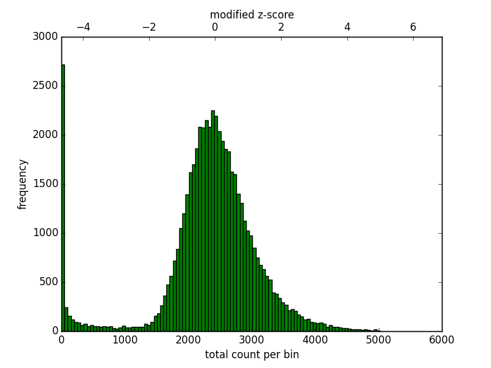
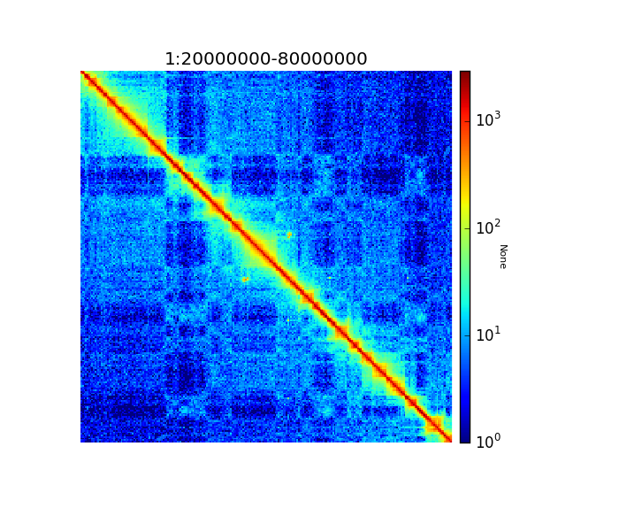
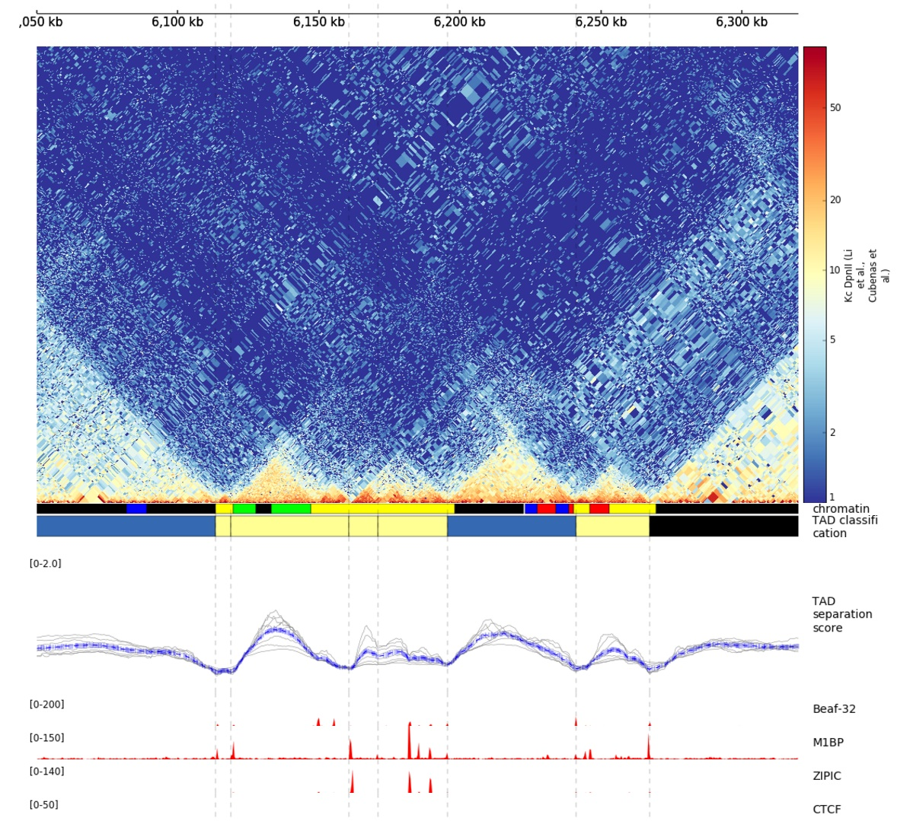

.. _example_usage:

Example usage
=============

.. contents::
    :local:
.. toctree::
   :maxdepth: 1

   mES-HiC_analysis
   HiCExport

How we use HiCExplorer
----------------------

To generate a Hi-C contact matrix is necessary to perform the following basic steps

 1. Map the Hi-C reads to the reference genome
 2. Filter the aligned reads to create a contact matrix
 3. Filter matrix bins with low or zero read coverage
 4. Remove biases from the Hi-C contact matrices

After a corrected Hi-C matrix is created other tools can be used to visualize it, call TADS
or compare it with other matrices.

Reads mapping
^^^^^^^^^^^^^

Mates have to be mapped individually to avoid mapper specific heuristics designed
for standard paired-end libraries.

We have used the HiCExplorer sucessfuly with `bwa`, `bowtie2` and `hisat2`. However, it is important to:

 * for either `bowtie2`or `hisat2` use the `--reorder` parameter which tells bowtie2 or hisat2 to output
   the *sam* files in the **exact** same order as in the *.fastq* files.
 * use local mapping, in contrast to end-to-end. A fraction of Hi-C reads are chimeric and will not map end-to-end
   thus, local mapping is important to increase the number of mapped reads.
 * Tune the aligner parameters to penalize deletions and insertions. This is important to avoid aligned reads with
   gaps if they happen to be chimeric.

.. code-block:: bash

   # map the reads, each mate individually using
   # for example bwa
   #
   # bwa mem mapping options:
   #       -A INT        score for a sequence match, which scales options -TdBOELU unless overridden [1]
   #       -B INT        penalty for a mismatch [4]
   #       -O INT[,INT]  gap open penalties for deletions and insertions [6,6]
   #       -E INT[,INT]  gap extension penalty; a gap of size k cost '{-O} + {-E}*k' [1,1] # this is set very high to avoid gaps
   #                                  at restriction sites. Setting the gap extension penalty high, produces better results as
   #                                  the sequences left and right of a restriction site are mapped independently.
   #       -L INT[,INT]  penalty for 5'- and 3'-end clipping [5,5] # this is set to no penalty.

   $ bwa mem -A1 -B4  -E50 -L0  index_path \
       -U mate_R1.fastq.gz 2>>mate_R1.log | samtools view -Shb - > mate_R1.bam

   $ bwa mem -A1 -B4  -E50 -L0  index_path \
       -U mate_R2.fastq.gz 2>>mate_R2.log | samtools view -Shb - > mate_R2.bam

Creation of a Hi-C matrix
^^^^^^^^^^^^^^^^^^^^^^^^^

Once the reads have been mapped the Hi-C matrix can be built. For this, the minimal
extra information required is the `binSize` used for the matrix. Is it best
to enter a low number like 10.000 because lower
resolution matrices (larger bins) can be easily constructed using :ref:`hicMergeMatrixBins`. Matrices
at restriction fragment resolution can be created by providing a file
containing the restriction sites, this file can be created with the tool :ref:`findRestSite`

:ref:`findRestSite`
that is part of HiCExplorer.

.. code-block:: bash

   # build matrix from independently mated read pairs
   # the restriction sequence GATC is recognized by the DpnII restriction enzyme

   $ hicBuildMatrix --samFiles mate_R1.bam mate_R2.bam \
                    --binSize 10000 \
                    --restrictionSequence GATC \
                    --threads 4
                    --inputBufferSize 100000
                    --outBam hic.bam \
                    -o hic_matrix.h5
                    --QCfolder ./hicQC

`hicBuildMatrix` creates two files, a bam file containing only the valid Hi-C read pairs and a matrix containing the
Hi-C contacts at the given resolution. The bam file is useful to check the quality of the
Hi-C library on the genome browser. A good Hi-C library should contain piles of reads near
the restriction fragment sites. In the `QCfolder` a html file is saved with plots containing
useful information for the quality control of the Hi-C sample like the number of valid pairs, duplicated pairs,
self-ligations etc. Usually, only 25%-40% of the reads are valid and used to build the Hi-C matrix mostly
because of the reads that are on repetitive regions that need to be discarded.

An important quality control measurement to check is the `inter chromosomal` fraction of reads as this is an indirect
measure of random Hi-C contacts. Good Hi-C libraries have lower than 10%  inter chromosomal contacts. The `hicQC`
module can be used to compare the QC measures from different samples.

Correction of Hi-C matrix
^^^^^^^^^^^^^^^^^^^^^^^^^

The Hi-C matrix has to be corrected to remove GC, open chromatin biases and, most importantly,
to normalize the number of restriction sites per bin. Because a fraction of bins from repetitive regions
contain few contacts it is necessary to filter those regions first. Also, in mammalian genomes some regions
enriched by reads should be discarded. To aid in the filtering of regions :ref:`hicCorrectMatrix` generates a
diagnostic plot as follows:

.. code-block:: bash

   $ hicCorrectMatrix diagnostic_plot -m hic_matrix.h5 -o hic_corrected.h5

The plot should look like this:

    Histogram of the number of counts per bin.

For the upper threshold is only important to remove very high outliers and thus a value of 5 could be used.
For the lower threshold it is recommended to use a value between -2 and -1. What it not desired is to
try to correct low count bins which could result simply in an amplification of noise. For the upper threshold
is not so concerning because those bins will be scaled down.

Once the thresholds have been decided, the matrix can be corrected

.. code-block:: bash

   # correct Hi-C matrix
   $ hicCorrectMatrix -m hic_matrix.h5 --filterThreshold -1.5 5 -o hic_corrected.h5

Visualization of results
^^^^^^^^^^^^^^^^^^^^^^^^

There are two ways to see the resulting matrix, one using :ref:`hicPlotMatrix` and the
other is using :ref:`hicPlotTADs`. The first one allows the visualization over large regions
while the second one is preferred to see specific parts together with other information,
for example genes or bigwig tracks.

Because of the large differences in counts found int he matrix, it is better to
plot the counts using the `--log1p` option.

.. code-block:: bash

   $ hicPlotMatrix -m hic_corrected.h5 -o hic_plot.png --region 1:20000000-80000000 --log1p

    Corrected Hi-C counts in log scale.
    
    
Quality control of Hi-C data and biological replicates comparison
^^^^^^^^^^^^^^^^^^^^^^^^^^^^^^^^^^^^^^^^^^^^^^^^^^^^^^^^^^^^^^^^^

HiCExplorer integrates multiple tools that allow the evualuation of the quality of Hi-C libraries and matrices.

- hicQC on the log files produced by hicBuildMatrix and control of the pdf file produced.

Proportion of useful reads is important to assess the efficiency of the HiC protocol, which is dependant of
proportion of dangling ends detected...
Proportion of inter chromosomal, short range and long range contacts are important for....

- hicPlotDistVsCounts to compare the distribution of corrected Hi-C counts in relation with the genomic

distance between multiple samples. If some differences are observed between biological replicates,
these can be investigated more precisely by computing log2ratio matrices.

- hicCompareMatrices log2ratio of matrices of biological replicates to identify where the potential changes are located.

- hicPlotPCA bins correlation of two biological replicates.

TAD calling
^^^^^^^^^^^

To call TADs a corrected matrix is needed. Restriction fragment resolution matrices provide the best results.
TAD calling works in two steps: First HiCExplorer computes a TAD-separation score based on a z-score matrix for
all bins. Then those bins having a local minimum of the TAD-separation score are evaluated with respect to the
surrounding bins to decide assign a p-value. Then a cutoff is applied to select the bins more likely to be TAD
boundaries.

.. code-block:: bash

   $ hicFindTADs -m hic_corrected.h5 --outPrefix hic_corrected --numberOfProcessors 16

This code will produce several files: 1. The TAD-separation score file, 2. the z-score matrix, 3. a bed file
with the boundary location, 4. a bed file with the domains, 5. a bedgraph file with the TAD-score that can be
visualized in a genome browser.

The TAD-separation score and the matrix can be visualized using :ref:`hicPlotTADs`.

    Example output from hicPlotTADs from http://chorogenome.ie-freiburg.mpg.de/

A / B compartment analysis
^^^^^^^^^^^^^^^^^^^^^^^^^^

To compute the A / B compartments the matrix needs to be transformed to an observed/expected matrix in the 
way `Lieberman-Aiden <http://doi.org/10.1126/science.1181369>`_ describes it. In a next step a pearson 
correlation matrix and based on it a covariance matrix is computed. Finally the eigenvectors based on 
the covariance matrix are computed. All these steps are computed with the command:

.. code-block:: bash

   $ hicPCA -m hic_corrected.h5 --outFileName pca1.bw pca2.bw --format bigwig 

If the intermediate matrices of this process should be used for plotting run:
 
.. code-block:: bash

   $ hicTransform -m hic_corrected.h5 --outFileName all.h5 --method all

This creates all intermediate matrices: obs_exp_all.h5, pearson_all.h5 and covariance_all.h5.

The A / B compartments can be plotted with :ref:`hicPlotMatrix`.

.. code-block:: bash

   $ hicPlotMatrix -m pearson_all.h5 --outFileName pca1.png --perChr --bigwig pca1.bw

//.. figure:: ../images/eigenvector1_lieberman.png
//    :scale: 90 %
//    :align: center

