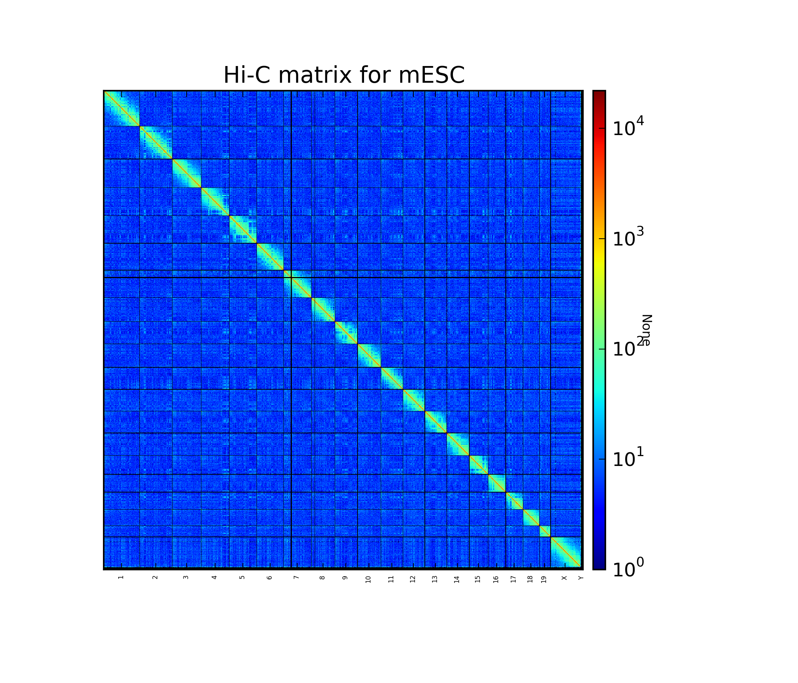
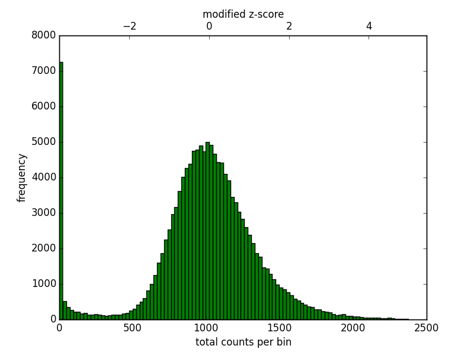
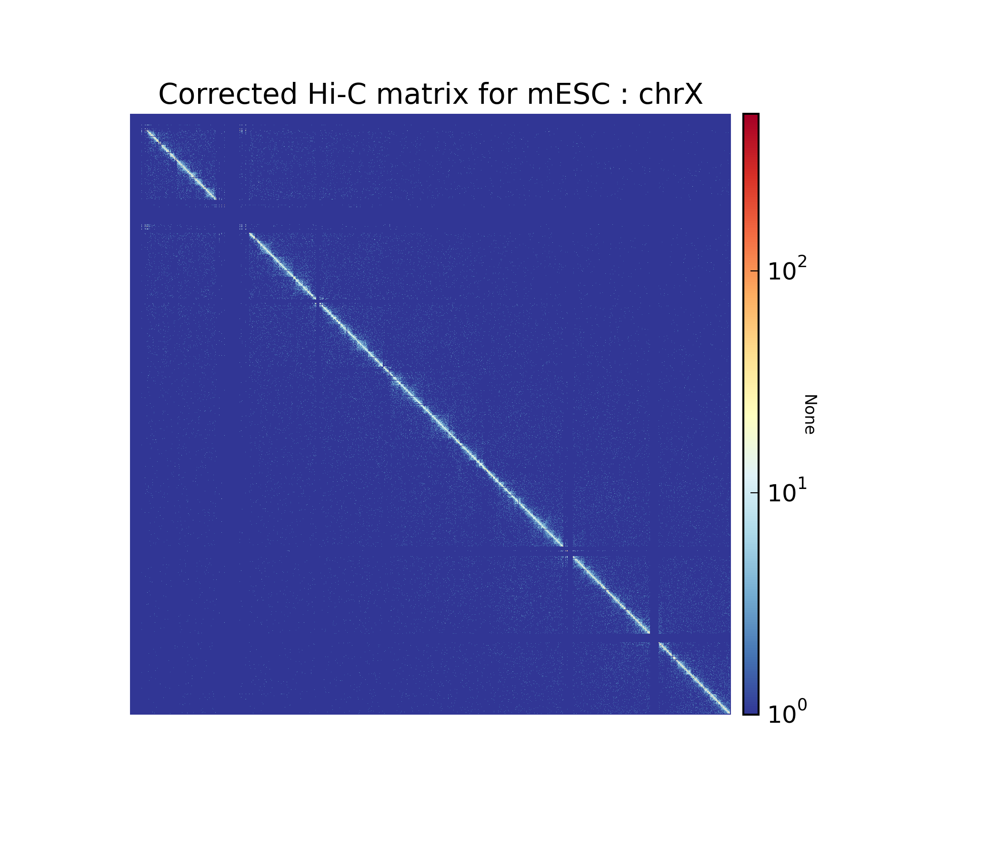
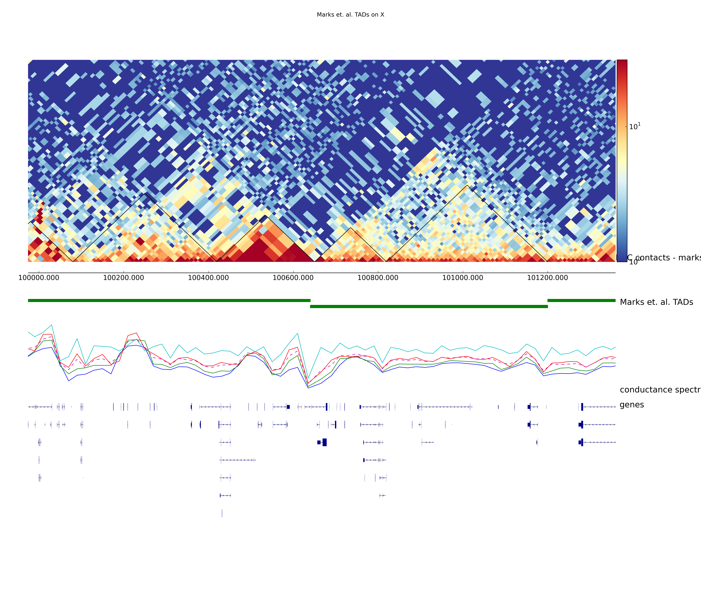
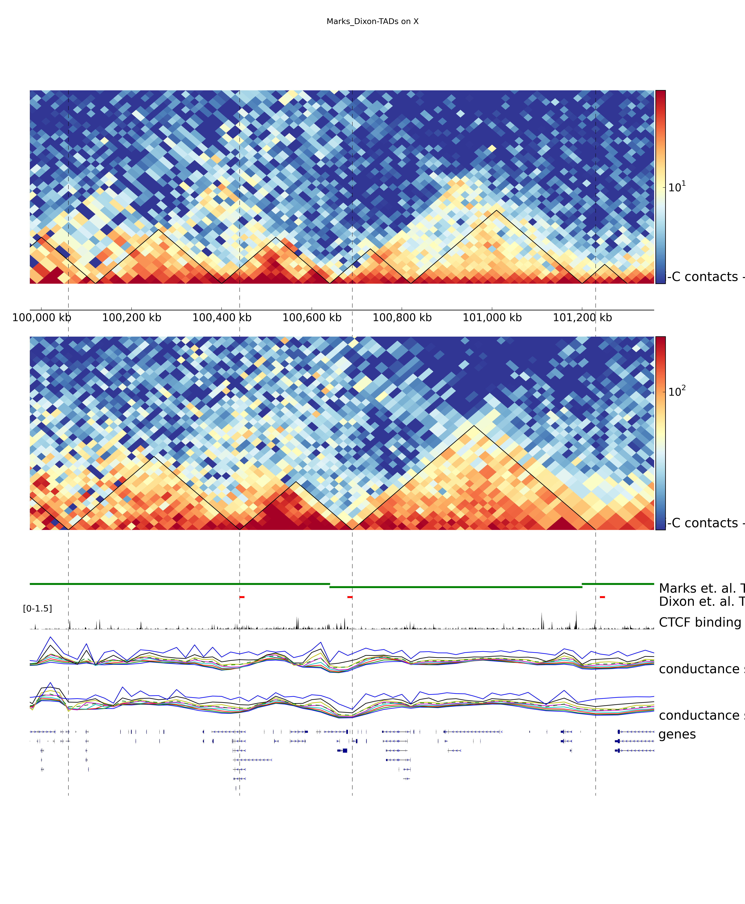

Hi-C analysis of mouse ESCs using HiC-Explorer
==============================================

The following example shows how we can use HiCExplorer to analyse a
published dataset. Here we are using a HiC dataset from `Marks et. al.
2015 <http://www.genomebiology.com/2015/16/1/149>`__, on mouse ESCs.

**Protocol** Collection of the cells for Hi-C and the Hi-C sample
preparation procedure was performed as previously described
`Lieberman-Aiden et
al. <http://www.sciencemag.org/content/326/5950/289.long>`__, with the
slight modification that *DpnII* was used as restriction enzyme during
initial digestion. Paired-end libraries were prepared according to
Lieberman-Aiden et al. and sequenced on the NextSeq 500 platform using 2
× 75 bp sequencing.

Prepare for analysis
--------------------

Install HiC explorer
~~~~~~~~~~~~~~~~~~~~

The following commands install HiCExplorar globally. In case you don't
have admin privileges, you can first install and setup a `virtual
environment <https://virtualenv.pypa.io/en/latest/>`__ for python, and
then install HiCExplorer inside the virtual environment.

.. code:: bash

    # To Clone and install in the ~/programs directory
    cd ~/programs
    git clone https://github.com/maxplanck-ie/HiCExplorer.git
    cd HiCExplorer.git
    python setup.py install
    ## now add HiCExplorer in $PATH
    export PATH=:$PATH

Download Raw fastq files
~~~~~~~~~~~~~~~~~~~~~~~~

Fastq files can be downloaded from the EBI archive (or NCBI archive).

.. code:: bash

    mkdir inputdir
    cd inputdir

    wget ftp://ftp.sra.ebi.ac.uk/vol1/fastq/SRR195/007/SRR1956527/SRR1956527_2.fastq.gz
    wget ftp://ftp.sra.ebi.ac.uk/vol1/fastq/SRR195/007/SRR1956527/SRR1956527_1.fastq.gz

    wget ftp://ftp.sra.ebi.ac.uk/vol1/fastq/SRR195/008/SRR1956528/SRR1956528_1.fastq.gz
    wget ftp://ftp.sra.ebi.ac.uk/vol1/fastq/SRR195/008/SRR1956528/SRR1956528_2.fastq.gz

    wget ftp://ftp.sra.ebi.ac.uk/vol1/fastq/SRR195/009/SRR1956529/SRR1956529_1.fastq.gz
    wget ftp://ftp.sra.ebi.ac.uk/vol1/fastq/SRR195/009/SRR1956529/SRR1956529_2.fastq.gz

Map Raw fastq files
~~~~~~~~~~~~~~~~~~~

The raw fastq files are now aligned to mouse genome. Here we will map
them to *GRCm37* using
`HISAT <https://ccb.jhu.edu/software/hisat/index.shtml>`__, a fast and
memory efficient read aligner.

The option : **--sensitive-local** is used, since we want local
alignment. In HiC, many reads in the read-pair overlap with their mates.
Using *local* alignment avoids the alignment of the end of the reads,
where the sequence might correspond to the read mate.

**--reorder** is used to get the reads in the sam file in the order they
are aligned in. HiCExplorer reads the alignment in this order.

Same options can be used with bowtie2 too.

.. code:: bash

    mkdir mapped_files

    for fq in $(ls ${inputdir} | grep '.fastq.gz')
    do fqbase=$(basename ${fq} .fastq.gz)
    /path/to/hisat/bin/hisat -x /path/to/hisat_index/prefix --sensitive-local --reorder -p 40 -U inputdir/${fq} -S mapped_files/${fqbase}.sam
    done

Build, visualize and correct Hi-C matrix
----------------------------------------

Create a Hi-C matrix using the aligned files
~~~~~~~~~~~~~~~~~~~~~~~~~~~~~~~~~~~~~~~~~~~~

Build restriction-site bed files
^^^^^^^^^^^^^^^^^^^^^^^^^^^^^^^^

Before creating the HiC matrix, we need to know the restriction cut
site. The program *findRestSite* creates it for us. It needs the
restriction sequence as input. Here `DpnII
sequence <https://www.neb.com/products/r0543-dpnii>`__ is used.

.. code:: bash

    findRestSite --fasta /path/to/GRCm37/genome_fasta/genome.fa --searchPattern GATC -o dpnII_positions_GRCm37.bed

    ## Sort the file
    sort -k1,1 -k2,2n dpnII_positions_GRCm37.bed > dpnII_positions_GRCm37-sorted.bed

Build Hi-C matrix
^^^^^^^^^^^^^^^^^

**hicBuildMatrix** builds the matrix of read counts over the bins in the
genome, considering the sites around the given restriction site. We need
to provide the input bams, the restriction site bed file [-rs],
restriction sequence [-seq] , binsize [-bs], name of output matrix file
[-o] and the name of output bam file (which contains the accepted
alignments) [-b] .

.. code:: bash

    mkdir hiCmatrix

    for SRR in SRR1956527 SRR1956528 SRR1956529;
    do hicBuildMatrix \
    -s mapped_files/${SRR}_1.bam mapped_files/${SRR}_2.bam \
    -bs 10000 \#-rs dpnII_positions_GRCm37-sorted.bed -seq GATC
    -b ${SRR}_ref.bam -o hiCmatrix/${SRR}.matrix & done

The output bam files show that we have around 34M, 54M and 58M selected
reads for SRR1956527, SRR1956528 & SRR1956529, respectively. Normally
25% of the total reads et selected.

The output matrices have counts for the genomic regions. The extention
of output matrix files is *.npz*.

Merge Matrices from Replicates
^^^^^^^^^^^^^^^^^^^^^^^^^^^^^^

To increase the depth of reads we merge the counts from these three
replicates.

.. code:: bash

    hicSumMatrices -m hiCmatrix/SRR1956527.matrix.npz hiCmatrix/SRR1956528.matrix.npz hiCmatrix/SRR1956529.matrix.npz -o hiCmatrix/replicateMerged.matrix

Correct Hi-C Matrix
^^^^^^^^^^^^^^^^^^^

**hiCorrectMatrix** corrects the matrix counts in an iterative manner.
For correcting the matrix, it's important to remove the unassembled
scaffolds (eg NT\_) and keep only chromosomes, as scaffolds create
problems with marix correction. Therefore we use the chromosome names
(1-19, X, Y) here.

.. code:: bash

    hicCorrectMatrix correct \
    --chromosomes 1 2 3 4 5 6 7 8 9 10 11 12 13 14 15 16 17 18 19 X Y \
    -m hiCmatrix/replicateMerged.matrix.npz -o hiCmatrix/replicateMerged.Corrected.npz

Plot Hi-C matrix
~~~~~~~~~~~~~~~~

since a big matrix takes too longs to plot, we merge the small bins into
larger one.

Merge matrix bins for plotting
^^^^^^^^^^^^^^^^^^^^^^^^^^^^^^

**hicMergeMatrixBins** merges the bins into larger bins of given number
(specified by -nb). We will merge the original (uncorrected) matrix and
then correct it.

.. code:: bash

    hicMergeMatrixBins \
    -m hiCmatrix/replicateMerged.matrix.npz -nb 100 \
    -o hiCmatrix/replicateMerged.matrix-100bins.npz

Correct the merged matrix
^^^^^^^^^^^^^^^^^^^^^^^^^

We will now correct the merged matrix befor plotting.

.. code:: bash

    hicCorrectMatrix correct \
    --chromosomes 1 2 3 4 5 6 7 8 9 10 11 12 13 14 15 16 17 18 19 X Y \
    -m hiCmatrix/replicateMerged.matrix-100bins.npz -o hiCmatrix/replicateMerged.Corrected-100bins.npz

Plot the corrected Hi-C Matrix
^^^^^^^^^^^^^^^^^^^^^^^^^^^^^^

**hicPlotMatrix** can plot the merged matrix. We use options :
**--log1p** to plot the log intensites and **dpi** in increase image
resolution

.. code:: bash

    mkdir plots
    hicPlotMatrix \
    --log1p --dpi 300 \
    -m hiCmatrix/replicateMerged.Corrected-100bins.npz \
    --chromosomeOrder 1 2 3 4 5 6 7 8 9 10 11 12 13 14 15 16 17 18 19 X Y \
    -o plots/replicateMerged_Corrected-100bins_plot.png

   corrected\_100kb\_plot

Remove outliers from hic-Matrix
~~~~~~~~~~~~~~~~~~~~~~~~~~~~~~~

Outliers can be removed by a cutoff after looking at the diagnostic plot
for **hicCorrectMatrix** (using **diagnostic\_plot** option). Here we
are using a matrix with 20kb bins (produced by *hicMergeMatrixBins -nb
2*), since 20kb seems to be decent resolution.

Select threshold for outlier removal
^^^^^^^^^^^^^^^^^^^^^^^^^^^^^^^^^^^^

Following is the disgnostic plot that shows a bimodal distribution. We
should remove the values from both lower and upper end of the
distribution.

.. code:: bash

    hicCorrectMatrix diagnostic_plot -m hiCmatrix/replicateMerged.matrix_20kb.npz -o plots/diagPlot-20kb.png

   diagplot

Correct matrix removing outliers
^^^^^^^^^^^^^^^^^^^^^^^^^^^^^^^^

Looking at the above distribution, we can select the value of -2 (lower
end) and 3 (upper end) to remove. This is given by the **-t** option in
hicCorrectMatrix.

.. code:: bash

    hicCorrectMatrix correct \
    --chromosomes 1 2 3 4 5 6 7 8 9 10 11 12 13 14 15 16 17 18 19 X Y \
    -m hiCmatrix/replicateMerged.matrix_20kb.npz \
    -t -2 3 --perchr -o hiCmatrix/replicateMerged.Corrected_20kb.npz

Plot corrected matrix
^^^^^^^^^^^^^^^^^^^^^

We can now plot the one of the chromosomes (eg. chromosome X) , with the
corrected matrix.

.. code:: bash

    hicPlotMatrix \
    --log1p --dpi 300 \
    -m hiCmatrix/replicateMerged.Corrected_20kb.npz \
    --region X -t "Corrected Hi-C matrix for mESC : chrX" \
    -o plots/replicateMerged_Corrected-20kb_plot-chrX.png

   correctMatrixPlot

Find and plot TADs
------------------

Find TADs
~~~~~~~~~

To find TADs we will first compute the TAD scores using hicFindTADs
**TAD\_score** option. It requires the minimum and maximum depth (window
length in base-pairs) to search around cut-points (bigger range will
find bigger TADs), and the step size (in base-pairs).

Then we find the TADs using hicFindTADs **find\_TADs** option.
Boundaries are discovered as local minima in a window. The *--lookahead*
option tells the number of bins to search before deciding the local
minima. Noise can be reduced by increasing the default *--delta* value.

.. code:: bash

    mkdir TADs
    hicFindTADs TAD_score -m hiCmatrix/replicateMerged.Corrected_20kb.npz \
    --minDepth 40000 --maxDepth 120000 -t 20 --step 20000 \
    -o TADs/marks_et-al_TADs_20kb-Bins

    hicFindTADs find_TADs -m hiCmatrix/replicateMerged.Corrected_20kb.npz \
    --lookahead 4 \
    --outPrefix TADs/marks_et-al_TADs_20kb-Bins

As an output we get the boundries and domains as seperate bed files.

Plot TADs
~~~~~~~~~

Build Tracks File
^^^^^^^^^^^^^^^^^

We can plot the TADs for a given chromosomal region. For this we need to
create a tracks file containing the instructions to build the plot. The
:doc:`tools/hicPlotTADs` documentation contains the instructions to build the track file.
A small example of a track file is:

.. code-block:: INI

   [x-axis]

   [hic track]
   file = hic.npz
   title = Hi-C
   colormap = RdYlBu_r
   depth = 1000000
   transform = log1p

   [genes]
   file = genes.bed
   title = genes
   color = darkblue
   width = 5
   type = genes

Plot
^^^^

Here I am plotting the TADs we have found (using 20kb bins) along with
the TADs found by Marks et. al., available as bed file
`here <http://www.ncbi.nlm.nih.gov/geo/query/acc.cgi?acc=GSM1652666>`__
and GRCm37\_genes.bed file (from ensembl).

.. code:: bash

    hicPlotTADs --tracks tracks_toPlot/tracks_2.txt \
    --region X:99974316-101359967 --dpi 300 \
    -out plots/marks_et-al_TADs.png -t "Marks et. al. TADs on X"

   TADplot
   
Comparing Marks et. al. and Dixon et. al.
^^^^^^^^^^^^^^^^^^^^^^^^^^^^^^^^^^^^^^^^^

We analysed the mESC Hi-C data from `Dixon et.
al <http://www.nature.com/nature/journal/v485/n7398/full/nature11082.html>`__
using Hi-C explorer, and compared it to Marks et. al. dataset. For this
we mapped the reads using bowtie and prepared 20kb matrices. Following
is the plot showing the TADs on the X chromosomes, at 1.2 MB region
around Xist (the X Inactivation Center).

We have plotted here the Hi-C tracks from both the studies, containing
TADs as triangles, detected by Hi-C explorer, along with the boundaries
as bed files provided with the studies, normalized CTCF signal from
ENCODE, spectrum of Hi-C signal produced by *hicFindTADs*, and a
genes.bed file from ensembl.

   TADplot2
