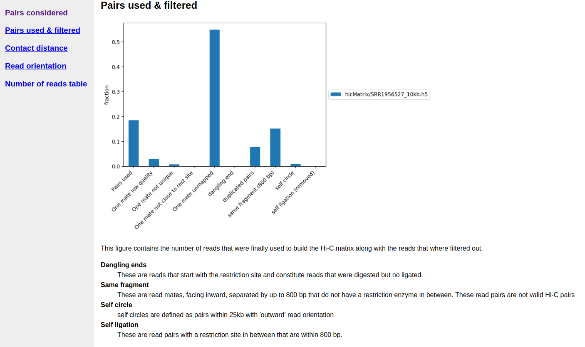
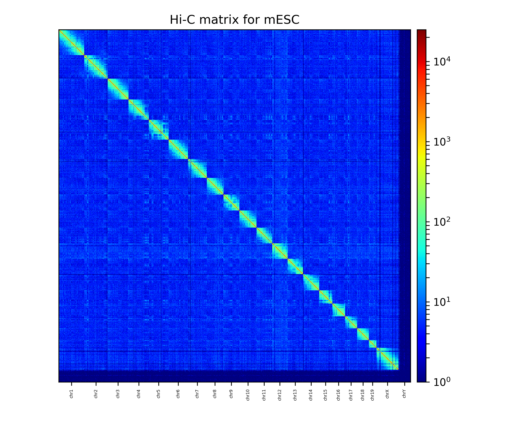
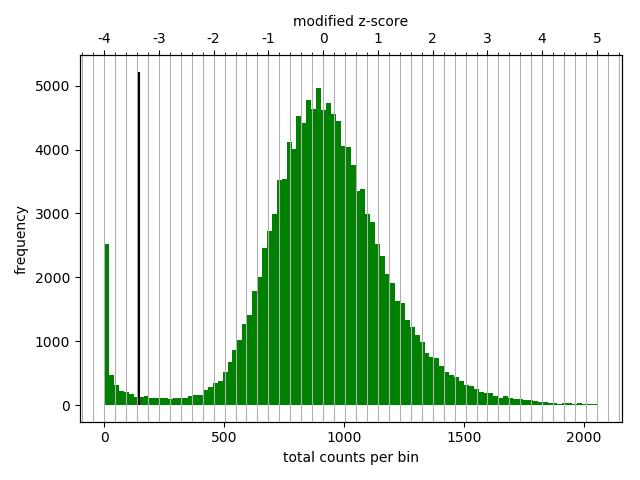
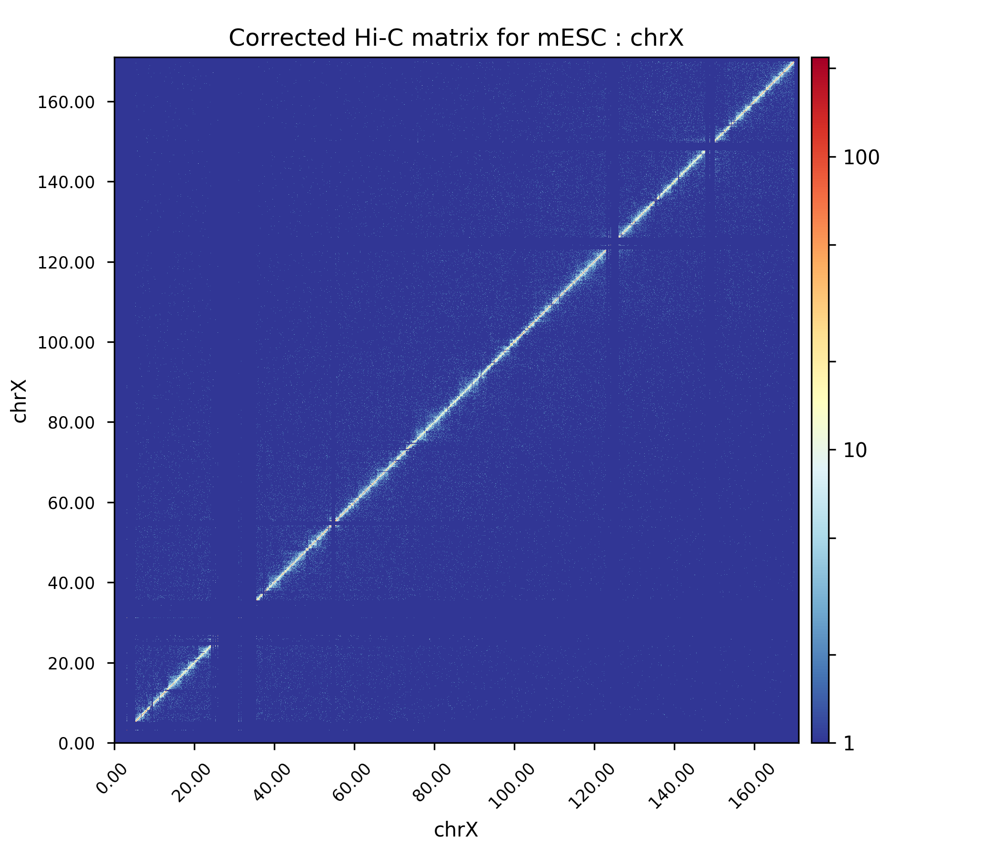

Hi-C analysis of mouse ESCs using HiCExplorer
==============================================

The following example shows how we can use HiCExplorer to analyze a
published dataset. Here we are using a Hi-C dataset from `Marks et. al.
2015 <http://www.genomebiology.com/2015/16/1/149>`__, on mouse ESCs.

Protocol
--------

The collection of the cells for Hi-C and the Hi-C sample
preparation procedure was performed as previously described
`Lieberman-Aiden et
al. <http://www.sciencemag.org/content/326/5950/289.long>`__, with the
slight modification that *DpnII* was used as restriction enzyme during
initial digestion. Paired-end libraries were prepared according to
Lieberman-Aiden et al. and sequenced on the NextSeq 500 platform using 2
× 75 bp sequencing.

Prepare for analysis
--------------------

Download Raw fastq files
~~~~~~~~~~~~~~~~~~~~~~~~

The fastq files can be downloaded from the EBI archive (or NCBI archive). We will store the files in the directory *original_data*.

.. code:: bash

    mkdir original_data

    wget ftp://ftp.sra.ebi.ac.uk/vol1/fastq/SRR195/007/SRR1956527/SRR1956527_1.fastq.gz -O original_data/SRR1956527_1.fastq.gz
    wget ftp://ftp.sra.ebi.ac.uk/vol1/fastq/SRR195/007/SRR1956527/SRR1956527_2.fastq.gz -O original_data/SRR1956527_2.fastq.gz

    wget ftp://ftp.sra.ebi.ac.uk/vol1/fastq/SRR195/008/SRR1956528/SRR1956528_1.fastq.gz -O original_data/SRR1956528_1.fastq.gz
    wget ftp://ftp.sra.ebi.ac.uk/vol1/fastq/SRR195/008/SRR1956528/SRR1956528_2.fastq.gz -O original_data/SRR1956528_2.fastq.gz

    wget ftp://ftp.sra.ebi.ac.uk/vol1/fastq/SRR195/009/SRR1956529/SRR1956529_1.fastq.gz -O original_data/SRR1956529_1.fastq.gz
    wget ftp://ftp.sra.ebi.ac.uk/vol1/fastq/SRR195/009/SRR1956529/SRR1956529_2.fastq.gz -O original_data/SRR1956529_2.fastq.gz

Create an index 
~~~~~~~~~~~~~~~

We start with creating an index for our alignment software for the *GRCm38/mm10* genome. 
As a source we use the mm10 genome from `UCSC <http://hgdownload-test.cse.ucsc.edu/goldenPath/mm10/bigZips/>`__

.. code:: bash

    mkdir genome_mm10
    wget http://hgdownload-test.cse.ucsc.edu/goldenPath/mm10/bigZips/chromFa.tar.gz -O genome_mm10/chromFa.tar.gz
    tar -xvzf genome_mm10/chromFa.tar.gz
    cat genome_mm10/*.fa > genome_mm10/mm10.fa

We have the mm10 genome stored in one fasta file and can build the index. We tried it successfully with `hisat2`, `bowtie2` and `bwa`. Run the mapping 
with one of them and do not mix them!

hisat2
^^^^^^^

.. code:: bash

    hisat2-build -p 8 genome_mm10/mm10.fa hisat2/mm10_index 

You can find more information about `hisat <https://ccb.jhu.edu/software/hisat2/manual.shtml>`__

bowtie2
^^^^^^^^
.. code:: bash

    bowtie2-build genome_mm10/mm10.fa bowtie2/mm10_index --threads 8

You can find more information about `bowtie <http://bowtie-bio.sourceforge.net/bowtie2/manual.shtml>`__

bwa
^^^^
.. code:: bash

    bwa index -p bwa/mm10_index genome_mm10/mm10.fa

You can find more information about `bwa <http://bio-bwa.sourceforge.net/bwa.shtml>`__

Mapping the RAW files
~~~~~~~~~~~~~~~~~~~~~

Mates have to be mapped individually to avoid mapper specific heuristics designed
for standard paired-end libraries.

It is important to have in mind for the different mappers:

 * for either `bowtie2` or `hisat2` use the `--reorder` parameter which tells bowtie2 or hisat2 to output
   the *sam* files in the **exact** same order as in the *.fastq* files.
 * use local mapping, in contrast to end-to-end. A fraction of Hi-C reads are chimeric and will not map end-to-end
   thus, local mapping is important to increase the number of mapped reads.
 * Tune the aligner parameters to penalize deletions and insertions. This is important to avoid aligned reads with
   gaps if they happen to be chimeric.

hisat2
^^^^^^

.. code:: bash

    hisat2 -x hisat2/mm10_index --threads 8 -U ../original_data/SRR1956527_1.fastq.gz --reorder | samtools view -Shb - > SRR1956527_1.bam 
    hisat2 -x hisat2/mm10_index --threads 8 -U ../original_data/SRR1956527_2.fastq.gz --reorder | samtools view -Shb - > SRR1956527_2.bam 
    hisat2 -x hisat2/mm10_index --threads 8 -U ../original_data/SRR1956528_1.fastq.gz --reorder | samtools view -Shb - > SRR1956528_1.bam 
    hisat2 -x hisat2/mm10_index --threads 8 -U ../original_data/SRR1956528_2.fastq.gz --reorder | samtools view -Shb - > SRR1956528_2.bam 
    hisat2 -x hisat2/mm10_index --threads 8 -U ../original_data/SRR1956529_1.fastq.gz --reorder | samtools view -Shb - > SRR1956529_1.bam 
    hisat2 -x hisat2/mm10_index --threads 8 -U ../original_data/SRR1956529_2.fastq.gz --reorder | samtools view -Shb - > SRR1956529_2.bam 
    
bowtie2
^^^^^^^^

.. code:: bash

    bowtie2 -x bowtie2/mm10_index --threads 8 -U ../original_data/SRR1956527_1.fastq.gz --reorder | samtools view -Shb - > SRR1956527_1.bam
    bowtie2 -x bowtie2/mm10_index --threads 8 -U ../original_data/SRR1956527_2.fastq.gz --reorder | samtools view -Shb - > SRR1956527_2.bam 
    bowtie2 -x bowtie2/mm10_index --threads 8 -U ../original_data/SRR1956528_1.fastq.gz --reorder | samtools view -Shb - > SRR1956528_1.bam 
    bowtie2 -x bowtie2/mm10_index --threads 8 -U ../original_data/SRR1956528_2.fastq.gz --reorder | samtools view -Shb - > SRR1956528_2.bam 
    bowtie2 -x bowtie2/mm10_index --threads 8 -U ../original_data/SRR1956529_1.fastq.gz --reorder | samtools view -Shb - > SRR1956529_1.bam 
    bowtie2 -x bowtie2/mm10_index --threads 8 -U ../original_data/SRR1956529_2.fastq.gz --reorder | samtools view -Shb - > SRR1956529_2.bam 
    

.. code:: bash

    bwa mem -A 1 -B 4 -E 50 -L 0 -t 8 bwa/mm10_index original_data/SRR1956527_1.fastq.gz | samtools view -Shb - > SRR1956527_1.bam 
    bwa mem -A 1 -B 4 -E 50 -L 0 -t 8 bwa/mm10_index original_data/SRR1956527_2.fastq.gz | samtools view -Shb - > SRR1956527_2.bam 
    bwa mem -A 1 -B 4 -E 50 -L 0 -t 8 bwa/mm10_index original_data/SRR1956528_1.fastq.gz | samtools view -Shb - > SRR1956528_1.bam 
    bwa mem -A 1 -B 4 -E 50 -L 0 -t 8 bwa/mm10_index original_data/SRR1956528_2.fastq.gz | samtools view -Shb - > SRR1956528_2.bam 
    bwa mem -A 1 -B 4 -E 50 -L 0 -t 8 bwa/mm10_index original_data/SRR1956529_1.fastq.gz | samtools view -Shb - > SRR1956529_1.bam 
    bwa mem -A 1 -B 4 -E 50 -L 0 -t 8 bwa/mm10_index original_data/SRR1956529_2.fastq.gz | samtools view -Shb - > SRR1956529_2.bam 

Build, visualize and correct Hi-C matrix
----------------------------------------

Create a Hi-C matrix using the aligned files
~~~~~~~~~~~~~~~~~~~~~~~~~~~~~~~~~~~~~~~~~~~~
In the following we will create three Hi-C matrices and merge them to one. 

Build Hi-C matrix
^^^^^^^^^^^^^^^^^

:ref:`hicBuildMatrix` builds the matrix of read counts over the bins in the
genome, considering the sites around the given restriction site. We need
to provide:

* the input BAM/SAM files: `--samFiles SRR1956527_1.sam SRR1956527_2.sam`
* binsize: `--binSize 1000`
* restriction sequence: `--restrictionSequence GATC`
* the name of output bam file which contains the accepted alignments: `--outBam SRR1956527_ref.bam`
* name of output matrix file: `--outFileName hicMatrix/SRR1956527_10kb.h5` 
* the folder for the quality report: `--QCfolder hicMatrix/SRR1956527_QC`
* the number of to be used threads. Minimum value is 3: `--threads 8`
* the buffer size for each thread buffering `inputBufferSize` lines of each input BAM/SAM file: `--inputBufferSize 400000`

To build the Hi-C matrices:

.. code:: bash

    mkdir hicMatrix
    hicBuildMatrix --samFiles SRR1956527_1.bam SRR1956527_2.bam --binSize 10000 --restrictionSequence GATC --outBam SRR1956527_ref.bam --outFileName hicMatrix/SRR1956527_10kb.h5 --QCfolder hicMatrix/SRR1956527_10kb_QC --threads 8 --inputBufferSize 400000
    hicBuildMatrix --samFiles SRR1956528_1.bam SRR1956528_2.bam --binSize 10000 --restrictionSequence GATC --outBam SRR1956528_ref.bam --outFileName hicMatrix/SRR1956528_10kb.h5 --QCfolder hicMatrix/SRR1956528_10kb_QC --threads 8 --inputBufferSize 400000
    hicBuildMatrix --samFiles SRR1956529_1.bam SRR1956529_2.bam --binSize 10000 --restrictionSequence GATC --outBam SRR1956529_ref.bam --outFileName hicMatrix/SRR1956529_10kb.h5 --QCfolder hicMatrix/SRR1956529_10kb_QC --threads 8 --inputBufferSize 400000
    

The output bam files show that we have around 34M, 54M and 58M selected
reads for SRR1956527, SRR1956528 & SRR1956529, respectively. Normally
25% of the total reads are selected. The output matrices have counts for the genomic regions. The extension
of output matrix files is *.h5*.

A quality report is created in e.g. `hicMatrix/SRR1956527_10kb_QC`, have a look at the report `hicQC.html`.

   A segment of Hi-C quality report.

Merge (sum) matrices from replicates
^^^^^^^^^^^^^^^^^^^^^^^^^^^^^^^^^^^^

To increase the depth of reads we merge the counts from these three
replicates.

.. code:: bash

    hicSumMatrices --matrices hicMatrix/SRR1956527_10kb.h5 hicMatrix/SRR1956528_10kb.h5 \
            hicMatrix/SRR1956529_10kb.h5 --outFileName hicMatrix/replicateMerged_10kb.h5

Plot Hi-C matrix
~~~~~~~~~~~~~~~~

A 10kb bin matrix is quite large to plot and is better to reduce the resolution (to know the size
of a Hi-C matrix use the tool :ref:`hicInfo`), i.e. we usually run out of memory for a 1 kb or a 10 kb matrix and second, the 
time to plot is very long (minutes instead of seconds). For this we use the tool :ref:`hicMergeMatrixBins`. 

Merge matrix bins for plotting
^^^^^^^^^^^^^^^^^^^^^^^^^^^^^^

:ref:`hicMergeMatrixBins` merges the bins into larger bins of given number
(specified by `--numBins`). We will merge 1000 bins in the original (uncorrected) matrix and
then correct it. The new bin size is going to be 10.000 bp * 100 = 1.000.000 bp = 1 Mb

.. code:: bash

    hicMergeMatrixBins \
    --matrix hicMatrix/replicateMerged_10kb.h5 --numBins 100 \
    --outFileName hicMatrix/replicateMerged.100bins.h5

Plot the corrected Hi-C matrix
^^^^^^^^^^^^^^^^^^^^^^^^^^^^^^

**hicPlotMatrix** can plot the merged matrix. We use the following options:

    * the matrix to plot: `--matrix hicMatrix/replicateMerged.100bins.h5`
    * logarithmic values for plotting: `--log1p`
    * the resolution of the plot: `--dpi 300`
    * masked bins should not be plotted: `--clearMaskedBins`
    * the order of the chromosomes in the plot: `--chromosomeOrder chr1 chr2 chr3 chr4 chr5 chr6 chr7 chr8 chr9 chr10 chr11 chr12 chr13 chr14 chr15 chr16 chr17 chr18 chr19 chrX chrY`
    * the color map: `--colorMap jet`
    * the title of the plot: `--title "Hi-C matrix for mESC"`
    * the plot image itself: `--outFileName plots/plot_1Mb_matrix.png`

.. code:: bash

    mkdir plots
    hicPlotMatrix \
    --matrix hicMatrix/replicateMerged.100bins.h5 \
    --log1p \
    --dpi 300 \
    --clearMaskedBins \
    --chromosomeOrder chr1 chr2 chr3 chr4 chr5 chr6 chr7 chr8 chr9 chr10 chr11 chr12 chr13 chr14 chr15 chr16 chr17 chr18 chr19 chrX chrY \
    --colorMap jet \
    --title "Hi-C matrix for mESC" \
    --outFileName plots/plot_1Mb_matrix.png 
    

   The Hi-C interaction matrix with a resolution of 1 MB. 

Correct Hi-C Matrix
^^^^^^^^^^^^^^^^^^^

:ref:`hicCorrectMatrix` corrects the matrix counts in an iterative manner.
For correcting the matrix, it's important to remove the unassembled
scaffolds (e.g. NT\_) and keep only chromosomes, as scaffolds create
problems with matrix correction. Therefore we use the chromosome names
(1-19, X, Y) here. **Important:** Use 'chr1 chr2 chr3 etc.' if your genome index uses
chromosome names with the 'chr' prefix.

Matrix correction works in two steps: first a histogram containing the sum of contact per bin (row sum) is
produced. This plot needs to be inspected to decide the best threshold for removing bins with lower number of reads. The
second steps removes the low scoring bins and does the correction.

In the following we will use a matrix with a bin size of 20 kb: 10kb * 2 = 20 kb 

.. code:: bash

    hicMergeMatrixBins \
    --matrix hicMatrix/replicateMerged_10kb.h5 --numBins 2 \
    --outFileName hicMatrix/replicateMerged.matrix_20kb.h5

(1-19, X, Y) variant:

.. code:: bash

    hicCorrectMatrix diagnostic_plot \
    --chromosomes 1 2 3 4 5 6 7 8 9 10 11 12 13 14 15 16 17 18 19 X Y \
    --matrix hicMatrix/replicateMerged.matrix_20kb.h5 --plotName hicMatrix/diagnostic_plot.png

(chr1-ch19, chrX, chrY) variant:

.. code:: bash

    hicCorrectMatrix diagnostic_plot \
    --chromosomes chr1 chr2 chr3 chr4 chr5 chr6 chr7 chr8 chr9 chr10 chr11 chr12 chr13 chr14 chr15 chr16 chr17 chr18 chr19 chrX chrY \
    --matrix hicMatrix/replicateMerged.matrix_20kb.h5 --plotName hicMatrix/diagnostic_plot.png

   Diagnostic plot for the Hi-C matrix at a resolution of 20 kb

The output of the program prints a threshold suggestion that is usually accurate but is better to
revise the histogram plot. The threshold is visualized in the plot as a black vertical line. See :ref:`example_usage` for an example and for more info.

The threshold parameter needs two values: 
    * low z-score
    * high z-score

"The absolute value of z represents the distance between the raw score and the population mean in units of the standard deviation. z is negative when the raw score is below the mean, positive when above."
(`Source <https://en.wikipedia.org/wiki/Standard_score#Calculation_from_raw_score>`__). For more information see `wikipedia <https://en.wikipedia.org/wiki/Standard_score>`__. 

   The z-score definition.

In our case the distribution describes the counts per bin of a genomic distance. To remove all bins with a z-score threshold less / more than X
means to remove all bins which have less / more counts than X of mean of their specific distribution in units of the standard deviation. 

Looking at the above distribution, we can select the value of -2 (lower
end) and 3 (upper end) to remove. This is given by the **--filterThreshold** option in
hicCorrectMatrix.

(1-19, X, Y) variant:

.. code:: bash

    hicCorrectMatrix correct \
    --chromosomes 1 2 3 4 5 6 7 8 9 10 11 12 13 14 15 16 17 18 19 X Y \
    --matrix hicMatrix/replicateMerged.matrix_20kb.h5 \
    --filterThreshold -2 3 --perchr --outFileName hicMatrix/replicateMerged.Corrected_20kb.h5

(chr1-ch19, chrX, chrY) variant:

.. code:: bash

    hicCorrectMatrix correct \
    --chromosomes chr1 chr2 chr3 chr4 chr5 chr6 chr7 chr8 chr9 chr10 chr11 chr12 chr13 chr14 chr15 chr16 chr17 chr18 chr19 chrX chrY \
    --matrix hicMatrix/replicateMerged.matrix_20kb.h5 \
    --filterThreshold -2 3 --perchr --outFileName hicMatrix/replicateMerged.Corrected_20kb.h5

It can happen that the correction stops with:

.. code:: bash

    `ERROR:iterative correction:*Error* matrix correction produced extremely large values. 
    This is often caused by bins of low counts. Use a more stringent filtering of bins.`

This can be solved by a more stringent z-score values for the filter threshold or by a look at the plotted matrix. In our case 
we see that chromosome Y is having more or less 0 counts in its bins. This chromosome can be excluded from the correction by not
defining it for the set of chromosomes that should be corrected, parameter `--chromosomes`.

Plot corrected matrix
^^^^^^^^^^^^^^^^^^^^^

We can now plot the one of the chromosomes (e.g. chromosome X) , with the
corrected matrix.

New parameter:
    * The region to plot: `--region chrX:10000000-2000000` or `--region chrX`

(1-19, X, Y) variant:

.. code:: bash

    hicPlotMatrix \
    --log1p --dpi 300 \
    -matrix hicMatrix/replicateMerged.Corrected_20kb.npz \
    --region X --title "Corrected Hi-C matrix for mESC : chrX" \
    --outFileName plots/replicateMerged_Corrected-20kb_plot-chrX.png

(chr1-ch19, chrX, chrY) variant:

.. code:: bash

    hicPlotMatrix \
    --log1p --dpi 300 \
    --matrix hicMatrix/replicateMerged.Corrected_20kb.npz \
    --region chrX --title "Corrected Hi-C matrix for mESC : chrX" \
    --outFileName plots/replicateMerged_Corrected-20kb_plot-chrX.png

   The Hi-C interaction matrix for chromosome X.

Plot TADs
---------

"The partitioning of chromosomes into topologically associating domains (TADs) is an
emerging concept that is reshaping our understanding of gene regulation in the context of
physical organization of the genome" [`Ramirez et al. 2017 <https://doi.org/10.1101/115063>`__].

Find TADs
~~~~~~~~~

TAD calling works in two steps: First HiCExplorer computes a TAD-separation score based on a z-score matrix for
all bins. Then those bins having a local minimum of the TAD-separation score are evaluated with respect to the
surrounding bins to decide assign a p-value. Then a cutoff is applied to select the bins more likely to be TAD
boundaries.

:ref:`hicFindTADs` tries to identify sensible parameters but those can be change to identify more stringent set of
boundaries.

.. code-block:: bash

    mkdir TADs
    hicFindTADs --matrix hicMatrix/replicateMerged.Corrected_20kb.h5 \
    --minDepth 60000 --maxDepth 120000 --numberOfProcessors 8 --step 20000 \
    --outPrefix TADs/marks_et-al_TADs_20kb-Bins  --minBoundaryDistance 80000 \
    --correctForMultipleTesting fdr --threshold 0.05

As an output we get the boundaries, domains and scores separated files. We will use in the plot below only
the TAD-score file.

Build Tracks File
~~~~~~~~~~~~~~~~~

We can plot the TADs for a given chromosomal region. For this we need to
create a track file containing the instructions to build the plot. The
:doc:`tools/hicPlotTADs` documentation contains the instructions to build the track file.

In following plot we will use the listed track file. Please store it as track.ini.

.. code-block:: INI

    [hic]
    file = hicMatrix/replicateMerged.Corrected_20kb.h5
    title = HiC mESC chrX:99974316-101359967 
    colormap = RdYlBu_r
    depth = 2000000
    height = 7
    transform = log1p
    x labels = yes
    type = interaction
    file_type = hic_matrix
   
    [tads]
    file = TADs/marks_et-al_TADs_20kb-Bins_domains.bed
    file_type = domains
    border color = black
    color = none
    height = 5
    line width = 1.5
    overlay previous = share-y
    show data range = no

    [x-axis]
    fontsize=16
    where=top

    [tad score]
    file = TADs/marks_et-al_TADs_20kb-Bins_score.bedgraph
    title = "TAD separation score"
    height = 2
    type = lines
    color = blue
    file_type = bedgraph

    [spacer]

    [gene track]
    file = mm10_genes_sorted.bed
    height = 10
    title = "mm10 genes"
    labels = off
  

We used as a gene track `mm10 genes <https://github.com/lucapinello/Haystack/blob/master/gene_annotations/mm10_genes.bed>`__ and
sorted with `sortBed` from `bedtools`.

Plot
~~~~

We plot the result with:

(1-19, X, Y) variant:

.. code:: bash

    hicPlotTADs --tracks track.ini --region X:98000000-105000000 \
    --dpi 300 --outFileName plots/marks_et-al_TADs.png \
    --title "Marks et. al. TADs on X"

(chr1-ch19, chrX, chrY) variant:

.. code:: bash

    hicPlotTADs --tracks track.ini --region chrX:98000000-105000000 \
    --dpi 300 --outFileName plots/marks_et-al_TADs.png \
    --title "Marks et. al. TADs on X"

The result is:

.. figure:: ../images/marks_et-al_TADs.png
   :alt: TADplot

   TADplot

.. Here I am plotting the TADs we have found (using 20kb bins) along with
.. the TADs found by Marks et. al., available as bed file
.. `here <http://www.ncbi.nlm.nih.gov/geo/query/acc.cgi?acc=GSM1652666>`__
.. and GRCm37\_genes.bed file (from ensembl).

.. .. code:: bash

..    hicPlotTADs --tracks tracks_toPlot/tracks_2.txt \
..    --region X:99974316-101359967 --dpi 300 \
..    -out plots/marks_et-al_TADs.png -t "Marks et. al. TADs on X"

.. .. figure:: ./plots/marks_et-al_TADs.png
..   :alt: TADplot

..   TADplot

.. .. code:: bash

..     hicPlotTADs --tracks track.ini --region chrX:95000000-110000000 \
..     --dpi 300 -out plots/marks_et-al_TADs.png \
..     -t "Marks et. al. TADs on X"

.. Comparing Marks et. al. and Dixon et. al.
.. ^^^^^^^^^^^^^^^^^^^^^^^^^^^^^^^^^^^^^^^^^

.. We analyzed the mESC Hi-C data from `Dixon et.
.. al <http://www.nature.com/nature/journal/v485/n7398/full/nature11082.html>`__
.. using HiCExplorer, and compared it to Marks et al. dataset. For this
.. we mapped the reads using bowtie and prepared 20kb matrices. Following
.. is the plot showing the TADs on the X chromosomes, at 1.2 MB region
.. around Xist (the X Inactivation Center).

.. We have plotted here the Hi-C tracks from both the studies, containing
.. TADs as triangles, detected by HiCExplorer, along with the boundaries
.. as bed files provided with the studies, normalized CTCF signal from
.. ENCODE, spectrum of Hi-C signal produced by *hicFindTADs*, and a
.. genes.bed file from ensembl.

.. .. figure:: ./plots/Marks-Dixon_TADs.png
..   :alt: TADplot2

..   TADplot2
