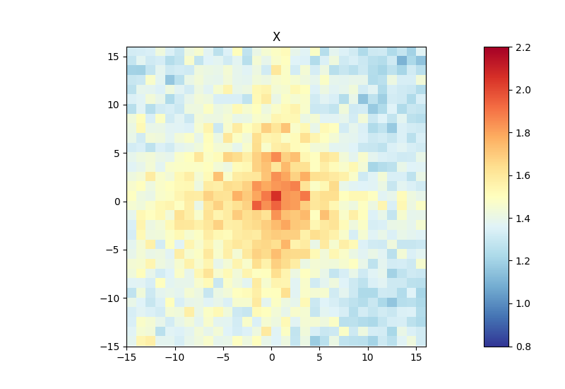

.. _hicAggregateContacts:

hicAggregateContacts
====================

.. contents::
    :local:

Background
^^^^^^^^^^

``hicAggregateContacts`` is a tool that allows plotting of aggregated Hi-C sub-matrices of a specified list of positions. Positions of interest can for example be binding sites of a specific protein that were determined by ChIP-seq or genetic elements as transcription start sites of active genes.

Description
^^^^^^^^^^^

.. argparse::
   :ref: hicexplorer.hicAggregateContacts.parse_arguments
   :prog: hicAggregateContacts

Usage example
^^^^^^^^^^^^^

Below, you can find an example of an aggregate Hi-C matrix obtained from *Drosophila melanogaster* Hi-C data. The interactions are plotted at binding sites of a protein that were determined by ChIP-seq. We plot sub-matrices of 30 bins (1.5 kb bin size, 45 kb in total). The regions specified in the BED file will be centered between half number of bins and the other half number of bins.The considered range is 300-1000 kb. The range should be adjusted and only contain contacts larger than TAD size to reduce background interactions.

.. code-block:: bash

    $ hicAggregateContacts --matrix Dmel.h5 --BED ChIP-seq-peaks.bed \
    --outFileName Dmel_aggregate_Contacts --vMin 0.8 --vMax 2.2 \
    --range 300000:1000000 --numberOfBins 30 --chromosomes X \
    --operationType mean --transform obs/exp --mode intra-chr

This example was calculated using mean interactions of an observed vs expected transformed Hi-C matrix. Additional options for the matrix transformation are total-counts or z-score. Aggregate contacts can be plotted in 2D or 3D.
