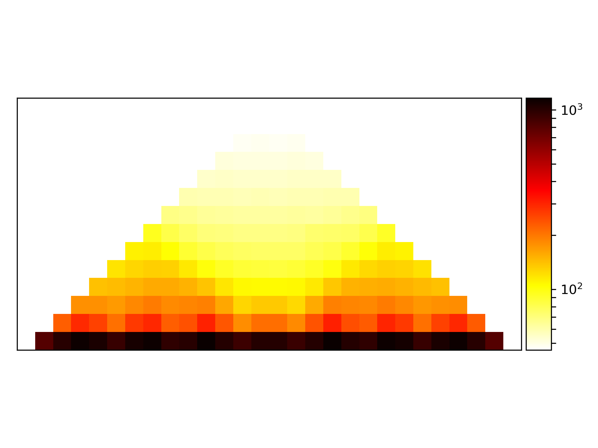

.. _hicAverageRegions:

hicAverageRegions
=================

.. argparse::
   :ref: hicexplorer.hicAverageRegions.parse_arguments
   :prog: hicAverageRegions

hicAverageRegions takes as input a BED files with genomic positions, these are the reference points to sum up and 
average the regions up- and downstream of all these positions, good reference points are e.g. the borders of TADs. This
can help to determine changes in the chromatin organization and TAD structure changes. 

In the following example the 10kb resolution interaction matrix of `Rao 2014 <https://www.ncbi.nlm.nih.gov/geo/query/acc.cgi?acc=GSE63525>`_ is used. 

The first step computes the TADs for chromosome 1.

.. code:: bash

    $ hicFindTADs -m GSE63525_GM12878_insitu_primary_10kb_KR.cool --outPrefix TADs 
        --correctForMultipleTesting fdr --minDepth 30000 --maxDepth 100000 
        --step 10000 -p 20 --chromosomes 1

Next, we use the `domains.bed` file of hicFindTADs to use the borders of TADs as reference points.
As a range up- and downstream of each reference point 100kb are chosen. 

.. code:: bash

    $ hicAverageRegions -m GSE63525_GM12878_insitu_primary_10kb_KR.cool 
        -r TADs_domains.bed --range 100000 100000 --outFileName primary_chr1

In a last step, the computed average region is plotted.

.. code:: bash

    $ hicPlotAverageRegions -m primary_chr1.npz -o primary_chr1.png

