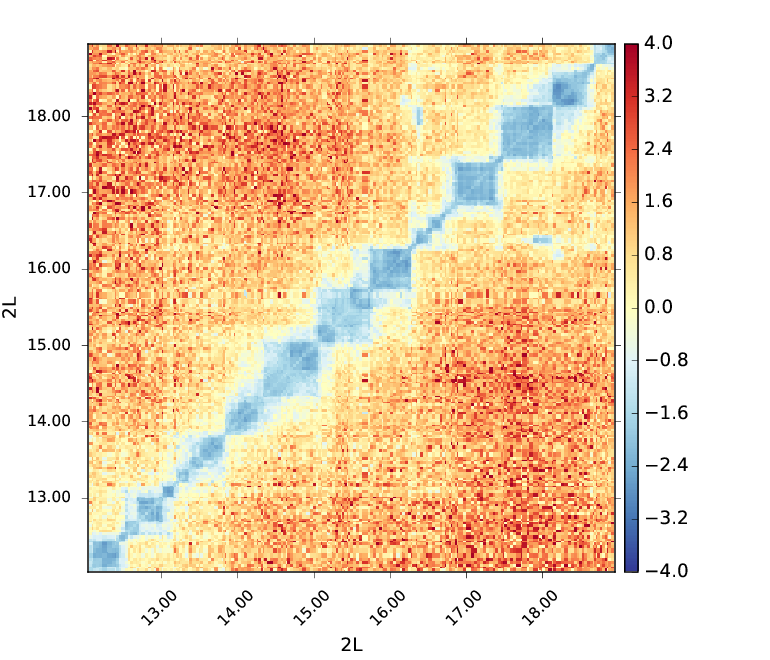
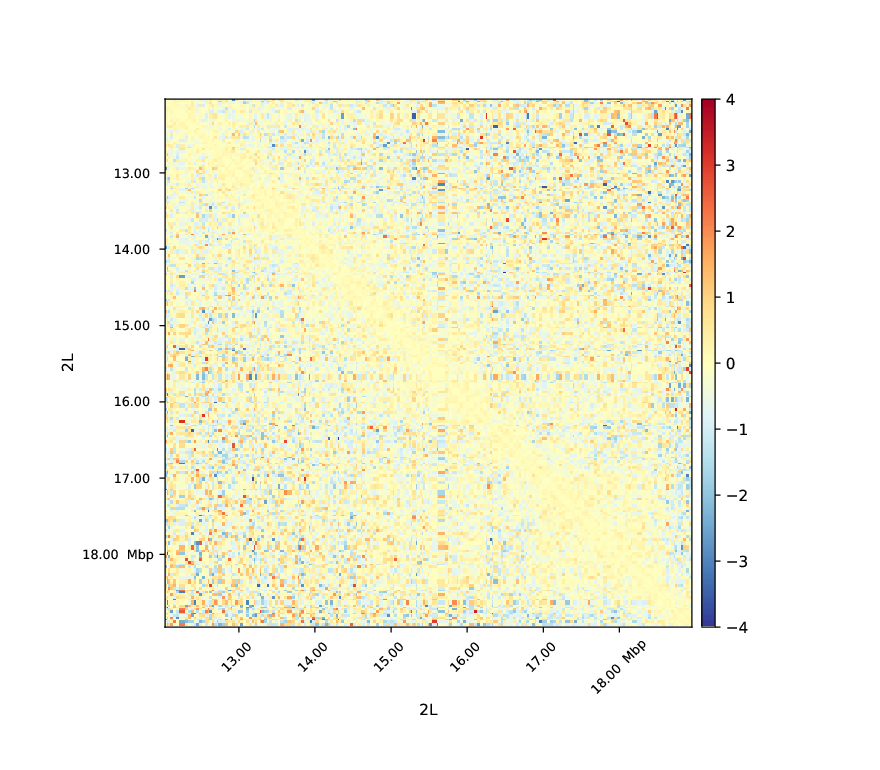

.. _hicCompareMatrices:

hicCompareMatrices
================

.. contents:: 
    :local:

Background
^^^^^^^^^^

This tool is useful to compare two matrices in .h5 format by applying operations like difference, ratio or log2ratio after normalization. This can be used to determine the effect of a mutation compared to wild-type samples on contact enrichment, or to see TAD structure modifications near differentially expressed genes between two conditions when followed by :doc:`hicPlotMatrix`. It can also be used to compare two biological replicates.

Description
^^^^^^^^^^^

.. argparse::
   :ref: hicexplorer.hicCompareMatrices.parse_arguments
   :prog: hicCompareMatrices

Usage example
^^^^^^^^^^^^^

``hicCompareMatrices`` is usually perfomed on corrected matrices (:doc:`hicCorrectMatrix`) with bins merged (:doc:`hicMergeMatrixBins`) depending on the downstream analyses to perform. Here is an example of a log2ratio comparison between M1BP Knockdown and GST cells in *Drosophila melanogaster* on corrected matrices with 50 bins merged (about 30kb bins).

.. code:: bash

    hicCompareMatrices -m \
    M1BP_KD_merge_m50_corrected.h5 \
    GST_merge_rf_m50_corrected.h5 \
    --operation log2ratio -o m1bp_over_gst_log2_m50.h5
    
This code outputs a matrix containing the normalized log2ratio values of M1BP_KD_merge_m50_corrected.h5 over GST_merge_rf_m50_corrected.h5. We can then display this matrix using :doc:`hicPlotMatrix`.

.. code:: bash

    hicPlotMatrix -m \
    m1bp_over_gst_log2_m50.h5 \
    --clearMaskedBins \
    --region chr2L:12,000,000-19,000,000 \
    --vMin -4 --vMax 4 \
    -o m1bp_over_gst_log2_m50_matrix_plot.png
    

In this plot we see that the cells with a M1BP Knockdown display a negative log2ratio compared to the wild-type. Depletion of M1BP thus show a dramatic effect on the distribution of Hi-C contacts in which short range contacts decrease (Ramirez *et al.* 2017,  High-resolution TADs reveal DNA sequences underlying genome organization in flies, https://doi.org/10.1038/s41467-017-02525-w).

Below you can find an example of a log2ratio plot between Hi-C matrices of two biological replicates, no differences are observable which means that the replicates are well correlated.

