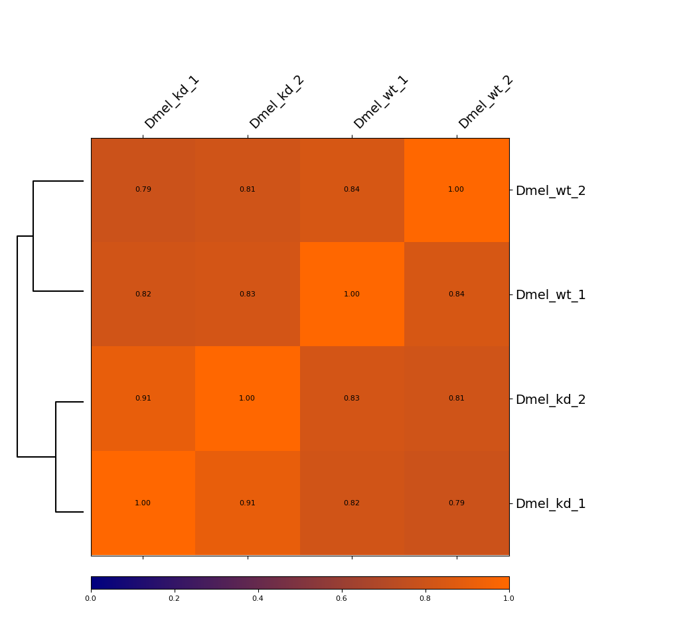
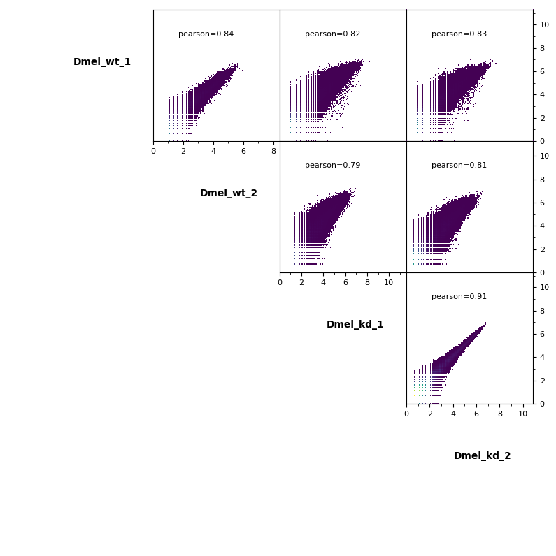

.. _hicCorrelate:

hicCorrelate
============

.. argparse::
   :ref: hicexplorer.hicCorrelate.parse_arguments
   :prog: hicCorrelate

Examples
^^^^^^^^

Here's an example of Hi-C data from wild-type and knock-down D. melanogaster
embryos.

**Heatmap**

This example is showing a heatmap that was calculated using the Pearson
correlation of un-corrected Hi-C matrices with a bin size of 6000 bp. The
dendrogram indicates which samples are most similar to each other. You can see
that the wild-type samples are seperated from the knock-down samples. The
second option we offer is calculating the Spearman correlation.

**Scatterplot**

Additionally, pairwise scatterplots comparing interactions between each sample
can be plotted.

.. code-block:: bash

    $ hicCorrelate -m Dmel_wt_1.h5 Dmel_wt_2.h5 Dmel_kd_1.h5 Dmel_kd_2.h5 \
    --method=pearson --log1p \
    --labels Dmel_wt_1 Dmel_wt_2 Dmel_kd_1 Dmel_kd_2 \
    --range 5000:200000 \
    --outFileNameHeatmap Dmel_heatmap --outFileNameScatter Dmel_scatterplot \
    --plotFileFormat png
