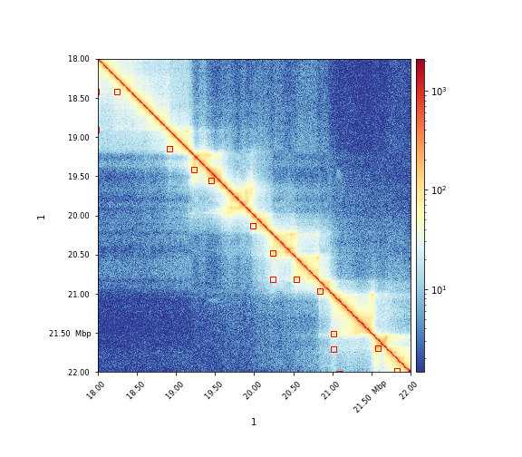

.. _hicDetectLoops:

_hicDetectLoops
===============

.. argparse::
   :ref: hicexplorer._hicDetectLoops.parse_arguments
   :prog: _hicDetectLoops

hicDetectLoops can detect enriched interaction regions (peaks / loops) based on a strict candidate selection, negative binomial distributions 
and Anderson-Darling tests. 

The algorithm was mainly develop on GM12878 cells from Rao 2014 on 10kb and 5kb fixed bin size resolution. 

Example usages
--------------

.. code:: bash

    $ hicDetectLoops -m matrix.cool -o loops.bedgraph --maxLoopDistance 2000000 --windowSize 10 --peakWidth 6 --pValuePreselection 0.05 --pValue 0.05 --peakInteractionsThreshold 20

The candidate selection is based on the restriction of the maximum genomic distance, here 2MB. This distance is given by Rao 2014. For each genomic distance 
a negative binomial distribution is computed and only interaction pairs with a threshold less than pValuePreselection are accepted. 
Detected candidates need to have at least an interaction count of `peakInteractionsThreshold` / log(genomic distance).
In a second step, each candidate is considered under its neighborhood. This neighborhood is defined by the windowSize parameter in the x and y dimension.
In one neighborhood only one candidate can exist, therefore per neighborhood only the candidate with the highest peak values is accepted. As a last step,
the neighborhood is split into a peak and background region (parameter 'peakWidth'). The peakWidth can never be larger than the windowSize. However, we recommend 
for 10kb matrices a windowSize of 10 and a peakWidth of 6.

loops.bedgraph: x and y position of the loop and the p-value of Anderson-Darling test. 

.. code::

    1	120000000	122500000	1	145000000	147500000	0.001

The results can visualized via hicPlotMatrix:

.. code:: bash

    $ hicPlotMatrix -m matrix.cool -o plot.png --log1p --region 1:18000000-22000000 --loops loops.bedgraph

