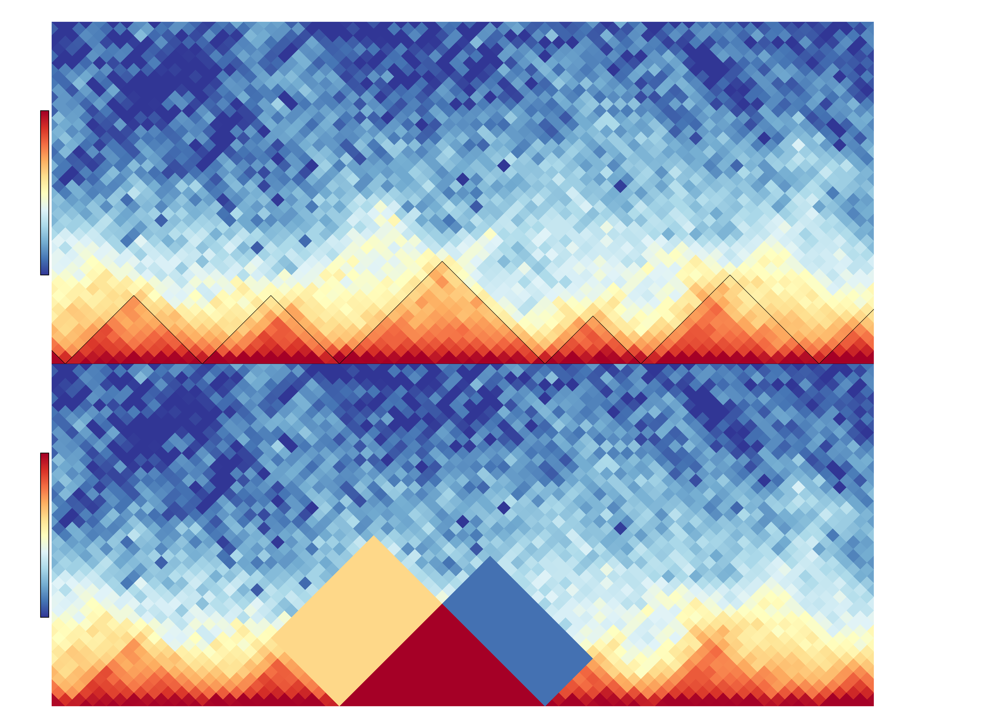

.. _hicDifferentialTAD:

hicDifferentialTAD
==================

.. argparse::
   :ref: hicexplorer.hicDifferentialTAD.parse_arguments
   :prog: hicDifferentialTAD

hicDifferentialTAD computes with a treatment Hi-C file, a control Hi-C file and a precomputed TAD domains file if the detected TADs are differential between the treatment and the control sample.
The TADs need to be precomputed on the treatment file with _hicFindTADs.

hicDifferentialTAD extract per TAD three regions: the intra-TAD, the left and right inter-TAD region. In the following image, the upper visualization shows a region with the
detected TADs which are indicated by the black lines. The bottom shows as an example which regions are used for the differential test: the intra-TAD region is highlighted in red,
the left inter-TAD in sandy-color and the right inter-TAD in blue. Between two samples a Wilcoxon rank-sum test is applied for a TAD under H0: 'The regions are equal'.
For all three regions of a TAD the rank-sum test is independently applied. The user has the choice with the two parameters 'mode' and 'modeReject' to define if a) all three
regions should be considered ('all'), or only a subset e.g. the intra-TAD or intra-TAD and left inter-TAD should be considered; and b) if all regions need to have lower p-value than the 
user given to reject H0 or if it is enough that at least one region is rejecting H0 to consider the region as differential.

Example usage
--------------

.. code:: bash

    $ hicDifferentialTAD -tm GSM2644945_Untreated-R1.100000_chr1.cool -cm GSM2644947_Auxin2days-R1.100000_chr1.cool -td untreated_R1_domains.bed -o differential -p 0.01 -t 4 -mr all

In this example data from Nora et al. "Targeted Degradation of CTCF Decouples Local Insulation of Chromosome Domains from Genomic Compartmentalization", Cell 169.5 (2017): 930-944 is used [GEO: https://www.ncbi.nlm.nih.gov/geo/query/acc.cgi?acc=GSE98671]

.. image:: ../../images/hicDifferentialTAD.png

The output are two BED-similar files: the '_accepted.diff_tad' and '_rejected.diff_tad' file. The difference to a real BED file is a) the usage of a header starting with '#', the first six columns are BED6 standard, however, there are three additional columns with the p-values of each intra-TAD, left-inter-TAD and right-inter-TAD test.
The score value and name is copied from the domains.bed file which is a output of hicFindTADs.

.. code:: bash

    # Created with HiCExplorer's hicDifferentialTAD version 3.5-dev
    # H0 'regions are equal' H0 is rejected for all p-value smaller or equal the user given p-value threshold; i.e. regions in this file are considered as differential.
    # Rejected regions with Wilcoxon rank-sum test to p-value: 0.01  with used mode: all and modeReject: all 
    # Chromosome	start	end	name	score	strand	p-value left-inter-TAD	p-value right-inter-TAD	p-value intra-TAD
    chr1	4400000	6200000	ID_0.01_1	-0.5630275	.	nan	0.42772134044376386	0.0001942482956610518
    chr1	6200000	7300000	ID_0.01_2	-0.235798	.	0.3479058102348157	0.651801360704674	0.011174626122333891
    chr1	7300000	9500000	ID_0.01_3	-0.44334	.	0.7619708385959597	0.9408966423531526	4.668547072331386e-06
    chr1	10100000	11600000	ID_0.01_5	-0.6844015	.	0.10355136240139871	0.2022260523997077	0.006197912102328514
    chr1	11600000	12900000	ID_0.01_6	-0.607587	.	0.39564035674322084	0.04934747494654432	5.069275897797787e-07
    chr1	12900000	13700000	ID_0.01_7	-0.6303795	.	0.030328896271663634	0.048097680638217614	0.0023999817017426378
    chr1	13700000	14900000	ID_0.01_8	-1.2063985	.	0.07605786424686575	0.5322636852613494	1.8146100883843892e-06
    chr1	14900000	17100000	ID_0.01_9	-0.3406565	.	0.4982863585572014	0.692745144471043	0.002562121461829293
    chr1	17100000	18100000	ID_0.01_10	-0.230354	.	0.8237750360973404	0.011911117420279341	0.00020602838341698515
    chr1	18100000	19100000	ID_0.01_11	-0.5135365	.	0.007089417650089524	0.07553560212368073	0.03561337274424189
