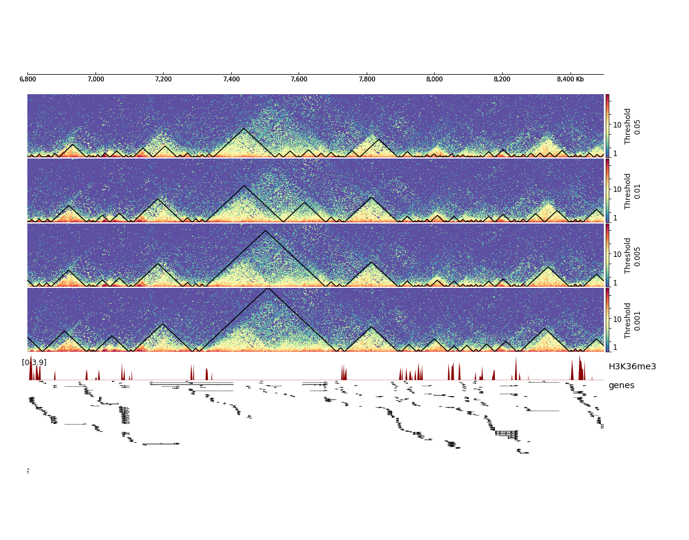

.. _hicFindTADs:

hicFindTADs
===========

.. contents:: 
    :local:

Description
^^^^^^^^^^^

.. argparse::
   :ref: hicexplorer.hicFindTADs.parse_arguments
   :prog: hicFindTADs
   
Usage example
^^^^^^^^^^^^^

It is recommended to test multiple parameters of TAD calling with hicFindTADs before making conclusions about the number of TADs in a given sample or before comparing TAD calling between multiple conditions. In order to compare several TAD calling parameters at once, it is recommended to use :doc:`hicPlotTADs`.

Below you can find a typical command-line to use `hicFindTADs`:

.. code:: bash

    $ hicFindTADs -m myHiCmatrix.h5 \ 
    --outPrefix myHiCmatrix_min3000_max31500_step1500_thres0.05_delta0.01_fdr \
    --minDepth 3000 \
    --maxDepth 31500 \
    --step 1500 \
    --thresholdComparisons 0.05 \
    --delta 0.01 \
    --correctForMultipleTesting fdr \
    -p 64

This command will output the following files:

.. code:: bash

    myHiCmatrix_min3000_max31500_step1500_thres0.05_delta0.01_fdr_boundaries.bed
    myHiCmatrix_min3000_max31500_step1500_thres0.05_delta0.01_fdr_boundaries.gff
    myHiCmatrix_min3000_max31500_step1500_thres0.05_delta0.01_fdr_domains.bed
    myHiCmatrix_min3000_max31500_step1500_thres0.05_delta0.01_fdr_score.bedgraph
    myHiCmatrix_min3000_max31500_step1500_thres0.05_delta0.01_fdr_score.npz
    myHiCmatrix_min3000_max31500_step1500_thres0.05_delta0.01_fdr_tad_score.bm
    myHiCmatrix_min3000_max31500_step1500_thres0.05_delta0.01_fdr_zscore_matrix.h5

TAD boundaries locations are stored in the ``boundaries`` files, ``domains.bed`` file contains the TAD locations, ``score`` files contain TAD separation score, or the so-called TAD insulation score, in various formats. As a side note, the ``tad_score.bm`` file is a bedgraph matrix that can be used to display TAD separation score curves in :doc:`hicPlotTADs` for example.

The ``zscore_matrix.h5`` file contains a z-score matrix that is useful to quickly test the **--thresholdComparisons**, **--delta** and **--correctForMultipleTesting** parameters by using the **--TAD_sep_score_prefix** option pointing to this ``zscore_matrix.h5`` file. For example to quickly test a **--thresholdComparisons** of 0.01 instead of 0.05 we can run the following command:

.. code:: bash

    $ hicFindTADs -m myHiCmatrix.h5 \ 
    --outPrefix myHiCmatrix_min10000_max40000_step1500_thres0.01_delta0.01_fdr \
    --TAD_sep_score_prefix myHiCmatrix_min10000_max40000_step1500_thres0.05_delta0.01_fdr
    --thresholdComparisons 0.01 \
    --delta 0.01 \
    --correctForMultipleTesting fdr \
    -p 64
    
As you can see above, **--minDepth**, **--maxDepth** and **--step** are ignored because these parameters are used to calculate the z-score matrix which is here provided to **--TAD_sep_score_prefix**. Since z-score matrix computation is the most demanding step of hicFindTADs in terms of memory and computation, the above command will thus run significantly faster than the previous one.

Multiple combinations of parameters can be tested that way with only one z-score matrix computation. To compare several TAD calling outputs, we use :doc:`hicPlotTADs` with the following command using, for example, the following tracks.ini file:

- **command line:**

.. code:: bash

    $ hicPlotTADs --tracks tracks.ini --region chrX:6800000-8500000  -o TAD_calling_comparison.png

- **tracks.ini:**

.. code:: INI

    [x-axis]
    fontsize=10

    [hic]
    file = myHiCmatrix.h5
    title = Threshold 0.05
    colormap = Spectral_r
    depth = 400000
    min_value = 1
    max_value = 80
    transform = log1p
    file_type = hic_matrix
    show_masked_bins = false

    [tads]
    file = myHiCmatrix_min10000_max40000_step1500_thres0.05_delta0.01_fdr_domains.bed
    file_type = domains
    border_color = black
    color = none
    overlay_previous = share-y

    [hic]
    file = myHiCmatrix.h5
    title = Threshold 0.01
    colormap = Spectral_r
    depth = 400000
    min_value = 1
    max_value = 80
    transform = log1p
    file_type = hic_matrix
    show_masked_bins = false

    [tads]
    file = myHiCmatrix_min10000_max40000_step1500_thres0.01_delta0.01_fdr_domains.bed
    file_type = domains
    border_color = black
    color = none
    overlay_previous = share-y
    
    [spacer]
    height = 0.1

    [hic]
    file = myHiCmatrix.h5
    title = Threshold 0.005
    colormap = Spectral_r
    depth = 400000
    min_value = 1
    max_value = 80
    transform = log1p
    file_type = hic_matrix
    show_masked_bins = false  

    [tads]
    file = myHiCmatrix_min10000_max40000_step1500_thres0.005_delta0.01_fdr_domains.bed
    file_type = domains
    border_color = black
    color = none
    overlay_previous = share-y
    
    [spacer]
    height = 0.1

    [hic]
    file = myHiCmatrix.h5
    title = Threshold 0.001
    colormap = Spectral_r
    depth = 400000
    min_value = 1
    max_value = 80
    transform = log1p
    file_type = hic_matrix
    show_masked_bins = false  

    [tads]
    file = myHiCmatrix_min10000_max40000_step1500_thres0.001_delta0.01_fdr_domains.bed
    file_type = domains
    border_color = black
    color = none
    overlay_previous = share-y
    
    [spacer]
    height = 0.1
    
    [bigwig]
    file = /data/processing/ChIP-Seq_Embryos/H3K36me3_14c.bigwig
    title = H3K36me3
    color = darkred
    min_value = 0
    max_value = auto
    height = 2
    file_type = bigwig

    [spacer]
    height = 0.1

    [genes]
    file = /data/group/bedfiles/dm6/genes_sorted.bed
    title = genes
    color = black
    height = 18
    labels = true
    file_type = bed

This will result in the following plot where we see that the fourth set of hicFindTADs parameters with a threshold of 0.001 gives the best results in terms of TAD calling compared to the corrected Hi-C counts distribution and compared to the enrichment of H3K36me3, which is known to be enriched at TAD boundaries in *Drosophila melanogaster*.

Notes
^^^^^

In the _domains.bed output file, the 5th column contains the TAD-separation score at the boundary located at the start of each domain.

The process to identify boundaries is as follows:

 * call all local minima in the average TAD-score. Each local minimum should be separated by at least `min_boundary_distance`. If this value is not given, it is set to the average bin size * 4
 * for each local minimum detected, compute its p-value and then compute a q-value.
 * for each local minimum detected, compute the 'delta' which is the difference between the mean TAD-score of the 10 bins before and the 10 bins after the minimum (excluding the min point)
 * keep only those minima that fulfill the following criteria: the p-value (or q-value depending on the user selection) should be below the given threshold and the delta should be above the user defined threshold
 * everything between 2 consecutive boundaries is a TAD

For computation of the p-values, the distribution of the z-scores at the 'diamond' above the local minimum is compared
with the distribution of z-scores that are `min_depth` downstream using the Wilcoxon rank-sum test. Similarly, the
distribution of z-scores is computed with the z-scores `min_depth` upstream of the local minimum. The smallest of the
two p-values is assigned to the local minimum.

If `min_depth` is not given, this is computed as bin size * 30
(if the bins are smaller than 1000), as bin size * 10 if the bins are between
1000 and 20.000 and as bin size * 5 if the bin size is bigger than 20.000.

If `max_depth` is not given, this is computed as bin size * 60
(if the bins are smaller than 1000), as bin size * 40 if the bins are between
1000 and 20.000 and as bin size * 10 if the bin size is bigger than 20.000.
