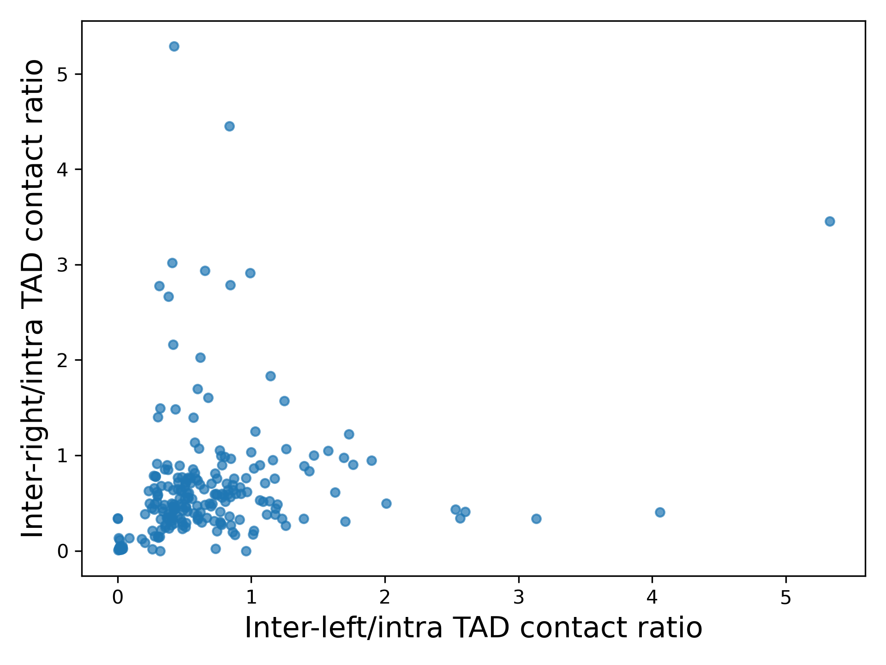

.. _hicInterIntraTAD:

hicInterIntraTAD
================

.. argparse::
   :ref: hicexplorer.hicInterIntraTAD.parse_arguments
   :prog: hicInterIntraTAD

This tool computes and extracts for given TADs the inter-left, inter-right and intra-TAD data: the absolute number of contacts, the density (non-zero contacts / all possible contacts) and the ratio of inter-left/intra, inter-right/intra and (inter-left + inter-right)/intra TAD contacts.
The data is saved in one file where it can be used for further, user-specific computations outside of HiCExplorer. Also a scatter plot of the ratio inter-left/intra vs. inter-right/intra is created.

.. code-block:: INI

    # Created with HiCExplorer's hicInterIntraTAD version 3.7-dev
    # Chromosome	start	end	name	score	strand	inter_left_sum	inter_right_sum	inter_left_density	inter_right_density	inter_left_number_of_contacts	inter_right_number_of_contacts	inter_left_number_of_contacts_nnz	inter_right_number_of_contacts_nnz	intra_sum	intra_number_of_contacts	intra_number_of_contacts_nnz	intra_density	inter_left_intra_ratio	inter_right_intra_ratio	inter_left_inter_right_intra_ratio
    chr1	4400000	6200000	ID_0.01_1	-0.5630275	.	0	265.6981737879304	0	1.0	0	180	0	180	780.0186987409819	324	324	1.0	0.0	0.340630518494993	0.340630518494993
    chr1	6200000	7300000	ID_0.01_2	-0.235798	.	288.00513572726237	327.503479611623	1.0	1.0	198	231	198	231	339.91508704783513	121	121	1.0	0.8472855330682405	0.9634861531331044	1.8107716862013452
    chr1	7300000	9500000	ID_0.01_3	-0.44334	.	340.12385944568155	159.40880484157745	1.0	1.0	242	110	242	110	1078.1133262629996	484	484	1.0	0.31548061892958207	0.14785904316211984	0.46333966209170185
    chr1	9500000	10100000	ID_0.01_4	-1.021538	.	186.65816676710497	124.2235190772146	1.0	1.0	132	84	132	84	118.58286349492002	36	36	1.0	1.5740737005823884	1.0475672067282826	2.6216409073106712

