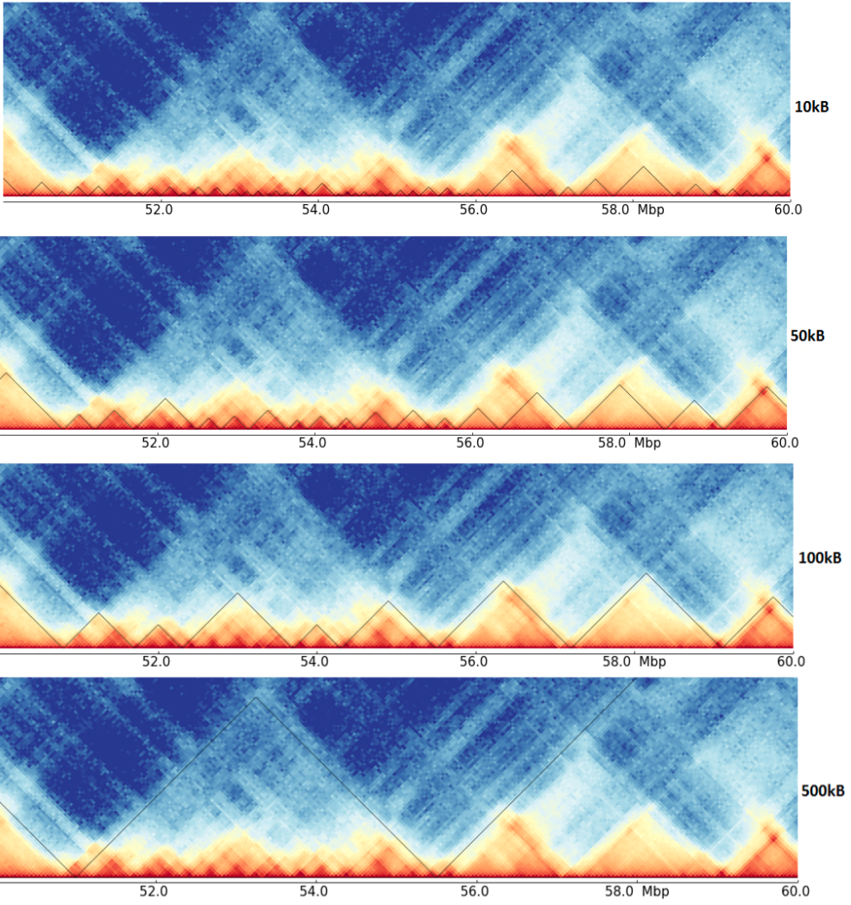
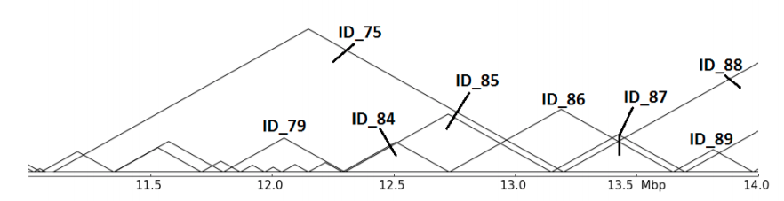
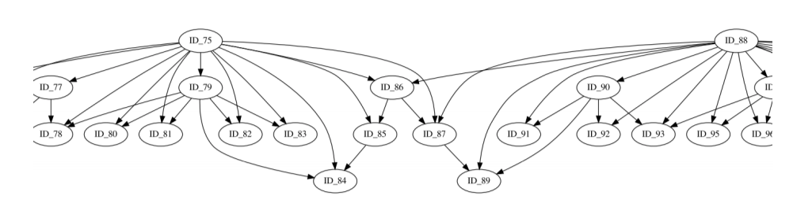
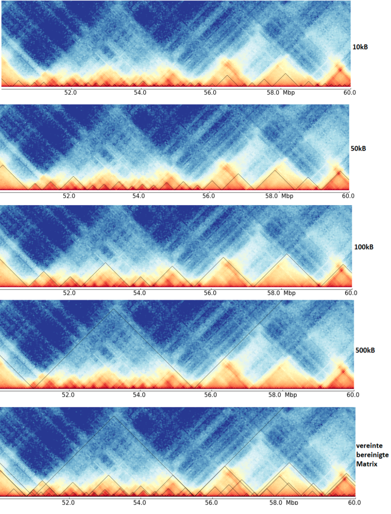

.. _hicMergeDomains:

hicMergeDomains
===============

.. argparse::
   :ref: hicexplorer.hicMergeDomains.parse_arguments
   :prog: hicMergeDomains

This tool is the result of the bachelor thesis from Sarah Domogalla at the Bioinformatics lab of the Albert-Ludwigs_University Freiburg. The thesis was written in winter semester 2019/2020.

The thesis covers the issue of differently detected TADs of the same data but on different resolutions. 

As it can be seen here, the detected TADs on the four resolutions are quite different, and have maybe a hierarchy. Compare for example
the region around 53 Mb in the different resolutions, it is unclear if these are multiple small TADs as suggest by the 10kb resolution,
mid-size one as seen by 50 kb or one big, as detected on 100 kb resolution. Consider the next image for an abstract representation of this problem.

The abstract representation shows multiple issues: Are ID_85,ID_86 and ID_87 related in any hierarchy? Which role plays ID_75? hicMergeDomains tries to solve this by
providing the parameters `--value` and `--percentage` to control how the relationship is determined and if TADs are duplicated and therefore deleted. 

This abstract representation of the hierarchical TADs is created for each chromosome and provides insights for the organization of the chromatin structure in the three dimensional space.

The last image shows a cleaned TAD detection based on all four inputs.