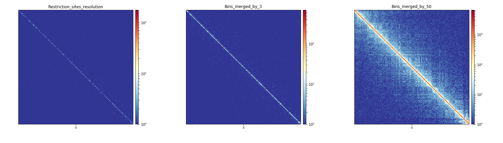

.. _hicMergeMatrixBins:

hicMergeMatrixBins
==================

.. contents:: 
    :local:

Background
^^^^^^^^^^

Depending on the downstream analyses to perform on a Hi-C matrix generated with HiCExplorer, one might need different bin resolutions. For example using :doc:`hicPlotMatrix` to display chromatin interactions of a whole chromosome will not produce any meaningful vizualisation if it is performed on a matrix at restriction sites resolution. :doc:`hicMergeMatrixBins` address this issue by merging a given number of adjacent bins (precised after --numBins). To limit the loss of information, it is mandatory to perform :doc:`hicMergeMatrixBins` on matrices prior to any correction, and perform a correction after bin merging for downstream analyses using :doc:`hicCorrectMatrix`. 

Description
^^^^^^^^^^^

.. argparse::
   :ref: hicexplorer.hicMergeMatrixBins.parse_arguments
   :prog: hicMergeMatrixBins

Usage example
^^^^^^^^^^^^^

Running hicMergeMatrixBins
""""""""""""""""""""""""""

Bellow, we will develop the example of a matrix to display at the whole X-chromosome scale and at the scale of a 1Mb region of the X chromosome. To do this, we will perform two different bin merging using :doc:`hicMergeMatrixBins` on an uncorrected matrix built at the restiction sites resolution using :doc:`hicBuildMatrix`. To do this, we run the two following command lines

.. code:: bash

    $ hicMergeMatrixBins -m myMatrix.h5 -o myMatrix_merged_nb3.h5 -nb 3
    
    $ hicMergeMatrixBins -m myMatrix.h5 -o myMatrix_merged_nb50.h5 -nb 50
    
Starting from a matrix ``myMatrix.h5`` with bins of a median length of 529bp, the first command produces a matrix ``myMatrix_merged_nb3.h5`` with bins of a median length of 1661bp while the second command produces a matrix ``myMatrix_merged_nb50.h5`` with bins of a median length of 29798bp. This can be checked with :doc:`hicInfo`.

After the correction of these three matrices using :doc:`hicCorrectMatrix`, we can now plot them, ``myMatrix_corrected.h5``, ``myMatrix_merged_nb3_corrected.h5`` and ``myMatrix_merged_nb50_corrected.h5``, at the scale of the whole X-chromosome and at the X:2000000-3000000 region to see the effect of bin merging on the interactions visualization.

Effect of bins merging at the scale of a chromosome 
"""""""""""""""""""""""""""""""""""""""""""""""""""

.. code:: bash

    $ hicPlotMatrix -m myMatrix_corrected.h5 \
    -o myMatrix_corrected_Xchr.png \
    --chromosomeOrder X \
    -t Restriction_sites_resolution --log1p \
    --clearMaskedBins
    
    $ hicPlotMatrix -m myMatrix_merged_nb3_corrected.h5 \
    -o myMatrix_merged_nb3_corrected_Xchr.png \
    --chromosomeOrder X \
    -t Bins_merged_by_3 --log1p \
    --clearMaskedBins
    
     $ hicPlotMatrix -m myMatrix_merged_nb50_corrected.h5 \
    -o myMatrix_merged_nb50_corrected_Xchr.png \
    --chromosomeOrder X \
    -t Bins_merged_by_50 --log1p \
    --clearMaskedBins

When observed altogether, the plots produced by these three commands show that the merging of bins by 50 is the most adequate way to plot interactions for a whole chromosome in *Drosophila melanogaster* when starting from a matrix with bins of a median length of 529bp.

Effect of bins merging at the scale of a specific region
""""""""""""""""""""""""""""""""""""""""""""""""""""""""

.. code:: bash

     $ hicPlotMatrix -m myMatrix_corrected.h5 \
    -o myMatrix_corrected_Xregion.png \
    --region X:2000000-3000000 \
    -t Restriction_sites_resolution --log1p \
    --clearMaskedBins
    
    $ hicPlotMatrix -m myMatrix_merged_nb3_corrected.h5 \
    -o myMatrix_merged_nb3_corrected_Xregion.png \
    --region X:2000000-3000000 \
    -t Bins_merged_by_3 --log1p \
    --clearMaskedBins
    
     $ hicPlotMatrix -m myMatrix_merged_nb50_corrected.h5 \
    -o myMatrix_merged_nb50_corrected_Xregion.png \
    --region X:2000000-3000000 \
    -t Bins_merged_by_50 --log1p \
    --clearMaskedBins

When observed altogether, the plots produced by these three commands show that the merging of bins by 3 is the most adequate way to plot interactions for a region of 1Mb in *Drosophila melanogaster* when starting from a matrix with bins of a median length of 529bp.

