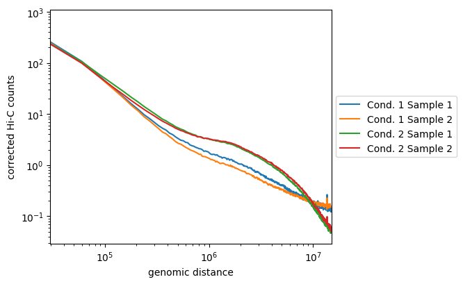

.. _hicPlotDistVsCounts:

hicPlotDistVsCounts
===================

.. contents:: 
    :local:

Background
^^^^^^^^^^^^^^^

This tool allows a quick comparison between multiple Hi-C matrices of the Hi-C counts enrichment at different genomic ranges / distances up to whole chromosome. Biological replicates should display the exact same distribution while samples coming from different cell-lines, treated versus to untreated samples or mutant versus wild-type samples should display a different distribution at long and/or close range.

The results of this tool usually reflect the proportion of long-range and short-range contacts calculated in each sample by :doc:`hicQC`. Local TAD or contact enrichments will not impact the results computed bu this tool, :doc:`hicPCA` is better suited for that purpose.

Description
^^^^^^^^^^^^^^^

.. argparse::
   :ref: hicexplorer.hicPlotDistVsCounts.parse_arguments
   :prog: hicPlotDistVsCounts

Usage example
^^^^^^^^^^^^^^^

``hicPlotDistVsCounts`` should be used on corrected matrices with very large bins (e.g. at least 50kb bins), otherwise the curves will be spiky at longer ranges because of the sparness of the contacts, thus the likelyness of the samples will become hard to assess after a certain distance. ``hicPlotDistVsCounts`` is thus often ran after :doc:`hicMergeBins` and :doc:`hicCorrectMatrix`.

.. code:: bash

    hicPlotDistVsCounts -m \
    condition1_sample1_50_bins_merged.h5 \
    condition1_sampel2_50_bins_merged.h5 \
    condition2_sample1_50_bins_merged.h5 \
    condition2_sample2_50_bins_merged.h5 \
    -o counts_vs_dist_50_bins_merged.png \
    --labels 'Cond 1 Sample 1' 'Cond 1 Sample 2' 'Cond 2 Sample 1' 'Cond 2 Sample 2' \
    --maxdepth 20000000 \
    --plotsize 5 4.2
    

Here, we see that the samples from the first condition are not so well correlated, but they follow the same tendancies and are distinct from the two samples of the second condition. The later are well correlated and display enriched long-range contacts compared to the first condition samples.
