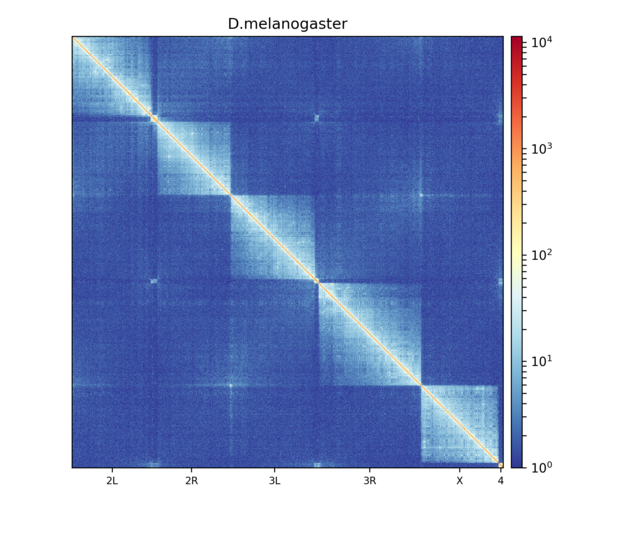
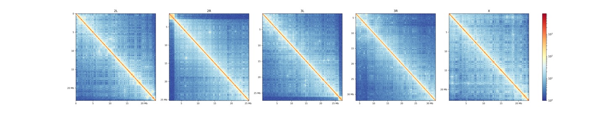

.. _hicPlotMatrix:

hicPlotMatrix
=============

.. argparse::
   :ref: hicexplorer.hicPlotMatrix.parse_arguments
   :prog: hicPlotMatrix

Details
^^^^^^^
hicplotMatrix takes a Hi-C matrix and plots the interactions of all or
some chromosomes.

Examples
^^^^^^^^

Here's an example of Hi-C data from wild-type D. melanogaster embryos.

This plot shows contacts of a Hi-C matrix that was merged to a 25 kb bin size
using :doc:`hicMergeMatrixBins`. Alternatively, chromosomes can be plotted
separately. 

.. code-block:: bash

    $ hicPlotMatrix -m Dmel.h5 -o hicPlotMatrix.png \
    -t 'D.melanogaster (--perChromosome)' --log1p \
    --clearMaskedBins --chromosomeOrder 2L 2R 3L 3R X --perChromosome
