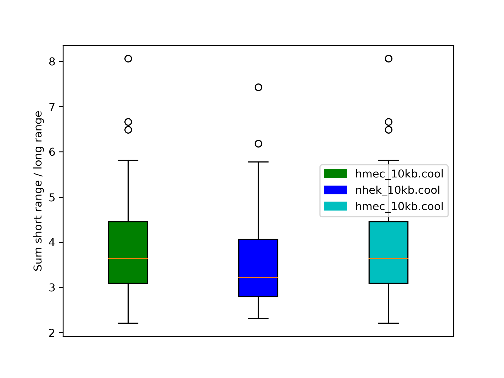

.. _hicPlotSVL:

hicPlotSVL
==========

.. contents:: 
    :local:

Description
^^^^^^^^^^^

hicPlotSVL computes the ratio between short range and long range contacts per chromosome independently. Per sample one box plot is created and, if more than one sample is given,
the computed ratios are assumed to be one distribution and a Wilcoxon rank-sum test under H0 'distributions are equal' is computed. All used data is written to a third raw data file.

The distance to distinct short and long range contacts can be set via the `--distance` parameter; for short range the sum for all contacts smaller or equal this distance are computed, for long range contacts all contacts greater this distance. 

Usage example
^^^^^^^^^^^^^^

.. code-block:: bash

    $ hicPlotSVL -m hmec_10kb.cool nhek_10kb.cool hmec_10kb.cool --distance 2000000 --threads 4 --plotFileName plot.png --outFileName pvalues.txt --outFileNameData rawData.txt

This results in three files:

The raw data containing the sums for short range, long range and ratio per sample and chromosome.

.. code-block:: INI

    # Created with HiCExplorer's hicPlotSVL 3.3
    # Short range vs long range contacts per chromosome: raw data
    # Short range contacts: <= 2000000
    #	hmec_10kb.cool			nhek_10kb.cool			hmec_10kb.cool
    # Chromosome	Ratio	Sum <= 2000000	Sum > 2000000	Ratio	Sum <= 2000000	Sum > 2000000	Ratio	Sum <= 2000000	Sum > 2000000
    1	3.0399769346724543	33476834	11012200	2.79740105237572	44262902	15822866	3.0399769346724543	33476834	11012200	
    2	2.7532203542810625	31723954	11522490	2.5007877714355438	47468438	18981394	2.7532203542810625	31723954	11522490	
    3	2.922650759458664	26251027	8981924	2.6235211241878442	39640848	15109788	2.922650759458664	26251027	8981924	
    4	2.7235598858451637	22474680	8251950	2.5572455199457864	37486882	14659086	2.7235598858451637	22474680	8251950	
    5	2.9585962905193712	22716268	7678056	2.752922527526723	35445722	12875670	2.9585962905193712	22716268	7678056	
    6	3.168274165465025	22872690	7219290	2.8602111006131703	33990211	11883812	3.168274165465025	22872690	7219290	
    7	3.1093346580597516	19603416	6304698	2.8021236966788887	29712823	10603680	3.1093346580597516	19603416	6304698	
    8	3.135391026076832	18355087	5854162	2.7964394470859024	28660624	10248970	3.135391026076832	18355087	5854162	
    9	4.1147978383348125	15395763	3741560	3.819940066283481	21994046	5757694	4.1147978383348125	15395763	3741560	
    10	3.448063050802953	17964043	5209894	3.1116673856502253	26270171	8442474	3.448063050802953	17964043	5209894	
    11	3.5924666993070407	18651850	5191934	3.1364875011923035	26240350	8366158	3.5924666993070407	18651850	5191934	
    12	3.6817551043464416	18640866	5063038	3.306662109403207	26101554	7893626	3.6817551043464416	18640866	5063038	
    13	3.476204237522881	11018462	3169682	3.0976674036654805	18922281	6108558	3.476204237522881	11018462	3169682	
    14	3.70550850832778	11164875	3013048	3.6226817463785164	17245704	4760480	3.70550850832778	11164875	3013048	
    15	4.607631079612186	11165313	2423222	4.567998349104569	15273742	3343640	4.607631079612186	11165313	2423222	
    16	4.397874357146307	10745775	2443402	3.890983210350018	14666462	3769346	4.397874357146307	10745775	2443402	
    17	5.809374740402161	12168235	2094586	5.3360710927739285	14154110	2652534	5.809374740402161	12168235	2094586	
    18	3.7647349280938895	9339833	2480874	3.485487446356812	15019063	4309028	3.7647349280938895	9339833	2480874	
    19	6.492239632778196	8466283	1304062	5.774337450385819	9368978	1622520	6.492239632778196	8466283	1304062	
    20	5.542933774973686	8962935	1617002	4.977679877778358	12009479	2412666	5.542933774973686	8962935	1617002	
    21	6.665622315255486	3910374	586648	6.1843701763589225	6554715	1059884	6.665622315255486	3910374	586648	
    22	8.063663557923096	4992327	619114	7.433759425439728	5932928	798106	8.063663557923096	4992327	619114	
    X	2.208752982178897	14424173	6530460	2.3130534357407995	27628734	11944702	2.208752982178897	14424173	6530460	
    Y	4.165021803993573	36294	8714	3.8063291139240505	45105	11850	4.165021803993573	36294	8714	
    MT				

The p-values between the samples:

.. code-block:: INI

    # Created with HiCExplorer's hicPlotSVL 3.3
    # Short range vs long range contacts per chromosome, p-values of each distribution against each other distribution with Wilcoxon rank-sum
    # Short range contacts: <= 2000000
    hmec_10kb.cool	nhek_10kb.cool	0.28362036331636575
    hmec_10kb.cool	hmec_10kb.cool	1.0
    nhek_10kb.cool	hmec_10kb.cool	0.28362036331636575

The box plot:

