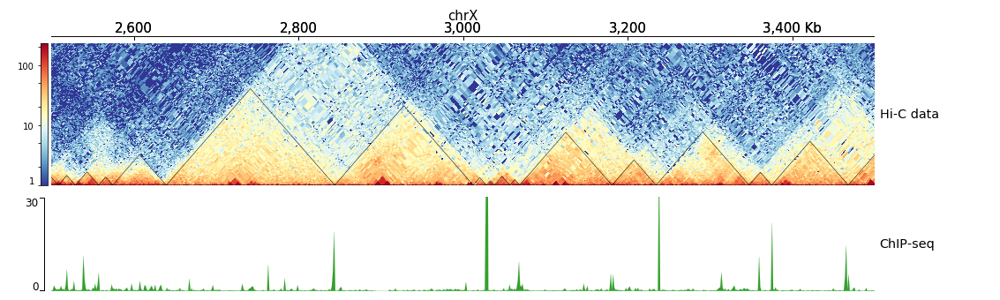

.. _hicPlotTADs:

hicPlotTADs
===========

.. contents:: 
    :local:

Description
^^^^^^^^^^^

For parameter options please see `pyGenomeTracks <https://github.com/deeptools/pyGenomeTracks>`_ documentation

Usage example
^^^^^^^^^^^^^

hicPlotTADs output is similar to a genome browser screen-shot that besides the usual genes,
and score data (like bigwig or bedgraph files) also contains Hi-C data. The plot is composed of
tracks that need to be specified in a configuration file. Once the tracks file is ready,
hicPlotTADs can be used as follows:

.. code-block:: bash

   $ hicPlotTADs --tracks tracks.ini --region chrX:99,974,316-101,359,967 \
   -t 'Marks et. al. TADs on X' -o tads.pdf

.. image:: ../../images/marks_et-al_TADs.png

Configuration file template
^^^^^^^^^^^^^^^^^^^^^^^^^^^

The following is a template for the configuration file which is based on .ini configuration files. Each
track is defined by a section header (for example `[hic track]`), followed by parameters specific to the
section as `color`, `title`, etc. For details please see the documentation of pyGenomeTracks.

.. code:: bash

    $ hicPlotTADs --tracks hic_track.ini -o hic_track.png --region chrX:2500000-3500000

.. code-block:: INI

    [x-axis]
    where = top

    [hic matrix]
    file = hic_data.h5
    title = Hi-C data
    # depth is the maximum distance plotted in bp. In Hi-C tracks
    # the height of the track is calculated based on the depth such
    # that the matrix does not look deformed
    depth = 300000
    transform = log1p
    file_type = hic_matrix

    [tads]
    file = domains.bed
    file_type = domains
    border color = black
    color = none
    # the tads are overlay over the hic-matrix
    # the share-y options sets the y-axis to be shared
    # between the Hi-C matrix and the TADs. 
    overlay previous = share-y

    [spacer]

    [bigwig file test]
    file = bigwig.bw
    # height of the track in cm (optional value)
    height = 4
    title = ChIP-seq
    min_value = 0
    max_value = 30

