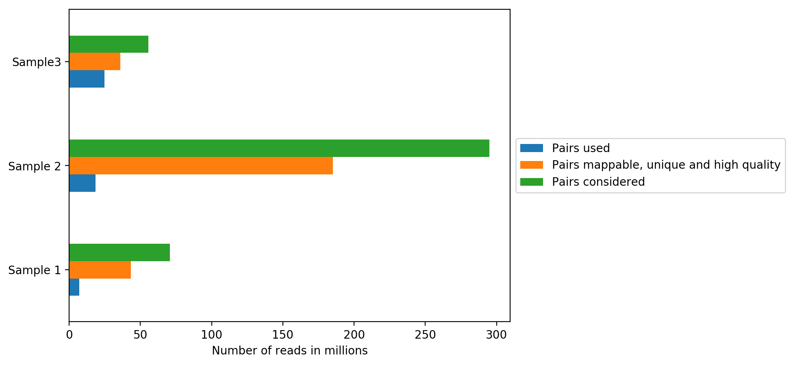
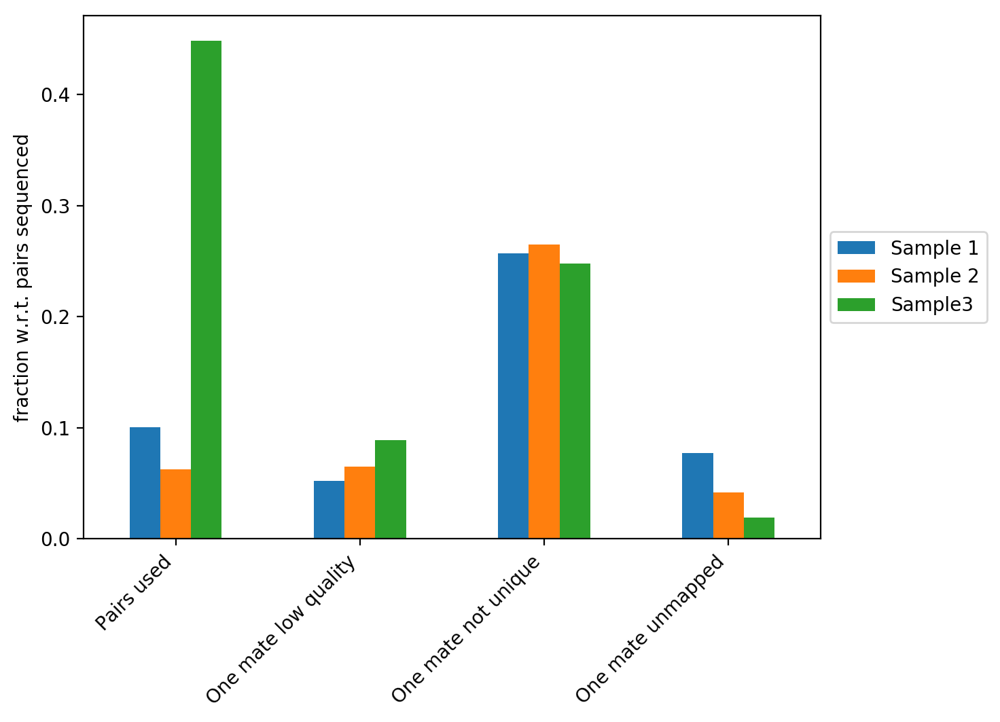
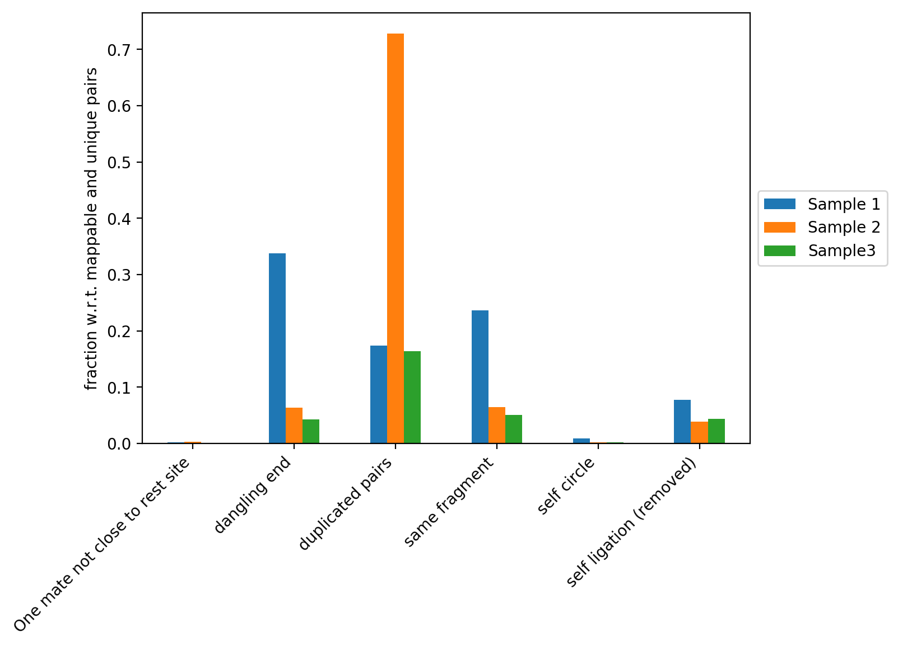
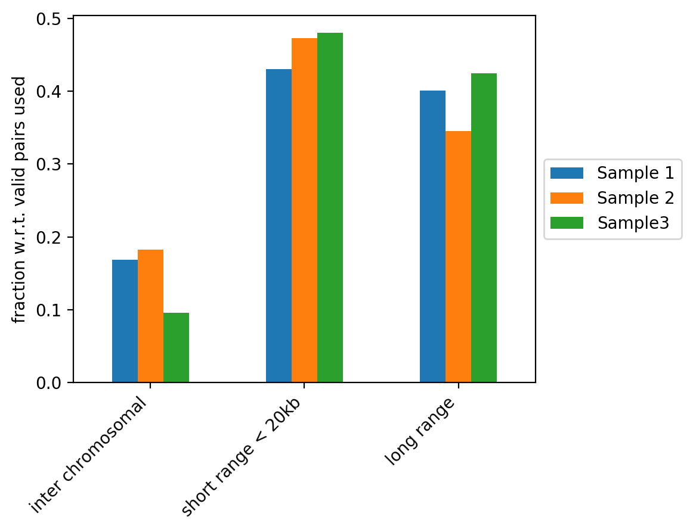
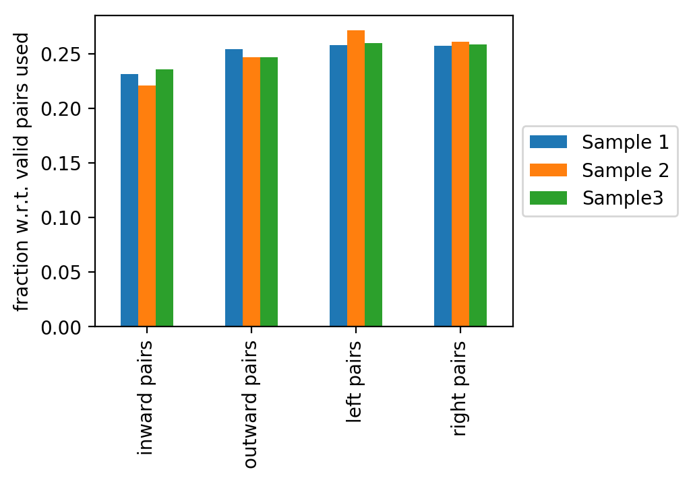

.. _hicQC:

hicQC
=====

Background
^^^^^^^^^^

This tool can process quality control log files produced by :doc:`hicBuildMatrix` for multiple samples at once to generate summary tables and plots of quality control (QC) measures for all these samples. Additionally, an HTML output is generated where all summary tables and plots are displayed.

Description
^^^^^^^^^^^

.. argparse::
   :ref: hicexplorer.hicPrepareQCreport.parse_arguments
   :prog: hicQC

Usage example
^^^^^^^^^^^^^

:doc:`hicBuildMatrix` generates a QC.log file for each processed Hi-C sample in a folder specified in the ``--QCfolder`` argument. The quality control measures stored for each of these samples can be merged in summary tables and plots using hicQC. An example usage is:

.. code-block:: bash

    $ hicQC --logfiles ./sample_1/QC.log ./sample_2/QC.log /sample_3/QC.log \
    --labels "Sample 1" "Sample 2" "Sample 3" \
    -o QC_plots

This command will generate several plots that are described in details below.

On the plot above, we can see how many reads were sequenced per sample (pairs considered), how many reads were mappable, unique and of high quality and how many reads passed all quality controls and are thus useful for further analysis (pairs used). All quality controls used for read filtering are explained below.

The figure above contains the fraction of reads with respect to the total number of reads that did not map, that have a low quality score or that didn't map uniquely to the genome. In our example we can see that Sample 3 has the highest fraction of pairs used. We explain the differences between the three samples on the plot below.

This figure contains the fraction of read pairs (with respect to mappable and unique reads) that were discarded when building the Hi-C matrix. You can find the description of each category below:

**Dangling ends:** reads that start with the restriction site and constitute reads that were digested but not ligated. Sample 1 in our example has a high fraction of dangling ends (and thus a low proportion of pairs used). Reasons for this can be inefficient ligation or insufficient removal of danging ends during samples preparation.

**Duplicated pairs:** reads that have the same sequence due to PCR amplification. For example, Sample 2 was amplified too much and thus has a very high fraction of duplicated pairs.

**Same fragment:** read mates facing inward, separated by up to 800bp that do not have a restriction enzyme site in between. These read pairs are not valid Hi-C pairs and are thus discarded from further analyses.

**Self circle:** read pairs within 25kb with 'outward' read orientation.

**Self ligation:** read pairs with a restriction site in between that are within 800bp.

The figure above contains the fraction of read pairs (with respect to mappable reads) that compose inter chromosomal, short range (< 20kb) or long range contacts. Inter chromosomal reads of a wild-type sample are expected to be low. Trans-chromosomal contacts can be primarily considered as random ligation events. These would be expected to contribute to technical noise that may obscure some of the finer features in the Hi-C datasets (Nagano *et al.* 2015, Comparison of Hi-C results using in-solution versus in-nucleus ligation, doi: https://doi.org/10.1186/s13059-015-0753-7). As such, a high fraction of inter chromosomal reads is an indicator of low sample quality, but it can also be associated to cell cycle changes (Nagano *et al.* 2018, Cell-cycle dynamics of chromosomal organisation at single-cell resolution, doi: https://doi.org/10.1038/nature23001).

Short range and long range contacts proportions can be associated to how the fixation is performed during Hi-C sample preparation. These two proportions also directly impact the Hi-C corrected counts versus genomic distance plots generated by :doc:`hicPlotDistVsCounts`.

The last figure shows the fractions of inward, outward, left or right read pairs (with respect to mappable reads). Deviations from an equal distribution indicates problems during sample preparation.
