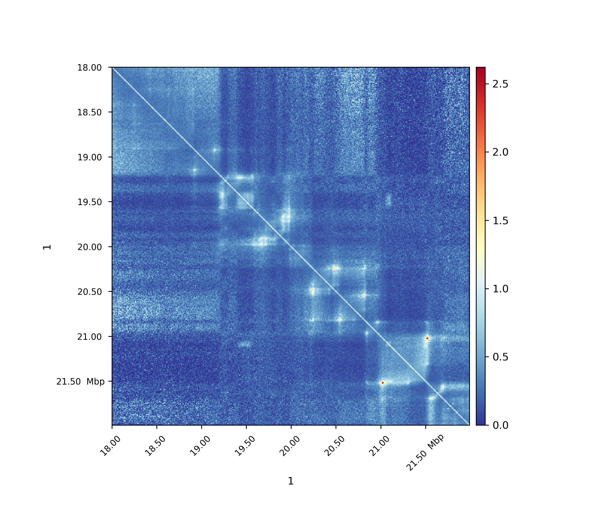
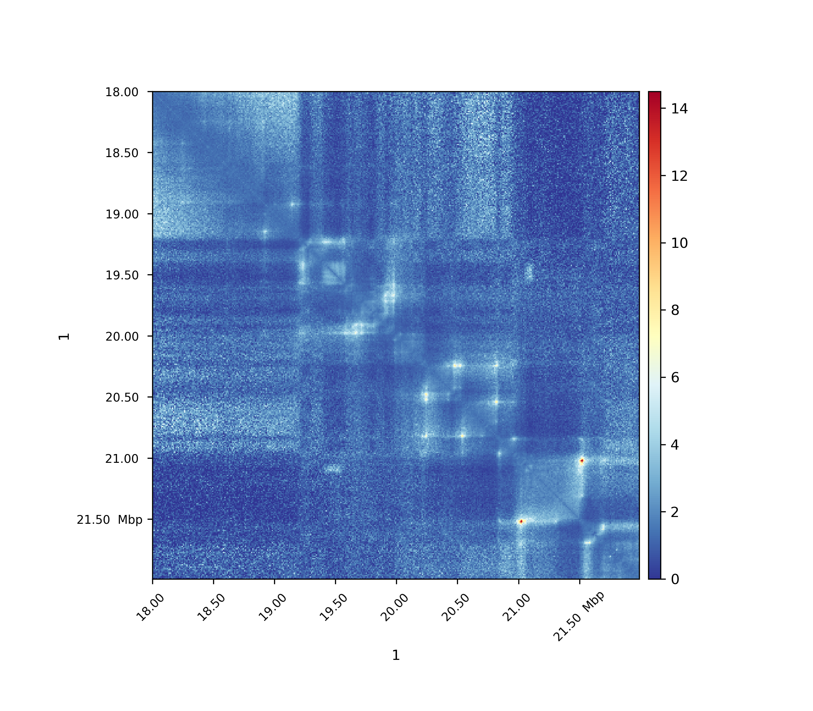
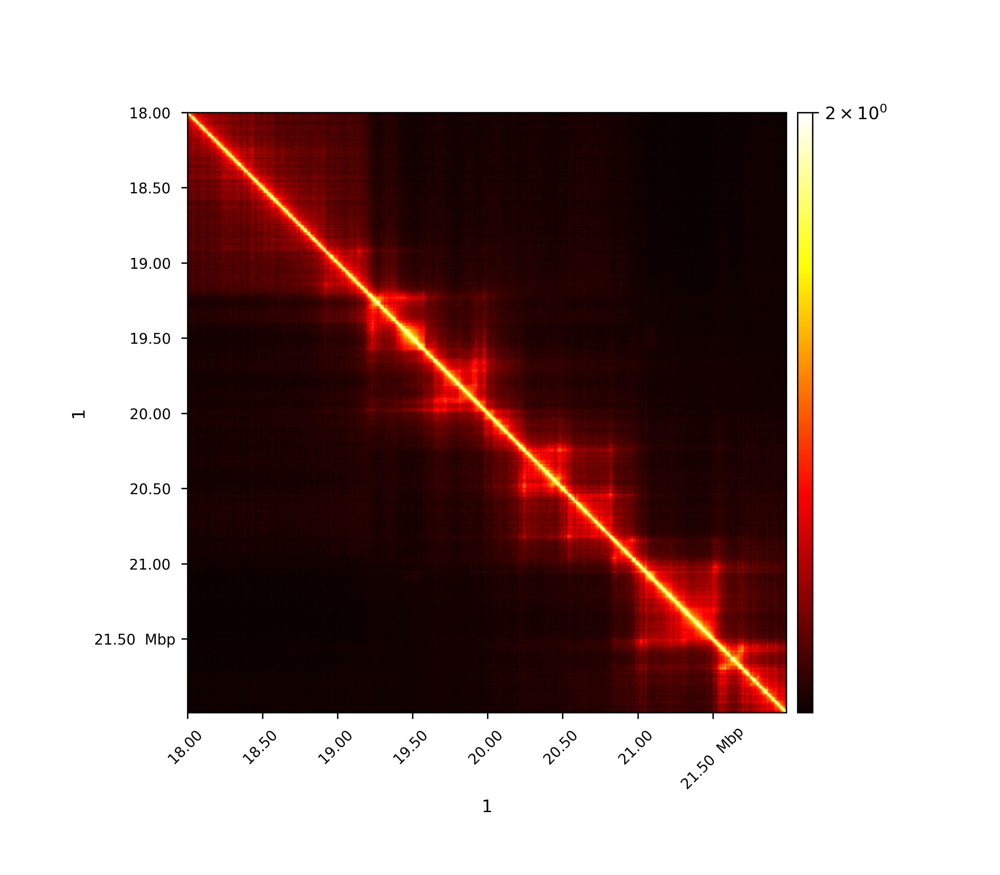
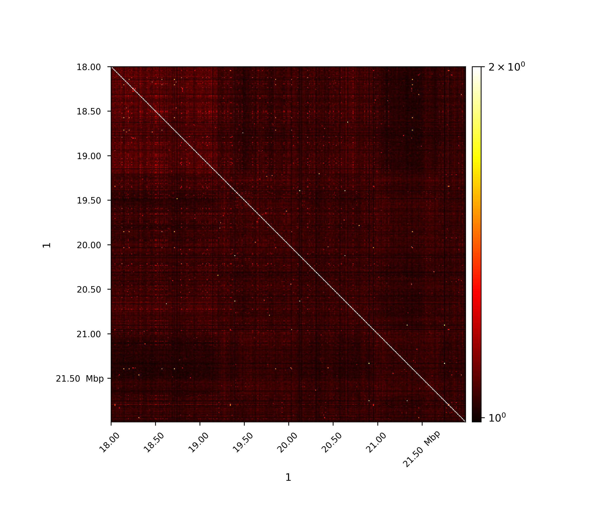

.. _hicTransform:

hicTransform
============

.. argparse::
   :ref: hicexplorer.hicTransform.parse_arguments
   :prog: hicTransform

Background
===========

hicTransform transforms a given input matrix to a matrix with the defined method applied on.

- obs_exp
- obs_exp_norm
- obs_exp_lieberman
- obs_exp_non_zero
- pearson
- covariance

All expected values are computed per genomic distances. 

Usage
-----

.. code:: bash

    $ hicTransform -m matrix.cool --method obs_exp -o obs_exp.cool

For all images data from `Rao 2014 <https://www.ncbi.nlm.nih.gov/geo/query/acc.cgi?acc=GSE63525>`_ was used.

Observed / Expected
-------------------

All values, including non-zero values, are used to compute the expected values per genomic distance. 

.. math::

    exp_{i,j} =  \frac{ \sum diagonal(|i-j|) }{|diagonal(|i-j|)|}

Observed / Expected norm
------------------------

The expected matrix is computed in the same way `Homer software <http://homer.ucsd.edu/homer/interactions/HiCBackground.html>`_ computes it with the option '-norm' set,
to conserve this reference, HiCExplorer names this expected matrix computation 'norm'. The usage of this expected
value computation gives better results for A/B compartment computation for drosophila genomes.

.. math::

    exp_{i,j} = \frac{ \sum diagonal(|i-j|) * \sum row(j) * \sum row(i) }{ \sum matrix }

Observed / Expected lieberman
-----------------------------

The expected matrix is computed in the way Lieberman-Aiden used it in the 2009 publication, it is quite similar 
to obs/exp matrix computation.

.. math::

    exp_{i,j} = \frac{ \sum diagonal(|i-j|) } {(length\ of\ chromosome\ - |i-j|))}

Observed / Expected non zero
----------------------------

Only non-zero values are used to compute the expected values per genomic distance, i.e. only non-zero values are taken into account
for the denominator. 

.. math::

   exp_{i,j} =  \frac{ \sum diagonal(i-j) }{ number\ of\ non-zero\ elements\ in\ diagonal(|i-j|)}

Pearson correlation matrix
--------------------------

.. math::

    Pearson_{i,j} = \frac {C_{i,j} }{ \sqrt{C_{i,i} * C_{j,j} }}
    
C is the covariance matrix

The first image shows the Pearson correlation on the original interaction matrix, the second one shows 
the Person correlation matrix on an observed/expected matrix. A consecutive computation like this is used in 
the A/B compartment computation.

Covariance matrix
-----------------

.. math::

    Cov_{i,j} = E[M_i, M_j] - \mu_i * \mu_j 

where M is the input matrix and :math:`\mu` the mean.
