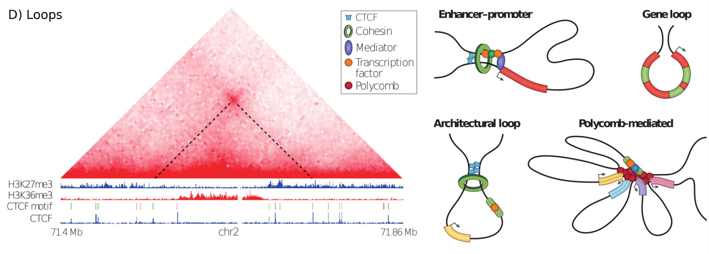

.. _hicValidateLocations:

hicValidateLocations
====================

hicValidateLoops is a tool to compare the detect loops and TADs from hicDetectLoops / hicFindTADs (or from any other software as long as the data format is followed, see below) 
with known peak protein locations to validate if the computed loops / TADs have the expected anchor points. For example, loops in mammals are usually bound by CTCF or Cohesin, 
therefore it is important to know if the detect loops have protein peaks at their X and Y position.

    Loops in Hi-C, graphic from Bonev & Cavalli, Nature Reviews Genetics 2016

Data format
-----------

The data format of hicDetectLoops output is:

chr_x start_x end_x chr_y start_y end_y p-value

As ``--validationData`` the input of narrowPeak / broadPeak (both as bed) or a cool file is accepted. However, for the bed files, as long as the ``--validationData`` input file contains chromosome, start and end in the first three columns, it should work.

Concerning the TAD locations: Please use a file containing the boundary positions and not the domains!  

.. argparse::
   :ref: hicexplorer.hicValidateLocations.parse_arguments
   :prog: hicValidateLocations

