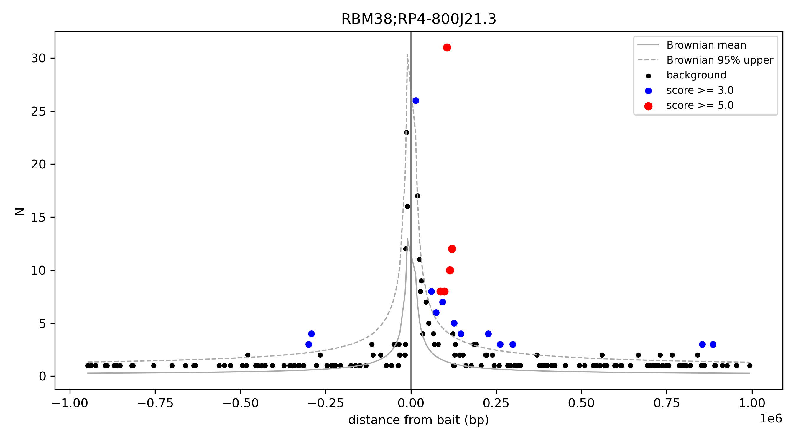
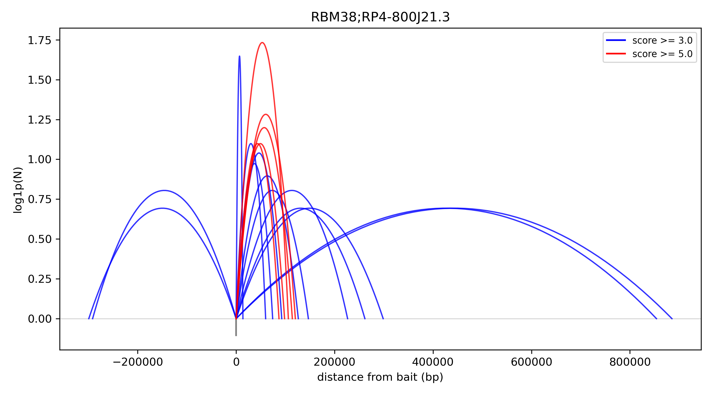
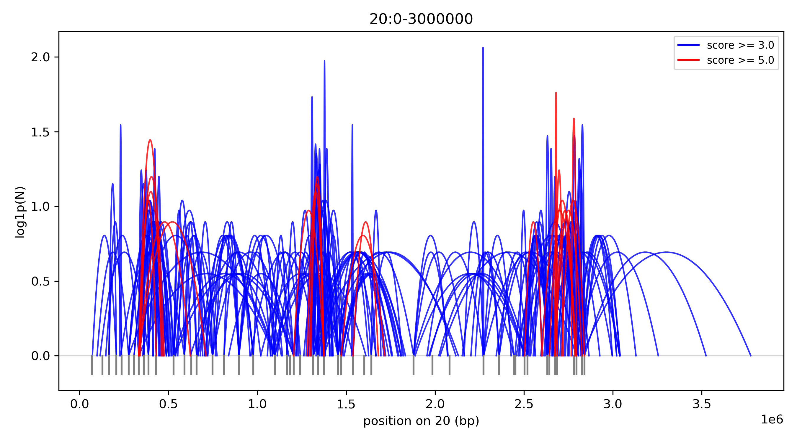
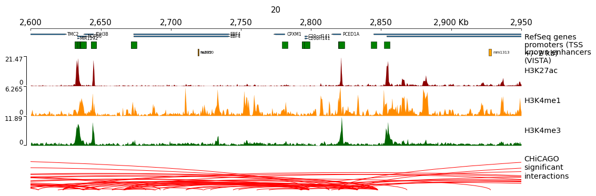

# CHiCAGO analysis

This tutorial scores a capture Hi-C sample with the CHiCAGO method (Cairns et al. 2016) using the `chicChicago*` tools and plots the result. The example is the GM12878 replicate of the PCHiCdata package restricted to chromosomes 20 and 21 (`hicexplorer/test/test_data/chicago/`), a promoter capture Hi-C design with HindIII fragments.

For the HiCExplorer HDF5 workflow (`chicViewpoint` and related tools) see the [Capture Hi-C analysis](capture-hic-tutorial.md).

## Design files

CHiCAGO needs a restriction fragment map (`.rmap`), a bait map (`.baitmap`) and three design tables (`.npb`, `.nbpb`, `.poe`). The tables are produced from the first two with `makeDesignFiles.py` of [chicagoTools](https://github.com/RegulatoryGenomicsGroup/chicago). The fixture ships all five files. See [File formats](../file-formats.md#chicago-formats).

## Interaction counts

The counts per (bait, other end) pair come from a `.chinput` file. Produce it with `bam2chicago.sh` of chicagoTools. To work with a matrix instead, convert the file to cool:

```bash
hicConvertFormat -m GM_rep1.chinput --rmap h19_chr20and21.rmap \
    --inputFormat chinput --outputFormat cool -o GM_rep1.cool
```

The cool file has one bin per restriction fragment (25,794 bins and 283,349 nonzero pixels here). Both directions of a bait-to-bait pair are summed. The matrix path derives cis pairs within the Brownian estimation distance, so trans counts are not available on it.

## Background model

```bash
chicChicagoBackgroundModel --rmap h19_chr20and21.rmap --baitmap h19_chr20and21.baitmap \
    --chinput GM_rep1.chinput \
    --nperbin h19_chr20and21.npb --nbaitsperbin h19_chr20and21.nbpb --proxOE h19_chr20and21.poe \
    --threads 8 -o background_model.txt
```

Use `--matrices GM_rep1.cool` in place of `--chinput` to derive the counts from the matrix. See [chicChicagoBackgroundModel](../tools/chicChicagoBackgroundModel.md).

## Scores

```bash
chicChicagoScores --chinput GM_rep1.chinput --backgroundModel background_model.txt \
    --baitmap h19_chr20and21.baitmap --rmap h19_chr20and21.rmap --threads 8 -o scores.txt
```

The output has one row per interaction (baitID, otherEndID, N, distSign, Bmean, the p-values and the weighted score). See [chicChicagoScores](../tools/chicChicagoScores.md).

## Significant interactions

```bash
chicChicagoSignificantInteractions --scores scores.txt --rmap h19_chr20and21.rmap \
    --baitmap h19_chr20and21.baitmap -o significant.txt
```

The default threshold is a score of 5. The example yields 1,170 interactions. The first row is bait NRSN2 (chr20:325,598-341,635) with the other end at chr20:459,227-463,619, N = 17 and a score of 13.8.

## Plot a viewpoint

```bash
chicChicagoPlotViewpoint --scores scores.txt --baitID 417632 --baitmap h19_chr20and21.baitmap \
    --backgroundModel background_model.txt -o viewpoint_scatter.png
```



*Bait RBM38: observed counts against signed distance, colored by score, with the Brownian mean and upper band.*

`--style arcs --onlySignificant` draws the significant interactions of the bait as arcs without background.



*The same bait as arcs, significant interactions only.*

`--region` draws every bait in a region:

```bash
chicChicagoPlotViewpoint --scores scores.txt --region 20 0 3000000 \
    --baitmap h19_chr20and21.baitmap --style arcs --onlySignificant -o region_arcs.png
```



*All baits in chr20:0-3,000,000, significant interactions only.*

See [chicChicagoPlotViewpoint](../tools/chicChicagoPlotViewpoint.md).

## Combine the interactions with genome tracks

`--linksFile` writes the interactions as a pyGenomeTracks links file. The example writes 220 links for the region above:

```bash
chicChicagoPlotViewpoint --scores scores.txt --region 20 0 3000000 \
    --baitmap h19_chr20and21.baitmap --rmap h19_chr20and21.rmap \
    --style arcs --onlySignificant --linksFile chicago.links -o region_arcs.png
```

A `tracks.ini` places the links next to histone bigWig files, a gene track, promoters and known enhancers:

```ini
[x-axis]
where = top

[genes]
file = genes.bed
title = RefSeq genes
file_type = bed
gene_rows = 3
labels = true

[promoters]
file = promoters.bed
title = promoters (TSS +/- 2 kb)
file_type = bed
display = collapsed
color = green
labels = false
height = 0.5

[enhancers]
file = enhancers.bed
title = known enhancers (VISTA)
file_type = bed
display = collapsed
color = orange
height = 0.5

[H3K27ac]
file = H3K27ac_hg19.bw
title = H3K27ac
height = 2
color = darkred
min_value = 0

[CHiCAGO]
file = chicago.links
title = CHiCAGO
file_type = links
links_type = arcs
```

```bash
pyGenomeTracks --tracks tracks.ini --region 20:2600000-2950000 --width 40 --outFileName genome_tracks.png
```



*CHiCAGO interactions (64 links in this window) with H3K27ac, gene, promoter and known-enhancer tracks.*

Two points about the reference data of this figure. The design is hg19, so the hg38 bigWig files of ENCODE were lifted over to hg19 with `liftOver` before plotting. The enhancer track holds VISTA enhancers, which are not specific to GM12878; an enhancer from another cell type can lie at a promoter contact without being active in GM12878.

## Performance

On a full-genome design with 22,076 baits and 119.8M rows the whole pipeline takes 236.6 s from a `.chinput` file and 48.5 s from the converted matrix with 16 threads, against 437.5 s for R Chicago. See [Benchmarks](../benchmarks.md#chicago).
