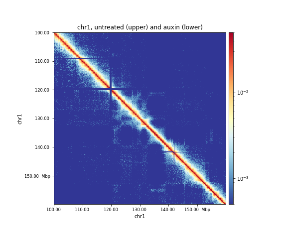

# New in version 4: examples

The commands below use the tools and options that are new in HiCExplorer 4. The outputs are from real
runs. Test matrices are in `hicexplorer/test/test_data`. The CHiCAGO tools have their own
[tutorial](chicago-tutorial.md).

## Detect stripes

`hicDetectStripes` finds architectural stripes in a corrected matrix. The example is a 10 kb matrix of an
AML Hi-C sample (GEO GSM4604271, balanced) on chromosome 1. The call set is limited by the raw p-value; here
`--pValue 0.1` is used for this low-coverage sample.

```bash
hicDetectStripes -m GSM4604271_576.iced.mcool::/resolutions/10000 \
    --chromosomes chr1 --pValue 0.1 --threads 8 -o stripes.tsv
```

```text
INFO:hicexplorer.hicDetectStripes:Number of detected stripes: 5
```

`stripes.tsv` has one stripe per line: chromosome, start and end of the anchor, the orientation
(`vertical` or `horizontal`), the start and end of the stripe body and the statistics.

```text
chr1  40420000   40450000   vertical    39960000   40450000   0.235776  0.0388548  0.0805243
chr1  165390000  165420000  horizontal  165390000  165800000  0.207182  0.0786948  0.0805243
chr1  207480000  207510000  vertical    206430000  207510000  0.107577  0.0805243  0.0805243
```

The run takes 33 s on chr1. See [hicDetectStripes](../tools/hicDetectStripes.md).

## Differential TADs with replicates

`hicDifferentialAnalysis tads` models raw contact counts with a negative binomial model and needs at least
two replicates per condition. To show the output, the example takes the GM12878 chr1 matrix at 10 kb,
splits it into complementary halves as pseudo-replicates (`--splitReplicates`) and plants a 2-fold
change into the regions of a BED file (`--plantRegions`, `--plantFold 2`), so the differences are known.

```bash
G=hicexplorer/test/test_data/hicTADClassifier/gm12878_chr1.cool
hicDifferentialAnalysis tads -a $G $G -b $G $G --splitReplicates 11 --blocks r1 r2 r1 r2 \
    -d gm12878_chr1_domains.bed --plantRegions gm12878_chr1_plants.bed --plantFold 2 \
    --plantSeed 5 -o diff --threads 8
```

```text
hicDifferentialAnalysis tads: 11 of 213 TADs and 28 of 210 boundaries differential at FDR 0.05
```

The command writes `diff_tads.tsv` and `diff_boundaries.tsv`. The strongest TADs:

```text
#chrom  start     end       name         strata  log2FoldChange  pvalueTotal  pvalue      fdr         differential
1       19580000  19990000  ID_0.01_66   6       -0.995855       7.96e-253    5.57e-252   1.18e-249   1
1       46050000  46350000  ID_0.01_166  5        1.01226        2.43e-201    1.46e-200   1.54e-198   1
1       56370000  56800000  ID_0.01_206  6        1.01009        3.47e-201    2.43e-200   1.71e-198   1
```

The log2 fold changes of about 1 and -1 are the planted 2-fold changes in either direction. For real
data give the replicate matrices of each condition to `-a` and `-b`. The runtime is 14 s. See
[hicDifferentialAnalysis](../tools/hicDifferentialAnalysis.md), which also covers `loops` and
`compartments`.

## Compare two matrices in one heatmap

`hicPlotMatrix --matrix2` draws `--matrix` in the upper triangle and `--matrix2` in the lower triangle. The
example compares HCT116 cells untreated (GSM2644945) and after two days of auxin (GSM2644947) at 100 kb.

```bash
hicPlotMatrix -m untreated.cool --matrix2 auxin.cool --region chr1:100000000-160000000 \
    --log --vMin 0.0005 --vMax 0.05 --colorMap RdYlBu_r \
    --title "chr1, untreated (upper) and auxin (lower)" --outFileName matrix2.png
```



*Untreated (upper triangle) and auxin-treated (lower triangle) HCT116 cells, chr1:100-160 Mb.*

## A/B compartments of large matrices

`hicPCA --eigenSolver lanczos` computes the leading eigenvectors iteratively. On GM12878 chr1 merged to
50 kb (4,986 bins) the two solvers give the same eigenvector (correlation 1.0) and differ in time:

| Solver | Time | Peak memory |
|---|---|---|
| `dense` (default) | 146 s | 543 MB |
| `lanczos` | 5.5 s | 343 MB |

```bash
hicPCA -m gm12878_chr1_50kb.cool -o pc1.bedgraph --whichEigenvectors 1 \
    --format bedgraph --eigenSolver lanczos --threads 8
```

## Convert to and from `.hic`

`hicConvertFormat` reads `.hic` files of versions 6 to 9 and writes versions 8 and 9. The write includes
the VC, VC_SQRT, KR and SCALE normalization vectors.

```bash
hicConvertFormat -m untreated.cool --inputFormat cool --outputFormat hic -o untreated.hic --threads 4
hicConvertFormat -m untreated.hic --inputFormat hic --outputFormat cool -o back.cool
```

The `.hic` file of the 9.5 MB cool matrix is 7.3 MB.

## Score capture Hi-C with CHiCAGO

```bash
chicChicagoBackgroundModel --rmap design.rmap --baitmap design.baitmap --chinput sample.chinput \
    --nperbin design.npb --nbaitsperbin design.nbpb --proxOE design.poe -o background_model.txt
chicChicagoScores --chinput sample.chinput --backgroundModel background_model.txt \
    --baitmap design.baitmap --rmap design.rmap -o scores.txt
chicChicagoSignificantInteractions --scores scores.txt --rmap design.rmap \
    --baitmap design.baitmap -o significant.txt
```

The [CHiCAGO tutorial](chicago-tutorial.md) shows the outputs and the viewpoint, arc and genome track
plots.
