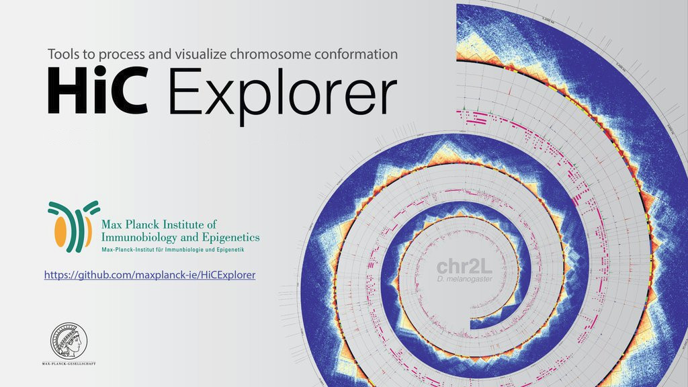

HiCExplorer
===========

Set of programs to process, normalize, analyze and visualize Hi-C data
----------------------------------------------------------------------

HiCExplorer addresses the common tasks of Hi-C data analysis from processing to visualization.

Availability
------------

HiCExplorer is available as a **command line suite of tools** on this `GitHub repository <https://github.com/deeptools/HiCExplorer>`_.

A **Galaxy HiCExplorer version** is directly available to users at http://hicexplorer.usegalaxy.eu. Training material is available at the `Galaxy Training Network <http://galaxyproject.github.io/training-material/topics/epigenetics/tutorials/hicexplorer/tutorial.html>`_,
while a Galaxy Tour is available `here <https://hicexplorer.usegalaxy.eu/tours/hixexplorer>`_ for users not familiar with this platform. Galaxy HiCExplorer is also available as a Docker image at the `Docker Galaxy HiCExplorer GitHub repository <https://github.com/deeptools/docker-galaxy-hicexplorer>`_. Finally, this Galaxy version is available on the `Galaxy Tool Shed <https://toolshed.g2.bx.psu.edu/>`_ and on the corresponding `GitHub repository <https://github.com/galaxyproject/tools-iuc>`_.

The following is the list of tools available in HiCExplorer
-----------------------------------------------------------

=============================== ==========================================================================================================================================================
tool                            description
=============================== ==========================================================================================================================================================
:ref:`findRestSite`              Identifies the genomic locations of restriction sites
:ref:`hicBuildMatrix`            Creates a Hi-C matrix using the aligned BAM files of the Hi-C sequencing reads
:ref:`hicQC`                     Plots QC measures from the output of hicBuildMatrix
:ref:`hicCorrectMatrix`          Uses iterative correction to remove biases from a Hi-C matrix
:ref:`hicFindEnrichedContacts`   Identifies enriched Hi-C contacts
:ref:`hicCorrelate`              Computes and visualises the correlation of Hi-C matrices
:ref:`hicFindTADs`               Identifies Topologically Associating Domains (TADs)
:ref:`hicPCA`                    Computes for A / B compartments the eigenvectors
:ref:`hicTransform`              Computes a obs_exp matrix like Lieberman-Aiden (2009), a pearson correlation matrix and or a covariance matrix. These matrices can be used for plotting.
:ref:`hicMergeMatrixBins`        Merges consecutive bins on a Hi-C matrix to reduce resolution
:ref:`hicMergeTADbins`           Uses a BED file of domains or TAD boundaries to merge the bin counts of a Hi-C matrix.
:ref:`hicPlotDistVsCounts`       Plot the decay in interaction frequency with distance
:ref:`hicPlotMatrix`             Plots a Hi-C matrix as a heatmap
:ref:`hicPlotTADs`               Plots TADs as a track that can be combined with other tracks (genes, signal, interactions)
:ref:`hicPlotViewpoint`          A plot with the interactions around a reference point or region.
:ref:`hicAggregateContacts`      A tool that allows plotting of aggregated Hi-C sub-matrices of a specified list of positions.
:ref:`hicSumMatrices`            Adds Hi-C matrices of the same size
:ref:`hicPlotDistVsCounts`       Plots distance vs. Hi-C counts of corrected data
:ref:`hicInfo`                   Shows information about a Hi-C matrix file (no. of bins, bin length, sum, max, min, etc)
:ref:`hicCompareMatrices`        Computes difference or ratio between two matrices
:ref:`hicAverageRegions`         Computes the average of multiple given regions, usually TAD regions
:ref:`hicPlotAverageRegions`     visualization of hicAverageRegions
:ref:`hicNormalize`              Normalizes the given matrices to 0-1 range or the smallest read coverage
:ref:`hicConvertFormat`          Converts between different Hi-C interaction matrices
:ref:`hicAdjustMatrix`           Keeps, removes or masks regions in a Hi-C matrix
=============================== ==========================================================================================================================================================

Getting Help
------------

* For general questions, please use Biostars with Tag `hicexplorer` : `Biostars <https://www.biostars.org/t/hicexplorer/>`_
* For specific questions and feature requests, use the `deepTools mailing list <https://groups.google.com/forum/#!forum/deeptools>`_
* For suggesting changes/enhancements and to report bugs, please create an issue on `our GitHub repository <https://github.com/deeptools/HiCExplorer>`_

Contents:
---------

.. toctree::
   :maxdepth: 2

   content/installation
   content/list-of-tools
   content/example_usage
   content/News

Citation
---------

Please cite HiCExplorer as follows:

Fidel Ramirez, Vivek Bhardwaj, Jose Villaveces, Laura Arrigoni, Bjoern A Gruening,Kin Chung Lam, Bianca Habermann, Asifa Akhtar, Thomas Manke.
**"High-resolution TADs reveal DNA sequences underlying genome organization in flies". Nature Communications**, Volume 9, Article number: 189 (2018), doi: https://doi.org/10.1038/s41467-017-02525-w

Joachim Wolff, Vivek Bhardwaj, Stephan Nothjunge, Gautier Richard, Gina Renschler, Ralf Gilsbach, Thomas Manke, Rolf Backofen, Fidel Ramírez, Björn A Grüning. 
**Galaxy HiCExplorer: a web server for reproducible Hi-C data analysis, quality control and visualization**, Nucleic Acids Research, Volume 46, Issue W1, 2 July 2018, Pages W11–W16, doi: https://doi.org/10.1093/nar/gky504

This tool suite is developed by the `Bioinformatics Unit <http://www.ie-freiburg.mpg.de/bioinformaticsfac>`_
at the `Max Planck Institute for Immunobiology and Epigenetics <http://www.ie-freiburg.mpg.de/>`_, Freiburg and by
the `Bioinformatics Lab <http://bioinf.uni-freiburg.de/>`_ of the `Albert-Ludwigs-University Freiburg <http://www.uni-freiburg.de>`_, Germany.
