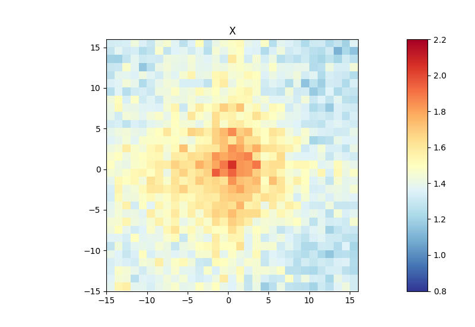

# hicAggregateContacts

Plots aggregated Hi-C sub-matrices for a list of positions.

```text
usage: hicAggregateContacts --matrix MATRIX --outFileName OUTFILENAME --BED BED
                            --mode {inter-chr,intra-chr,all} [--range RANGE]
                            [--row_wise] [--BED2 BED2] [--numberOfBins NUMBEROFBINS]
                            [--transform {total-counts,z-score,obs/exp,none}]
                            [--operationType {sum,mean,median}] [--perChr]
                            [--considerStrandDirection]
                            [--largeRegionsOperation {first,last,center}] [--help]
                            [--version] [--dpi DPI]
                            [--outFilePrefixMatrix OUTFILEPREFIXMATRIX]
                            [--outFileContactPairs OUTFILECONTACTPAIRS]
                            [--outFileObsExp OUTFILEOBSEXP]
                            [--diagnosticHeatmapFile DIAGNOSTICHEATMAPFILE]
                            [--kmeans KMEANS] [--hclust HCLUST] [--spectral SPECTRAL]
                            [--howToCluster {full,center,diagonal}] [--keep_outlier]
                            [--max_deviation MAX_DEVIATION]
                            [--chromosomes CHROMOSOMES [CHROMOSOMES ...]]
                            [--colorMap COLORMAP] [--plotType {2d,3d}]
                            [--vMin VMIN] [--vMax VMAX] [--noPlot]
                            [--plotData FILE]
```

Takes a list of positions in the Hi-C matrix and makes a pooled image.

The options are those of the Python `hicAggregateContacts`; see the Python tool's own documentation for
the full option-by-option reference (`--matrix`, `--outFileName`, `--BED`/`--BED2`, `--mode`, `--range`,
`--transform`, `--operationType`, clustering with `--kmeans`/`--hclust`/`--spectral`, and the plot styling
options). The tables of aggregated contacts are computed in C++; the figure is drawn by the
`hicexplorer_plot` drawing layer using the same matplotlib calls as the Python tool
(`HICX_PLOT_PYTHON` names the interpreter to use for drawing).

## C++ port only

| Flag | Meaning |
|---|---|
| `--noPlot` | Write the numeric outputs (`--outFilePrefixMatrix`, `--outFileContactPairs`, `--outFileObsExp`) without any figure. |
| `--plotData FILE` | Write the data of the figures as JSON to FILE instead of drawing them. |

## Notes

### Usage example

Below is an example of an aggregate Hi-C matrix obtained from *Drosophila melanogaster* Hi-C data. The
interactions are plotted at binding sites of a protein determined by ChIP-seq. Sub-matrices of 30 bins
(1.5 kb bin size, 45 kb in total) are plotted; the regions specified in the BED file are centered between
half the number of bins and the other half. The considered range is 300-1000 kb; adjust the range to
contain only contacts larger than the TAD size, to reduce background interactions.

```bash
hicAggregateContacts --matrix Dmel.h5 --BED ChIP-seq-peaks.bed \
  --outFileName Dmel_aggregate_Contacts --vMin 0.8 --vMax 2.2 \
  --range 300000:1000000 --numberOfBins 30 --chromosomes X \
  --operationType mean --transform obs/exp --mode intra-chr
```



This example used mean interactions of an observed-versus-expected transformed Hi-C matrix. Other
matrix transformations are `total-counts` or `z-score`. Aggregate contacts can be plotted in 2D or 3D.
