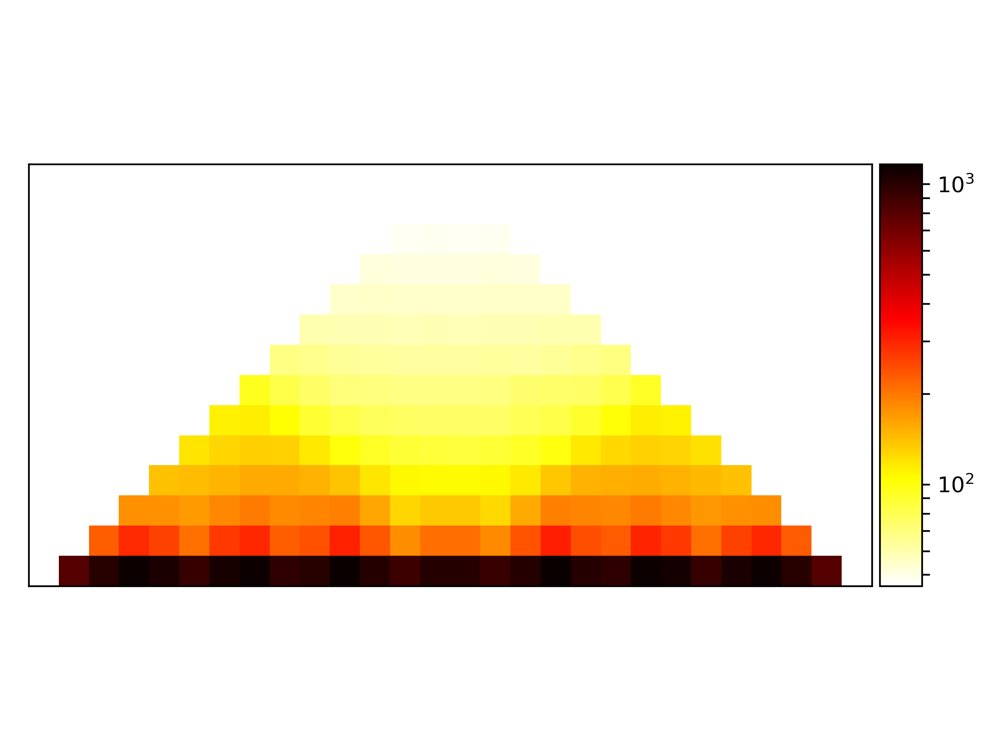

# hicAverageRegions

Averages a set of given locations across one or more matrices, usually TAD regions.

```text
usage: hicAverageRegions --matrix MATRIX --regions REGIONS
                         (--range RANGE RANGE | --rangeInBins RANGEINBINS RANGEINBINS)
                         --outFileName OUTFILENAME [--help]
                         [--coordinatesToBinMapping {start,center,end}]
                         [--considerStrandDirection] [--version]
```

Sums Hi-C contacts around given reference points and computes their average. This tool is useful to detect differences at certain reference points as for example TAD boundaries between samples.

WARNING: This tool can only be used with fixed bin size Hi-C matrices. No guarantees how and if it works on restriction site interaction matrices.

## options

| Flag | Meaning |
|---|---|
| `--range RANGE RANGE, -ra RANGE RANGE` | Range of region up- and downstream of each region to include in genomic units. |
| `--rangeInBins RANGEINBINS RANGEINBINS, -rib RANGEINBINS RANGEINBINS` | Range of region up- and downstream of each region to include in bin units. |

## Required arguments

| Flag | Meaning |
|---|---|
| `--matrix MATRIX, -m MATRIX` | The matrix to use for the average of TAD regions. |
| `--regions REGIONS, -r REGIONS` | BED file which stores a list of regions that are summed and averaged |
| `--outFileName OUTFILENAME, -o OUTFILENAME` | File name to save the average regions TADs matrix. |

## Optional arguments

| Flag | Meaning |
|---|---|
| `--help, -h` | show this help message and exit |
| `--coordinatesToBinMapping {start,center,end}, -cb {start,center,end}` | If the region contains start and end coordinates, define if the start, center (start + (end-start) / 2) or end bin should be used as start for range.This parameter is only important to set if the given start and end coordinates are not in the same bin (Default: start). |
| `--considerStrandDirection` | This parameter specifies if the strand information is taken into account for the aggregation. It has the effect that the contacts of a reverse strand region are inverted e.g. [1,2,3] becomes [3,2,1]. |
| `--version` | show program's version number and exit |

## Notes

hicAverageRegions takes as input a BED files with genomic positions, these are the reference points to sum up and 
average the regions up- and downstream of all these positions, good reference points are e.g. the borders of TADs. This
can help to determine changes in the chromatin organization and TAD structure changes. 

In the following example the 10kb resolution interaction matrix of [Rao 2014 ](https://www.ncbi.nlm.nih.gov/geo/query/acc.cgi?acc=GSE63525) is used. 

The first step computes the TADs for chromosome 1.

```bash
$ hicFindTADs -m GSE63525_GM12878_insitu_primary_10kb_KR.cool --outPrefix TADs 
    --correctForMultipleTesting fdr --minDepth 30000 --maxDepth 100000 
    --step 10000 -p 20 --chromosomes 1
```
Next, we use the `domains.bed` file of hicFindTADs to use the borders of TADs as reference points.
As a range up- and downstream of each reference point 100kb are chosen. 

```bash
$ hicAverageRegions -m GSE63525_GM12878_insitu_primary_10kb_KR.cool 
    -r TADs_domains.bed --range 100000 100000 --outFileName primary_chr1
```
In a last step, the computed average region is plotted.

```bash
$ hicPlotAverageRegions -m primary_chr1.npz -o primary_chr1.png
```

