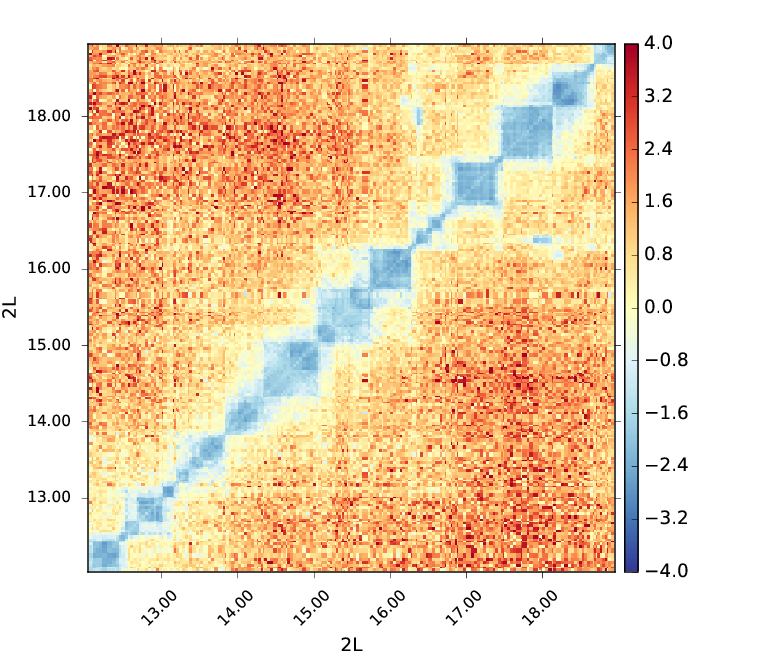
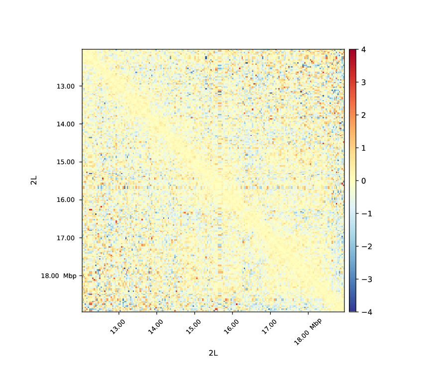

# hicCompareMatrices

Computes the difference, ratio or log2 ratio between two matrices.

```text
usage: hicCompareMatrices --matrices matrix.h5 matrix.h5 --outFileName
                          OUTFILENAME [--operation {diff,ratio,log2ratio}]
                          [--noNorm] [--help] [--version]
```

Takes two matrices as input, normalizes them and applies the given operation. To normalize the matrices each element is divided by the sum of the matrix.

## Required arguments

| Flag | Meaning |
|---|---|
| `--matrices matrix.h5 matrix.h5, -m matrix.h5 matrix.h5` | Name of the matrices in .h5 format to use, separated by a space. (default: None) |
| `--outFileName OUTFILENAME, -o OUTFILENAME` | File name to save the resulting matrix. The output is also a .h5 file. (default: None) |

## Optional arguments

| Flag | Meaning |
|---|---|
| `--operation {diff,ratio,log2ratio}` | Operation to apply to the matrices (Default: log2ratio). |
| `--noNorm` | Do not apply normalisation before computing the operation (Default: False). (default: False) |
| `--help, -h` | show this help message and exit |
| `--version` | show program's version number and exit |

## Notes

#### Usage example

`hicCompareMatrices` is usually perfomed on corrected matrices ([hicCorrectMatrix](hicCorrectMatrix.md)) with bins merged ([hicMergeMatrixBins](hicMergeMatrixBins.md)) depending on the downstream analyses to perform. Here is an example of a log2ratio comparison between M1BP Knockdown and GST cells in *Drosophila melanogaster* on corrected matrices with 50 bins merged (about 30kb bins).

```bash
hicCompareMatrices -m \
M1BP_KD_merge_m50_corrected.h5 \
GST_merge_rf_m50_corrected.h5 \
--operation log2ratio -o m1bp_over_gst_log2_m50.h5
```
This code outputs a matrix containing the normalized log2ratio values of M1BP_KD_merge_m50_corrected.h5 over GST_merge_rf_m50_corrected.h5. We can then display this matrix using [hicPlotMatrix](hicPlotMatrix.md).

```bash
hicPlotMatrix -m \
m1bp_over_gst_log2_m50.h5 \
--clearMaskedBins \
--region chr2L:12,000,000-19,000,000 \
--vMin -4 --vMax 4 \
-o m1bp_over_gst_log2_m50_matrix_plot.png
```

In this plot we see that the cells with a M1BP Knockdown display a negative log2ratio compared to the wild-type. Depletion of M1BP thus show a dramatic effect on the distribution of Hi-C contacts in which short range contacts decrease (Ramirez *et al.* 2017,  High-resolution TADs reveal DNA sequences underlying genome organization in flies, https://doi.org/10.1038/s41467-017-02525-w).

Below you can find an example of a log2ratio plot between Hi-C matrices of two biological replicates, no differences are observable which means that the replicates are well correlated.


