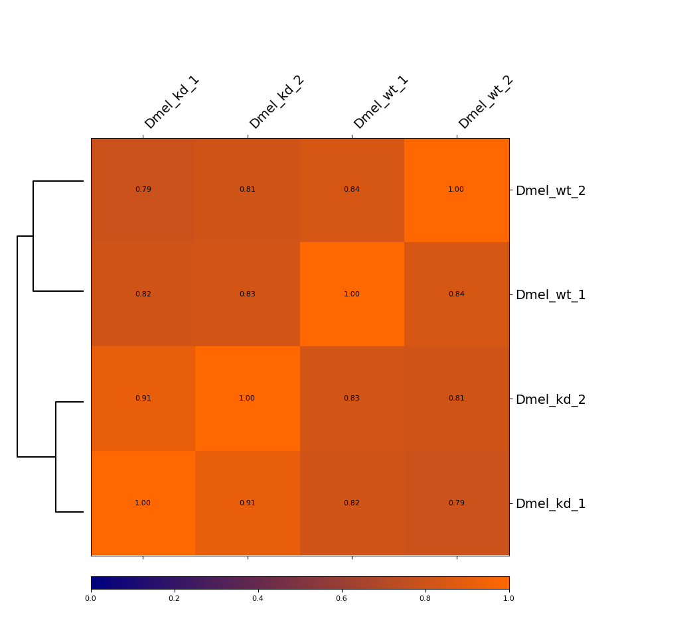
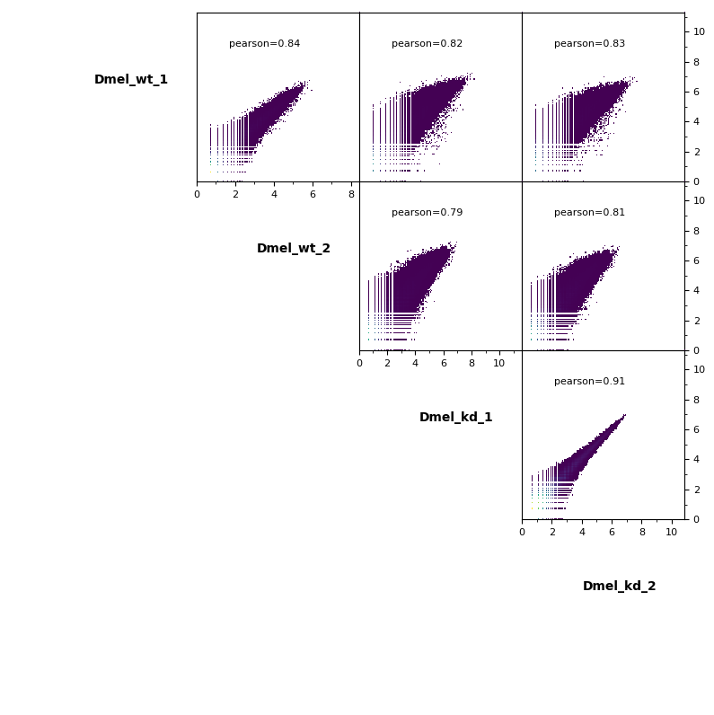

# hicCorrelate

Computes and visualizes the correlation of Hi-C matrices.

```text
usage: hicCorrelate --matrices MATRICES [MATRICES ...] [--zMin ZMIN]
                    [--zMax ZMAX] [--colorMap] [--plotNumbers]
                    [--method {pearson,spearman}] [--log1p]
                    [--labels sample1 sample2 [sample1 sample2 ...]]
                    [--range RANGE] --outFileNameHeatmap OUTFILENAMEHEATMAP
                    --outFileNameScatter OUTFILENAMESCATTER
                    [--chromosomes CHROMOSOMES [CHROMOSOMES ...]] [--help]
                    [--version]
```

Computes pairwise correlations between Hi-C matrices data. The correlation is computed taking the values from each pair of matrices and discarding values that are zero in both matrices.Parameters that strongly affect correlations are bin size of the Hi-C matrices and the considered range. The smaller the bin size of the matrices, the finer differences you score. The --range parameter should be selected at a meaningful genomic scale according to, for example, the mean size of the TADs in the organism you work with.

## Required arguments

| Flag | Meaning |
|---|---|
| `--matrices MATRICES [MATRICES ...], -m MATRICES [MATRICES ...]` | Matrices to correlate (usually .h5 but other formats are allowed). hicCorrelate is better used on un- corrected matrices in order to exclude any changes introduced by the correction. (default: None) |

## Heatmap arguments

Options for generating the correlation heatmap

| Flag | Meaning |
|---|---|
| `--zMin ZMIN, -min ZMIN` | Minimum value for the heatmap intensities. If not specified the value is set automatically. (default: None) |
| `--zMax ZMAX, -max ZMAX` | Maximum value for the heatmap intensities.If not specified the value is set automatically. (default: None) |
| `--colorMap` | Color map to use for the heatmap. Available values can be seen here: http://matplotlib.org/examples/color/col ormaps_reference.html (Default: jet). |
| `--plotNumbers` | If set, then the correlation number is plotted on top of the heatmap. (default: False) |

## Optional arguments

| Flag | Meaning |
|---|---|
| `--method {pearson,spearman}` | Correlation method to use (Default: pearson). |
| `--log1p` | If set, then the log1p of the matrix values is used. This parameter has no effect for Spearman correlations but changes the output of Pearson correlation and, for the scatter plot, if set, the visualization of the values is easier. (default: False) |
| `--labels sample1 sample2 [sample1 sample2 ...], -l sample1 sample2 [sample1 sample2 ...]` | User defined labels instead of default labels from file names. Multiple labels have to be separated by space, e.g. --labels sample1 sample2 sample3 (default: None) |
| `--range RANGE` | In bp with the format low_range:high_range, for example 1000000:2000000. If --range is given only counts within this range are considered. The range should be adjusted to the size of interacting domains in the genome you are working with. (default: None) |
| `--outFileNameHeatmap OUTFILENAMEHEATMAP, -oh OUTFILENAMEHEATMAP` | File name to save the resulting heatmap plot. Supported file formats are given by matplotlib, usually these are: png, pdf, ps, eps and svg. (default: heatmap.png) |
| `--outFileNameScatter OUTFILENAMESCATTER, -os OUTFILENAMESCATTER` | File name to save the resulting scatter plot. Supported file formats are given by matplotlib, usually these are: png, pdf, ps, eps and svg. (default: scatter.png) |
| `--chromosomes CHROMOSOMES [CHROMOSOMES ...]` | List of chromosomes to be included in the correlation. (default: None) |
| `--help, -h` | show this help message and exit |
| `--version` | show program's version number and exit |

## Additional notes

C++ port: the vectors, correlations and clustering are computed in C++, and the figures are drawn by the hicexplorer_plot drawing layer with the calls of the Python tool (HICX_PLOT_PYTHON names the interpreter). The C++-only option --plotData FILE writes the data of the figures as JSON to FILE (and the vectors to FILE.npy) instead of drawing them.

## Notes

#### Usage example

Below, you can find a correlation example of uncorrected Hi-C matrices obtained from *Drosophila melanogaster* embryos, either wild-type or having one gene knocked-down by RNAi.

```bash
$ hicCorrelate -m Dmel_wt_1.h5 Dmel_wt_2.h5 Dmel_kd_1.h5 Dmel_kd_2.h5 \
--method=pearson --log1p \
--labels Dmel_wt_1 Dmel_wt_2 Dmel_kd_1 Dmel_kd_2 \
--range 5000:200000 \
--outFileNameHeatmap Dmel_heatmap --outFileNameScatter Dmel_scatterplot \
--plotFileFormat png
```
### Heatmap


This example is showing a heatmap that was calculated using the Pearson correlation of un-corrected Hi-C matrices with a bin size of 6000 bp. The dendrogram indicates which samples are most similar to each other. You can see that the wild-type samples are separated from the knock-down samples. The second option we offer is calculating the Spearman correlation.

### Scatter plot

Additionally, pairwise scatter plots comparing interactions between each sample can be plotted.


