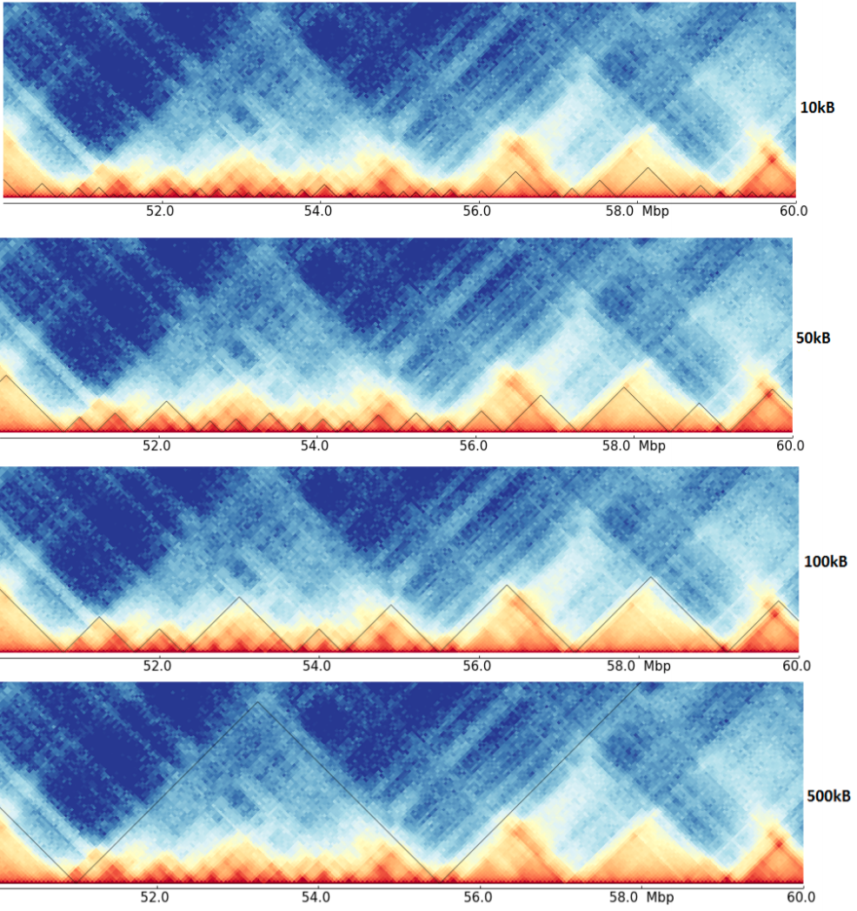
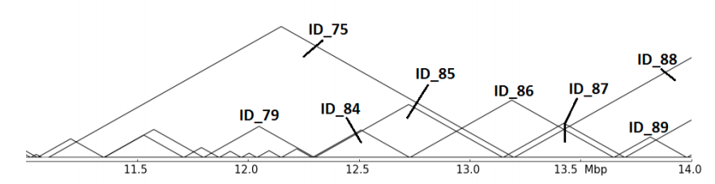
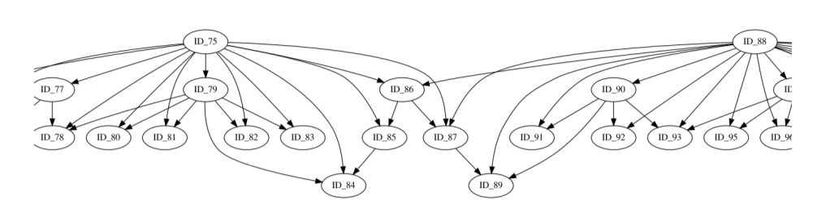
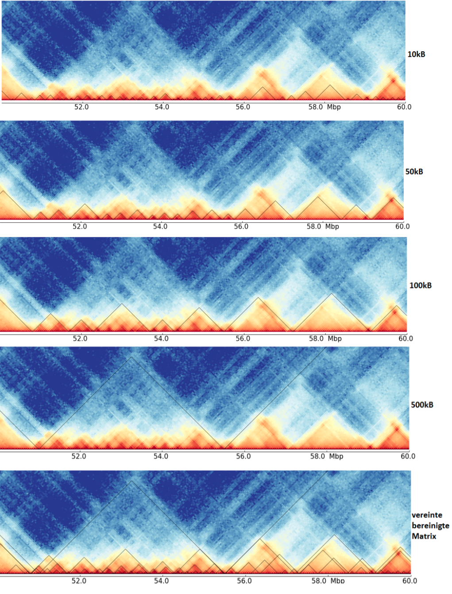

# hicMergeDomains

Merges TAD domains called at different resolutions and their hierarchical relation.

```text
usage: hicMergeDomains --domainFiles DOMAINFILES [DOMAINFILES ...]
                       [--proteinFile PROTEINFILE]
                       [--minimumNumberOfPeaks MINIMUMNUMBEROFPEAKS]
                       [--value VALUE] [--percent PERCENT]
                       [--outputMergedList OUTPUTMERGEDLIST]
                       [--outputRelationList OUTPUTRELATIONLIST]
                       [--outputTreePlotPrefix OUTPUTTREEPLOTPREFIX]
                       [--outputTreePlotFormat OUTPUTTREEPLOTFORMAT] [--help]
                       [--version]
```

hicMergeDomains takes as input multiple TAD domain files from hicFindTads. It merges TADs from different resolutions to one TAD domains file, considers protein peaks from known TAD binding sites and computes a dependency graph of the TADs.

Two TADs are considered as one if they don't overlap at x bins given by `--value`; TAD borders need to match the protein peaks given by `--proteinFile`; a relation between two TADs is given by their overlap of area in percent, parameter `--percent`. The protein peaks are only considered if in one bin at least `--minPeak`.

## Required arguments

| Flag | Meaning |
|---|---|
| `--domainFiles DOMAINFILES [DOMAINFILES ...], -d DOMAINFILES [DOMAINFILES ...]` | The domain files of the different resolutions is required |

## Optional arguments

| Flag | Meaning |
|---|---|
| `--proteinFile PROTEINFILE, -p PROTEINFILE` | In order to be able to better assess the relationship between TADs, the associated protein file (e.g. CTCF for mammals) can be included. The protein file is required in broadpeak format |
| `--minimumNumberOfPeaks MINIMUMNUMBEROFPEAKS, -m MINIMUMNUMBEROFPEAKS` | Optional parameter to adjust the number of protein peaks when adapting the resolution to the domain files. At least minimumNumberOfPeaks of unique peaks must be in a bin to considered. Otherwise the bin is treated like it has no peaks (Default: 1). |
| `--value VALUE, -v VALUE` | Determine a value by how much the boundaries of two TADs must at least differ to consider them as two separate TADs (Default: 5000). |
| `--percent PERCENT, -pe PERCENT` | For the relationship determination, a percentage is required from which area coverage the TADs are related to each other.For example, a relationship should be entered from 5 percent area coverage -p 0.05 (Default: 0.5). |
| `--outputMergedList OUTPUTMERGEDLIST, -om OUTPUTMERGEDLIST` | File name for the merged domains list (Default: mergedDomains.bed). |
| `--outputRelationList OUTPUTRELATIONLIST, -or OUTPUTRELATIONLIST` | File name for the relationship list of the TADs (Default: relationList.txt). |
| `--outputTreePlotPrefix OUTPUTTREEPLOTPREFIX, -ot OUTPUTTREEPLOTPREFIX` | File name prefix for the relationship tree of the TADs (Default: relationship_tree_). |
| `--outputTreePlotFormat OUTPUTTREEPLOTFORMAT, -of OUTPUTTREEPLOTFORMAT` | File format of the relationship tree. Supported formats are listed on: https://www.graphviz.org/doc/info/output.html (Default: pdf). |
| `--help, -h` | show this help message and exit |
| `--version` | show program's version number and exit |

## An example usage is

`$ hicMergeDomains --domainFiles 10kbtad_domains.bed 50kbtad_domains.bed --proteinFile ctcf_sorted.bed --outputMergedList two_files_ctcf --outputRelationList two_files_relation_ctcf --outputTreePlotPrefix two_files_plot_ctcf --outputTreePlotFormat pdf`

## Additional notes

C++ port: the relation tree is rendered by running graphviz's `dot`, which must be on PATH whenever more than one domain file is given.

## Notes

This tool is the result of the [bachelor thesis ](http://www.bioinf.uni-freiburg.de/Lehre/Theses/BA_Sarah_Domogalla.pdf) (in German) from Sarah Domogalla at the Bioinformatics lab of the Albert-Ludwigs-University Freiburg. The thesis was written in winter semester 2019/2020.

The thesis covers the issue of differently detected TADs of the same data but on different resolutions. 


As it can be seen here, the detected TADs on the four resolutions are quite different, and have maybe a hierarchy. Compare for example
the region around 53 Mb in the different resolutions, it is unclear if these are multiple small TADs as suggest by the 10kb resolution,
mid-size one as seen by 50 kb or one big, as detected on 100 kb resolution. Consider the next image for an abstract representation of this problem.


The abstract representation shows multiple issues: Are ID_85,ID_86 and ID_87 related in any hierarchy? Which role plays ID_75? hicMergeDomains tries to solve this by
providing the parameters `--value` and `--percentage` to control how the relationship is determined and if TADs are duplicated and therefore deleted. 


This abstract representation of the hierarchical TADs is created for each chromosome and provides insights for the organization of the chromatin structure in the three dimensional space.


The last image shows a cleaned TAD detection based on all four inputs.
