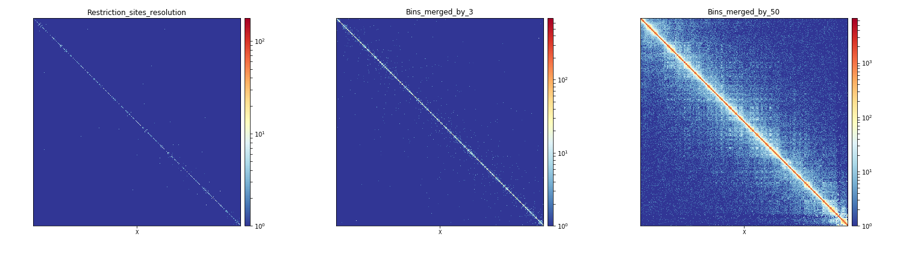
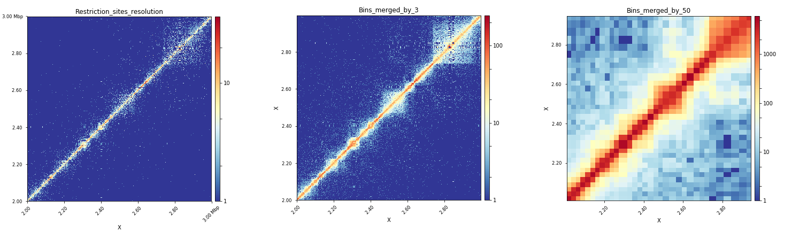

# hicMergeMatrixBins

Merges consecutive bins on a Hi-C matrix to reduce resolution.

```text
usage: hicMergeMatrixBins --matrix matrix.h5 --outFileName OUTFILENAME
                          --numBins int [--runningWindow] [-h] [--version]
```

Merges bins from a Hi-C matrix. For example, using a matrix containing 5kb bins, a matrix of 50kb bins can be derived using --numBins 10. From one type of downstream analysis to another, different bin sizes are used. For example to call TADs, unmerged matrices are recommended while to display Hi-C matrices, bins of approximately 2000bp usually yield the best representations with `hicPlotMatrix` for small regions, and even larger bins (50kb) are recommended for whole chromosome representations or for `hicPlotDistVsCounts`.

## Required arguments

| Flag | Meaning |
|---|---|
| `--matrix matrix.h5, -m matrix.h5` | Matrix to reduce in h5 format. (default: None) |
| `--outFileName OUTFILENAME, -o OUTFILENAME` | File name to save the resulting matrix. The output is also a .h5 file. But don't add the suffix. (default: None) |
| `--numBins int, -nb int` | Number of bins to merge. (default: None) |

## Optional arguments

| Flag | Meaning |
|---|---|
| `--runningWindow` | Set to merge for using a running window of length --numBins. (default: False) |
| `-h, --help` | Show this help message and exit. |
| `--version` | show program's version number and exit |

## Notes

#### Usage example

##### Running hicMergeMatrixBins

Below, we display the example of plotting a Hi-C matrix at the scale of the whole X-chromosome and at the scale of a 1Mb region of the X chromosome. To do this, we will perform two different bin merging using [hicMergeMatrixBins](hicMergeMatrixBins.md) on an uncorrected matrix built at restriction site resolution using [hicBuildMatrix](hicBuildMatrix.md). To do this, we run the two following commands:

```bash
$ hicMergeMatrixBins -m myMatrix.h5 -o myMatrix_merged_nb3.h5 -nb 3

$ hicMergeMatrixBins -m myMatrix.h5 -o myMatrix_merged_nb50.h5 -nb 50
```
Starting from a matrix `myMatrix.h5` with bins of a median length of 529bp, the first command produces a matrix `myMatrix_merged_nb3.h5` with bins of a median length of 1661bp while the second command produces a matrix `myMatrix_merged_nb50.h5` with bins of a median length of 29798bp. This can be checked with [hicInfo](hicInfo.md).

After correction of these three matrices using [hicCorrectMatrix](hicCorrectMatrix.md), we can now plot the corrected matrices `myMatrix_corrected.h5`, `myMatrix_merged_nb3_corrected.h5` and `myMatrix_merged_nb50_corrected.h5` at the scale of the whole X-chromosome and at the X:2000000-3000000 region to see the effect of bin merging on the interactions visualization.

##### Effect of bin merging at the scale of a chromosome

```bash
$ hicPlotMatrix -m myMatrix_corrected.h5 \
-o myMatrix_corrected_Xchr.png \
--chromosomeOrder X \
-t Restriction_sites_resolution --log1p \
--clearMaskedBins

$ hicPlotMatrix -m myMatrix_merged_nb3_corrected.h5 \
-o myMatrix_merged_nb3_corrected_Xchr.png \
--chromosomeOrder X \
-t Bins_merged_by_3 --log1p \
--clearMaskedBins

 $ hicPlotMatrix -m myMatrix_merged_nb50_corrected.h5 \
-o myMatrix_merged_nb50_corrected_Xchr.png \
--chromosomeOrder X \
-t Bins_merged_by_50 --log1p \
--clearMaskedBins
```
When observed altogether, the plots produced by these three commands show that merging of bins by 50 is the most adequate way to plot interactions for a whole chromosome in *Drosophila melanogaster* when starting from a matrix with bins of a median length of 529bp.


##### Effect of bin merging at the scale of a specific region

```bash
$ hicPlotMatrix -m myMatrix_corrected.h5 \
o myMatrix_corrected_Xregion.png \
-region X:2000000-3000000 \
t Restriction_sites_resolution --log1p \
-clearMaskedBins

 hicPlotMatrix -m myMatrix_merged_nb3_corrected.h5 \
o myMatrix_merged_nb3_corrected_Xregion.png \
-region X:2000000-3000000 \
t Bins_merged_by_3 --log1p \
-clearMaskedBins

$ hicPlotMatrix -m myMatrix_merged_nb50_corrected.h5 \
o myMatrix_merged_nb50_corrected_Xregion.png \
-region X:2000000-3000000 \
t Bins_merged_by_50 --log1p \
-clearMaskedBins
```
When observed altogether, the plots produced by these three commands show that merging of bins by 3 is the most adequate way to plot interactions for a region of 1Mb in *Drosophila melanogaster* when starting from a matrix with bins of a median length of 529bp.


