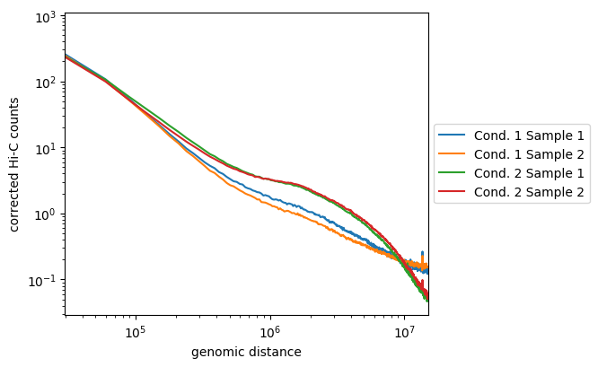

# hicPlotDistVsCounts

Plots the decay in interaction frequency with genomic distance.

```text
usage: hicPlotDistVsCounts --matrices MATRICES [MATRICES ...] --plotFile file
                           name [--labels LABELS [LABELS ...]]
                           [--skipDiagonal] [--maxdepth INT bp] [--perchr]
                           [--chromosomeExclude CHROMOSOMEEXCLUDE [CHROMOSOMEEXCLUDE ...]]
                           [--domains DOMAINS] [--outFileData OUTFILEDATA]
                           [--plotsize PLOTSIZE PLOTSIZE] [--help] [--version]
```

This program creates distance vs. Hi-C counts plots. It can use several matrix files to compare them at once. If the `--perchr` option is given, each chromosome is plotted independently. When plotting multiple matrices, denser matrices are scaled down to match the sum of the smallest matrix.

## Required arguments

| Flag | Meaning |
|---|---|
| `--matrices MATRICES [MATRICES ...], -m MATRICES [MATRICES ...]` | Hi-C normalized (corrected) matrices. Each path should be separated by a space. |
| `--plotFile file name, -o file name` | File name to save the file. The given file ending will be used to determine the image format. The available options are: .png, .emf, .eps, .pdf and .svg. |

## Optional arguments

| Flag | Meaning |
|---|---|
| `--labels LABELS [LABELS ...]` | Label to assign to each matrix file. Each label should be separated by a space. Quote labels that contain spaces: E.g. --labels label1 "labels 2". If no labels are given then the file name is used. |
| `--skipDiagonal, -s` | If set, diagonal counts are not included. |
| `--maxdepth INT bp` | Maximum distance from diagonal to use. In other words, distances up to maxDepth are computed. Default is 3 million bp. |
| `--perchr` | If given, computes and display distance versus Hi-C counts plots for each chromosome stored in the matrices passed to --matrices. |
| `--chromosomeExclude CHROMOSOMEEXCLUDE [CHROMOSOMEEXCLUDE ...]` | Exclude the given list of chromosomes. This is useful for example to exclude the Y chromosome. The names of the chromosomes should be separated by space. |
| `--domains DOMAINS` | Bed file with domains coordinates: instead of evaluating the distance vs. Hi-C counts for intra chromosomal counts, compute it for intra-domains. |
| `--outFileData OUTFILEDATA` | If given, the data underlying the plots is saved on this file. |
| `--plotsize PLOTSIZE PLOTSIZE` | Width and height of the plot (in inches). Default is 6*number of cols, 4 * number of rows. The maximum number of rows is 4. Example: --plotsize 6 5 |
| `--help, -h` | show this help message and exit |
| `--version` | show program's version number and exit |

## Additional notes

C++ port: the distance means, the scale factors and --outFileData are computed in C++, and the figure is drawn by the hicexplorer_plot drawing layer with the matplotlib calls of the Python tool (HICX_PLOT_PYTHON names the interpreter). The C++-only option --plotData FILE writes the data of the figure as JSON to FILE instead of drawing it.

## Notes

#### Usage example

[hicPlotDistVsCounts](hicPlotDistVsCounts.md) should be used on corrected matrices with large bins (e.g. at least 50kb bins), otherwise the curves will be very spiky and unstable at longer ranges because of the sparseness of the contacts. The tool [hicMergeMatrixBins](hicMergeMatrixBins.md) can be used to merge matrix bins and the tool [hicCorrectMatrix](hicCorrectMatrix.md) can be used for matrix correction before using [hicPlotDistVsCounts](hicPlotDistVsCounts.md).

```bash
hicPlotDistVsCounts -m \
condition1_sample1_50_bins_merged.h5 \
condition1_sampel2_50_bins_merged.h5 \
condition2_sample1_50_bins_merged.h5 \
condition2_sample2_50_bins_merged.h5 \
-o counts_vs_dist_50_bins_merged.png \
--labels 'Cond 1 Sample 1' 'Cond 1 Sample 2' 'Cond 2 Sample 1' 'Cond 2 Sample 2' \
--maxdepth 20000000 \
--plotsize 5 4.2
```

Here, we see that the samples of the first condition are not so well correlated, but they follow the same tendencies and are distinct from the two samples of the second condition. The later are well correlated and display enriched long-range contacts compared to the samples of the first condition.
