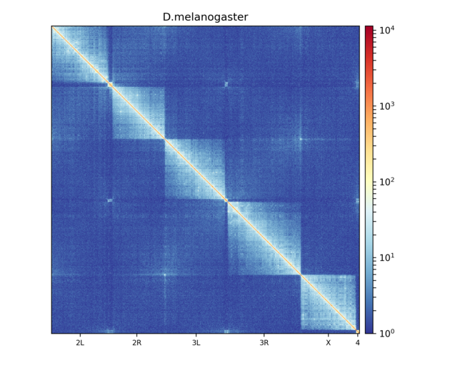
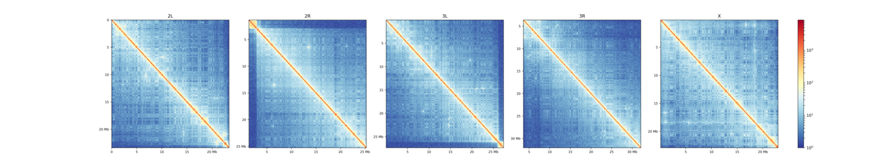

# hicPlotMatrix

Plots a Hi-C matrix as a heatmap.

```text
usage: hicPlotMatrix --matrix MATRIX --outFileName OUTFILENAME
                     [--title TITLE] [--scoreName SCORENAME]
                     [--perChromosome] [--clearMaskedBins]
                     [--chromosomeOrder CHROMOSOMEORDER [CHROMOSOMEORDER ...]]
                     [--region REGION] [--region2 REGION2] [--log1p] [--log]
                     [--colorMap COLORMAP] [--vMin VMIN] [--vMax VMAX]
                     [--dpi DPI] [--bigwig BIGWIG [BIGWIG ...]]
                     [--bigwigAdditionalVerticalAxis]
                     [--vMinBigwig VMINBIGWIG] [--vMaxBigwig VMAXBIGWIG]
                     [--flipBigwigSign]
                     [--scaleFactorBigwig SCALEFACTORBIGWIG]
                     [--fontsize FONTSIZE] [--rotationX ROTATIONX]
                     [--rotationY ROTATIONY]
                     [--increaseFigureWidth INCREASEFIGUREWIDTH]
                     [--increaseFigureHeight INCREASEFIGUREHEIGHT]
                     [--loops LOOPS]
                     [--loopLargeRegionsOperation {first,last,center}]
                     [--tads TADS] [--help] [--version]
```

Creates a heatmap of a Hi-C matrix.

The tool computes the matrices, positions and extents of the figure, then draws it with matplotlib
through the `hicexplorer_plot` drawing layer (`HICX_PLOT_PYTHON` names the interpreter to use for
drawing). The plotting and styling options include `--title`, `--colorMap`, `--vMin`/`--vMax`, `--log1p`/`--log`,
`--region`/`--region2`, `--perChromosome`, the bigwig overlay options and more. `--plotData FILE`
writes the data of the figure as JSON to FILE (and its matrices as `FILE.<n>.npy`) instead of drawing it.

`--matrix2 MATRIX2` draws one heatmap that shows `--matrix` in the upper triangle and `--matrix2` in the
lower triangle, for the side-by-side comparison of two matrices. Both matrices are read for the same
requested region and need the same shape there. The diagonal comes from `--matrix`. The option cannot be
combined with `--perChromosome`.

## Notes

### Details

`hicPlotMatrix` takes a Hi-C matrix and plots the interactions of all or some chromosomes.

### Examples

Hi-C data from wild-type *D. melanogaster* embryos:



This plot shows all contacts of a Hi-C matrix. Its bins were merged into 25 kb bins using
[hicMergeMatrixBins](hicMergeMatrixBins.md). Alternatively, chromosomes can be plotted separately:



```bash
hicPlotMatrix -m Dmel.h5 -o hicPlotMatrix.png \
  -t 'D.melanogaster (--perChromosome)' --log1p \
  --clearMaskedBins --chromosomeOrder 2L 2R 3L 3R X --perChromosome
```
