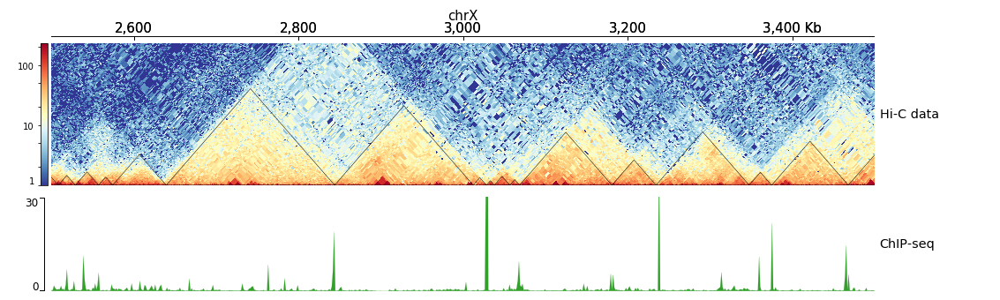

# hicPlotTADs

Plots Hi-C contacts and TADs as a track alongside other genomic tracks.

```text
usage: hicPlotTADs --tracks tracks.ini --region chr1:1000000-4000000 -o image.png
```

Plots genomic tracks on specified region(s). Citations: Ramirez et al. High-resolution TADs reveal DNA
sequences underlying genome organization in flies. Nature Communications (2018)
doi:10.1038/s41467-017-02525-w. Lopez-Delisle et al. pyGenomeTracks: reproducible plots for multivariate
genomic datasets. Bioinformatics (2020) doi:10.1093/bioinformatics/btaa692.

## Options

| Flag | Meaning |
|---|---|
| `--tracks TRACKS` | File containing the instructions to plot the tracks. The `tracks.ini` file can be generated using the `make_tracks_file` program. |
| `--region REGION` | Region to plot, the format is `chr:start-end`. |
| `--BED BED` | Instead of a region, a file containing the regions to plot, in BED format, can be given. If this is the case, multiple files will be created; it uses the value of `--outFileName` as a template and puts the coordinates between the file name and the extension. |
| `--width WIDTH` | Figure width in centimeters (default is 40). |
| `--plotWidth PLOTWIDTH` | Width in centimeters of the plotting (central) part. |
| `--height HEIGHT` | Figure height in centimeters. If not given, it is computed from the heights of the tracks; if given, the track heights are proportionally scaled to match it. |
| `--title TITLE, -t TITLE` | Plot title. |
| `--outFileName OUTFILENAME, -out OUTFILENAME` | File name to save the image, file prefix in case multiple images are stored. |
| `--fontSize FONTSIZE` | Font size for the labels of the plot (default is 0.3 times the figure width). |
| `--dpi DPI` | Resolution for the image in case the output is a raster graphics image (for example png, jpg); default is 72. |
| `--trackLabelFraction TRACKLABELFRACTION` | By default the space dedicated to the track labels is 0.05 of the plot width; change it with this parameter. |
| `--trackLabelHAlign {left,right,center}` | Horizontal alignment of the track labels (default left). |
| `--decreasingXAxis` | By default the x-axis is increasing; use this option for a decreasing x-axis. |
| `--help, -h` | show this help message and exit |
| `--version` | show program's version number and exit |

C++ port: the command line is checked here and passed to pyGenomeTracks' `plotTracks` through the
`hicexplorer_plot` drawing layer (`HICX_PLOT_PYTHON` names the interpreter). The C++-only option
`--plotData FILE` writes the checked command line as JSON to FILE instead of plotting.

## Notes

### Description

For parameter options of the individual track types, see the
[pyGenomeTracks](https://github.com/deeptools/pyGenomeTracks) documentation.

### Usage example

The `hicPlotTADs` output is similar to a genome browser screenshot that, besides the usual genes and
score data (bigwig or bedgraph files), also contains Hi-C data. The plot is composed of tracks specified
in a configuration file. Once the track file is ready, `hicPlotTADs` is used as follows:

```bash
hicPlotTADs --tracks tracks.ini --region chrX:99,974,316-101,359,967 \
  -t 'Marks et. al. TADs on X' -o tads.pdf
```


### Configuration file template

The configuration file is an `.ini` file. Each track is defined by a section header (for example
`[hic track]`), followed by parameters specific to the section such as `color`, `title`, and so on. See
the [pyGenomeTracks documentation](https://pygenometracks.readthedocs.io/) for the full set of track
types and options.

```bash
hicPlotTADs --tracks hic_track.ini -o hic_track.png --region chrX:2500000-3500000
```

```ini
[x-axis]
where = top

[hic matrix]
file = hic_data.h5
title = Hi-C data
# depth is the maximum distance plotted in bp. In Hi-C tracks
# the height of the track is calculated based on the depth such
# that the matrix does not look deformed
depth = 300000
transform = log1p
file_type = hic_matrix

[tads]
file = domains.bed
file_type = domains
border_color = black
color = none
# the tads are overlaid over the hic matrix
# the share-y option sets the y-axis to be shared
# between the Hi-C matrix and the TADs
overlay_previous = share-y

[spacer]

[bigwig file test]
file = bigwig.bw
# height of the track in cm (optional value)
height = 4
title = ChIP-seq
min_value = 0
max_value = 30
```


