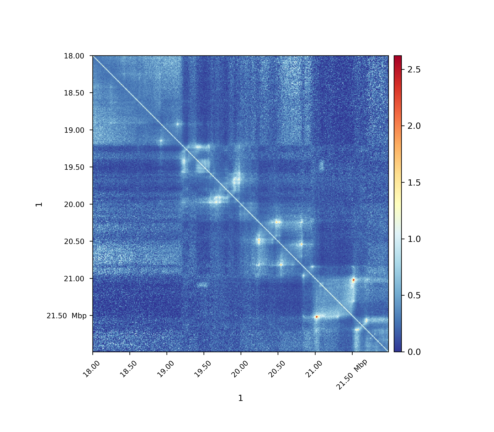
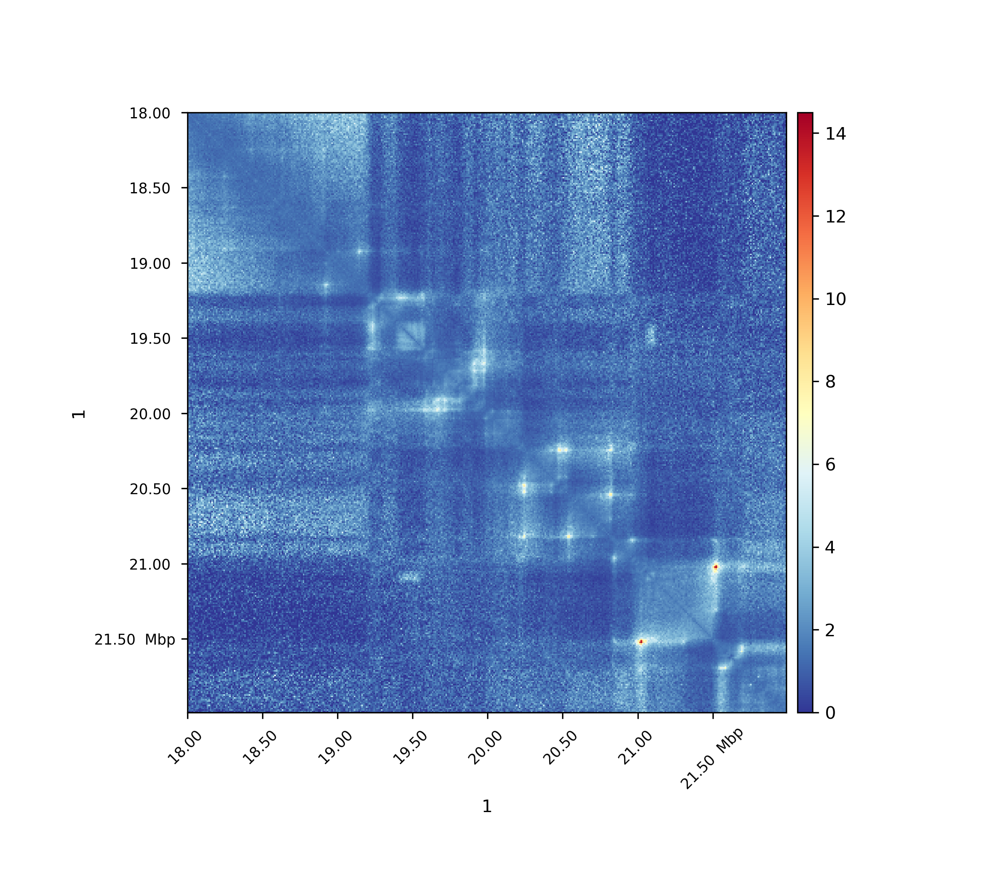
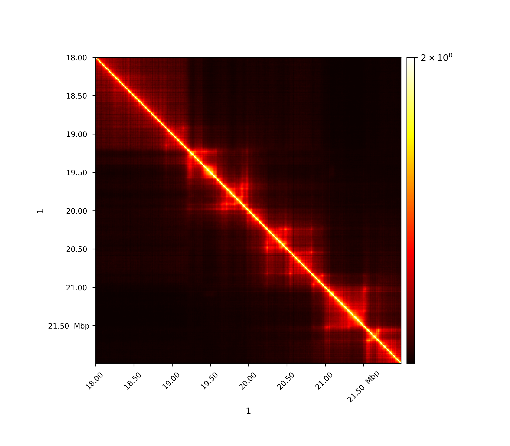
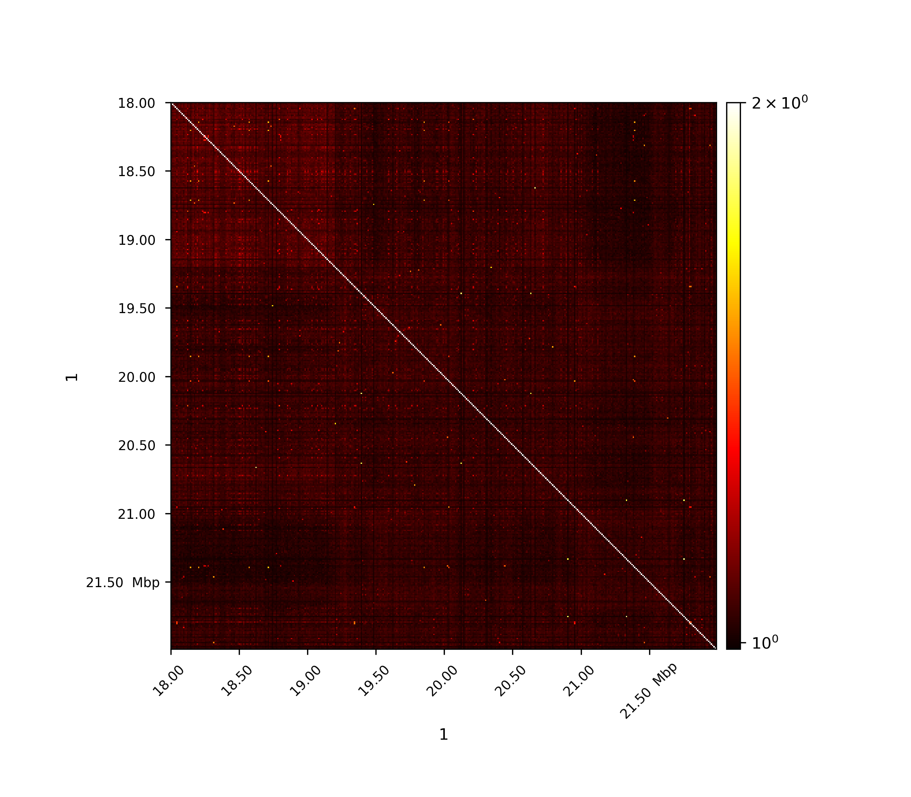

# hicTransform

Computes an observed/expected matrix (Lieberman-Aiden 2009), a Pearson correlation matrix and/or a covariance matrix.

```text
usage: hicTransform --matrix MATRIX --outFileName OUTFILENAME
                    [--method {obs_exp,obs_exp_lieberman,obs_exp_non_zero,pearson,covariance}]
                    [--ligation_factor]
                    [--chromosomes CHROMOSOMES [CHROMOSOMES ...]]
                    [--perChromosome] [--threads THREADS]
                    [--help] [--version]
```

Converts the (interaction) matrix to different types of obs/exp, pearson or covariance matrix.

## Required arguments

| Flag | Meaning |
|---|---|
| `--matrix MATRIX, -m MATRIX` | input file. The computation is done per chromosome. |
| `--outFileName OUTFILENAME, -o OUTFILENAME` | File name to save the exported matrix. |

## Optional arguments

| Flag | Meaning |
|---|---|
| `--method {obs_exp,obs_exp_lieberman,obs_exp_non_zero,pearson,covariance}, -me ...` | Transformation method to use for the input matrix. (Default: obs_exp). |
| `--ligation_factor` | Multiply a scaling factor to each entry of the expected matrix, as the Homer software does. Only effective with obs_exp_non_zero. |
| `--chromosomes CHROMOSOMES [CHROMOSOMES ...]` | List of chromosomes to be included in the computation. |
| `--perChromosome, -pc` | Each chromosome is processed individually, inter-chromosomal interactions are ignored. Option not valid for obs_exp_lieberman. |
| `--threads THREADS` | Workers the dense pearson and covariance rows are split over. The output is byte-identical for any value. Not a Python option; see cpp/OPTIMIZATION.md. (Default: 4). |
| `--help, -h` | show this help message and exit |
| `--version` | show program's version number and exit |

## Notes

### Background

hicTransform transforms a given input matrix into a new matrix using one of the following methods:

- obs_exp
- obs_exp_lieberman
- obs_exp_non_zero
- pearson
- covariance

All expected values are computed per genomic distances.

### Usage

```bash
$ hicTransform -m matrix.cool --method obs_exp -o obs_exp.cool
```
For all images data from [Rao 2014 ](https://www.ncbi.nlm.nih.gov/geo/query/acc.cgi?acc=GSE63525) was used.

### Observed / Expected

All values, including non-zero values, are used to compute the expected values per genomic distance.

.. math:
```
exp_{i,j} =  \frac{ \sum diagonal(|i-j|) }{|diagonal(|i-j|)|}
```

### Observed / Expected lieberman

The expected matrix is computed in the way as Lieberman-Aiden used it in the 2009 publication. It is quite similar
to the obs/exp matrix computation.

.. math:
```
exp_{i,j} = \frac{ \sum diagonal(|i-j|) } {(length\ of\ chromosome\ - |i-j|))}
```

### Observed / Expected non zero

Only non-zero values are used to compute the expected values per genomic distance, i.e. only non-zero values are taken into account
for the denominator.

.. math:
```
exp_{i,j} =  \frac{ \sum diagonal(i-j) }{ number\ of\ non-zero\ elements\ in\ diagonal(|i-j|)}
```

By adding the --ligation_factor flag, the expected matrix can be re-scaled in the same way as has been done by [Homer software ](http://homer.ucsd.edu/homer/interactions/HiCBackground.html) when computing observed/expected matrices with the option '-norm'. 

.. math:
```
exp_{i,j} = exp_{i,j} * \sum row(j) * \sum row(i) }{ \sum matrix }
```

### Pearson correlation matrix

.. math:
```
Pearson_{i,j} = \frac {C_{i,j} }{ \sqrt{C_{i,i} * C_{j,j} }}
```
C is the covariance matrix



The first image shows the Pearson correlation on the original interaction matrix, the second one shows
the Person correlation matrix on an observed/expected matrix. A consecutive computation like this is used in
the A/B compartment computation.

### Covariance matrix

.. math:
```
Cov_{i,j} = E[M_i, M_j] - \mu_i * \mu_j
```
where M is the input matrix and :math:`\mu` the mean.
